# 焼額山スキー場の春の早朝営業の案内が出てたよ！今シーズンも1，2ゴン両方で朝6時から，4/12以降は平日も早朝営業！…そして今週末土曜は晴れ→曇り，日曜は吹雪→暴風雨？

📅 投稿日時: 2025-03-15 00:07:17

🏷️ カテゴリ: [日記](cc4b5682fb7b8b144980957a978653fb0.md)

えー．

本日も志賀高原の特派員から送られてきた

写真を見ると…

朝から終日晴天だったみたいです！

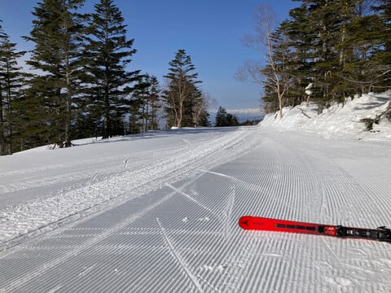

…うぎゃーーー！！！

いい感じの晴天シマシマじゃないですか！！

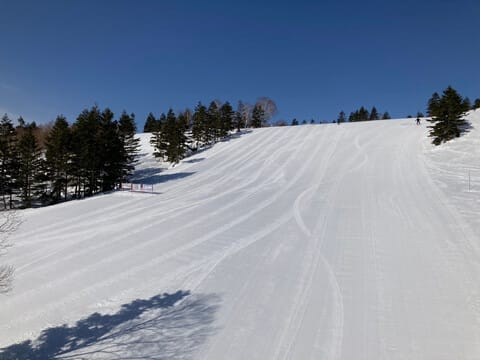

朝イチは気温も-6℃と比較的低め

だったので，バーンは結構硬め

だったみたいですが…

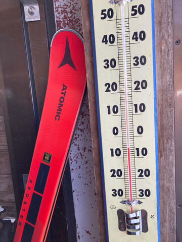

一ノ瀬ファミリー正面とかは夕方まで

硬いまま緩まなかったらしいけど．

朝日が当たる方角の焼額は，午前中から

表面はエッジが効く優しさになってきて，

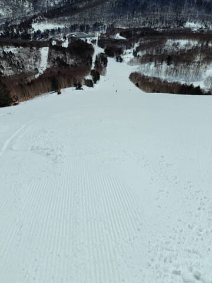

昼頃には気温がプラスに上がってしまい，

さらに日差しもあったので．

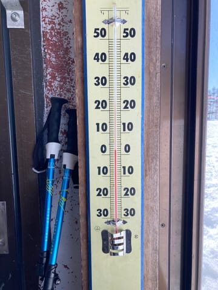

昼ごろにはちょっとしっとりした

雪になってきたみたいです…

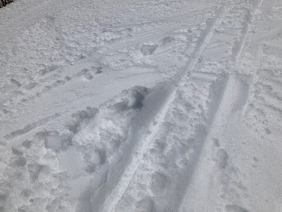

GSコースなんかは雪が緩んできて

ちょっと荒れたものの．

人が少ないのでそこまで凸凹にならず．

うーん．春雪でも，これだけ晴れてて

フラットなら，楽しめそう…！

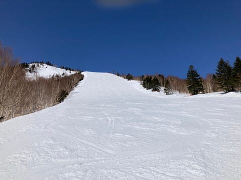

GSコースの一番荒れる部分，

突き当りを右に曲がるあたりの荒れも

この程度で．

下地までザブザブになってないようで，

そこまでひどく荒れずに済んでるように

見えますね…

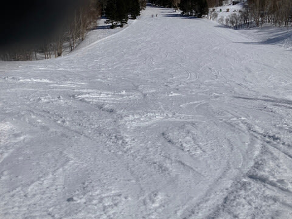

とりあえず，今日もいい感じで楽しめる，

晴天ガラガラフラットバーンの

焼額山だったみたいです…！！

…しかし．

平日に滑れる特派員がうらやましすぎる…

ってなことで，この好天が週末まで続けば

いいんですが．

この土日の天気は，

15日(土)；朝は晴れ！気温は-5℃以下くらい．

　朝イチは硬めのシマシマ．

　日が当たらないバーンは午前遅くまで

　硬いまま，日が当たるバーンは午前

　早くから緩むけど，午前中は滑りいいかな．

　昼間はプラス気温まで上がるので，

　日差しが強いバーンは雪が緩んで

　午後は荒れていく．

　午後はちょっと雲が増えていくか？

　夕方～夜のどこかのタイミングで雪が

　降り始める

16日(日)：朝は雪降り．かなり湿った

　重い雪が前日から5-10cmくらい積もる．

　朝イチの気温は-2℃くらい？

　ただ，強烈な南風が吹き，営業できない

　ゴンドラやリフトが多発しそう…

　昼過ぎには標高が低いところは

　雨に変わるかも．

　運が良ければリフト営業終了に近い

　ところまで雪のままもってくれるか

　もしれないけど…

　雪になってくれても，ゴーグルに

　張り付き，ウエアが濡れていくような

　雪になりそう．

　そもそも強風で，どの程度のリフトが

　営業してくれるのか…？

　

といった感じで．

日曜は試練の日になりそうな予感…(泣)

ってなことで．

ここから話題は変わって．

焼額山のこの春の早朝営業の案内が

出てました～！！

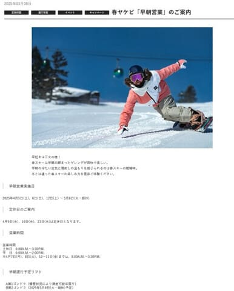

（[焼額山スキー場ホームページ](https://www.princehotels.co.jp/ski/shiga/informations/early_morning_skiing/)より，以下同じ）

ざっくりと見てみると…

早朝営業開始は，例年通り4月第1週の

週末からスタートで．

今年は4/5(土)からです！

それも，2週目の4/12以降は，GWまで

平日も毎日早朝営業があるようです！！

…ただ，4月に入ると，水曜はGWを除いて

定休日になるのでご注意を！！

あ，営業開始は去年と変わらず，

6時スタートです！！

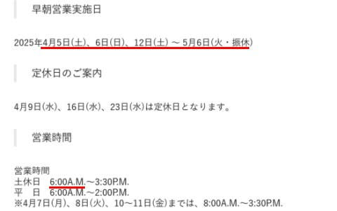

そして…

早朝営業は，第1ゴンドラと第2ゴンドラの

2本とも営業してくれるようです！！！

…まぁ，第1ゴンドラは雪がある限りという

ことなので，GW前に息絶える可能性も

ありますが…

何にしろ，雪がある限りゴンドラ2本

早朝から運転してくれるのはすごい！！！

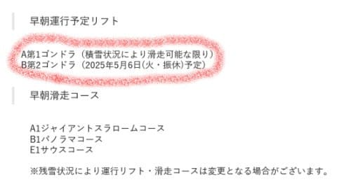

で．

使えるリフト券も去年と変わらず．

焼額限定券なら時間券でも日数券でも

シーズン券でも滑れます！！

…全山券は使えないので，全山1日券や

日数券，全然シーズン券の人は，

早朝2時間券を4000円で買わねば

なりませんが…

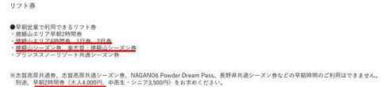

まぁ，早朝を9日以上滑るなら，

[焼額山のセカンドシーズン券](e016a0fce93dccca58b9b11e2fbd74036.md)を買うのが

お得ですね…

[このサイト](https://jp.wamazing.com/snow/languages.html?source=eWFrZWJpdGFpeWFtYQ==)から購入できますが．

大人33000円，中高生・シニア28500円です！！

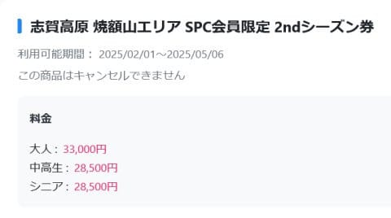

（[Wamazingサイト](https://jp.wamazing.com/snow/languages.html?source=eWFrZWJpdGFpeWFtYQ==)より）

ということで．

私はこのためにセカンドシーズン券を買って

しまったので．

今シーズンもガンガン早朝を滑りますよ～！！

ってなことで．

また今週末もいつも通り志賀に行きますが．

これから3時間半後に出発です～！！

…いつも通り，3時間以下しか寝れないんだけど…(泣)
