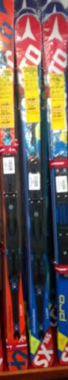
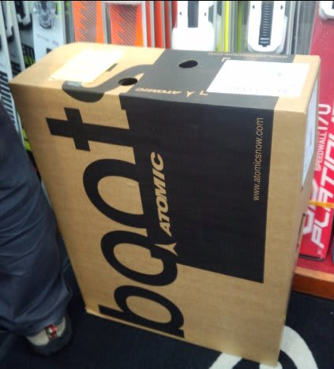
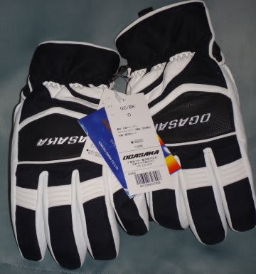

# まだ続く，第5回物欲選手権！その3

📅 投稿日時: 2015-11-13 01:06:00

「あれ…？前回で終わりじゃなかったの？」

と思う人が多いかもしれませんが．

実はまだ，終わっていないんですね～．

なぜかまだ，物欲選手権，続きます…

-----

アナウンサー　「というわけで，Skier_S選手，

　今回もブーツという大物にやられてしまい，

　完敗という結果となりました！」

解説　「…ん？ちょっと待ってください」

アナウンサー　「なんでしょうか…？

　…

　…あれ？

　なんだか…Skier_S選手．

　店員さんにまだ何か言われている様子ですよ…？」

解説　「えー…

　どうやら，ブーツとセットで板を買うと，

　さらに安くすると言われているようですよ」

アナウンサー　「うーむ．…これは…これは，かなり

　危険な展開じゃないでしょうか！」

解説　「…もうすでに負けが決定している

　Skier_S選手に，いまさら危険も

　へったくれもないと思うんですけど…」

アナウンサー　「Skier_S選手，またなんだか

　驚いてますよ！」

解説　「…あー，Skier_S選手，もうヘタリまくった

　古いATOMICのSXを持っているわけですけど．

　新しいSXをビンディング無しで買って，

　古い板からビンディングを載せ替えれば安くすむ，

　と言われたようですね」

アナウンサー　「なるほど．それで，ビンディング無し，ブーツ同時購入で

　かなり安い価格が提示されたことに驚いているわけですね…！」

解説　「それもありますが…他の店では，ATOMICのSXはビンディング

　セットのみで，板単体の購入を断られていたところ，

　このお店では，板単体で購入できるってことにも

　驚いているようなんですが…あぁ…これは…」

アナウンサー　「あー．これは…」

解説　「これはもう，ダメですね…」

アナウンサー　「あー．ダメです．

　Skier_S選手，ダメダメです！

　行っちゃいました…っ！

　もう，ブーツだけでなく，板までも購入してしまいました…っ！

　驚くべき意志の弱さですっ！！！」

解説　「どうやら彼は，我慢という概念を，

　完全にどこかに置き忘れてきてしまったようですね…」

アナウンサー　「ということで，何も買わない様子見のつもりが．

　まさか，まさかのブーツ＆板同時購入という，

　想定外の大敗となった，今回の第5回選手権でしたが．

　板尾さん，いかがでした？」

解説　「…ある意味，想定の範囲内かと…」

アナウンサー　「ということで，神田からお別れ…」

解説　「…あれ？…ちょっと待ってください」

アナウンサー　「どうしました？」

解説　「…いや，買い物が終わったはずなのに，

　Skier_S選手，今度はスキーウェアの店に寄ってますよ？」

アナウンサー　「あれ？」

解説　「え？」

アナウンサー　「なんだか…

　なぜか，スキーウェアのジャケットを

　買っちゃってるみたいですが…」

解説　「…買っちゃってますね…」

アナウンサー　「確か，彼のウェアのジャケットは，

　日に焼けてかなり色あせてきたものの，4シーズン目の

　今シーズンまでもたせる予定だったはずなのですが…」

解説　「…どうやら，ビンディング無しで予想より

　3万円以上安く板を買えた，ということに気を良くして，

　ウェアまで行っちゃったみたいですね…」

アナウンサー　「でも…予定外のブーツ買ってますよね…」

解説　「…」

アナウンサー　「これは，我々の予想をはるかに超える

　負けっぷりですね…」

解説　「まぁ，型落ちで2万円という，破格の安い

　ジャケットとはいえ…

　Skier_S選手の意志の弱さは天下一品と

　思っていましたが．

　まさか，ここまで弱いとは…」

アナウンサー　「ということで．

　第5回 スキーヤーの物欲を刺激する街神田に来て，

　物欲にまみれたスキーヤーが買い物をせずに

　我慢できるか選手権ですが．

　Skier_S選手，期待を裏切らないどころか，

　スキー，ブーツ，ウェアのコンボという，

　はるかに想定を超える，見事な負けっぷりを見せて

　くれたところで，

　このあたりでお別れとしたいと思います．

　解説は，本日も板尾買蔵さんでした．

　では，また第6回でお会いしましょう！」

解説　「…彼，また別の店で，グローブも買ってる

　みたいですが…」

アナウンサー　「もう付き合いきれません．では，ごきげんよう！」

----

ということで．

なんだか．

物欲に負けて．

いろいろ買ってしまった…

さすがの私も，板とブーツをウェアのすべてを1シーズンで

買ったのは，初めてかもしれない…

## 💬 コメント一覧

### 💬 コメント by (マルハバ)
**タイトル**: 雪崩的大敗・・
**投稿日**: 2015-11-13 10:06:21

オメデトウございます♪（爆）

実は私も先月、価格調査のために訪れた

同店（アウトレットの方ですが）で

お目当ての板の隣にそれより2万数千円も安い

掘り出し物を発見してしまい

思わずとびついてしまいました・・

4月の小回りスペシャルに続いて

半年も経たないうちに

大回りスペシャルも買ってしまうとは・・

こちらも大敗であります

物欲バンザイ（お手上げ）でございます♪（汗）

### 💬 コメント by (れお)
**タイトル**: 完敗じゃないですか!!(笑)
**投稿日**: 2015-11-13 14:21:07

でも、すがすがしい負けっぷりです!!

ただ、ここで負けておけば、シーズンのスキー滑走での勝利は間違い無しですよ～。

私も、'13SXからVARビン持ってきて、'15SXに付けちゃおうかな～。

'15SXは扱いやすいんですけど、ちょっと硬さとかが物足りないですよね。Sさんのレポートみると、VARにすると良くなるような感じですし…。

### 💬 コメント by (KENKEN)
**タイトル**: ブーツも
**投稿日**: 2015-11-13 21:53:44

いっちゃおうかな？（嫁に黙って。）

来週仕事帰りに同店(アウトレット)寄ってみます。

来月のカード請求額が怖いです。

今回も物欲選手権抱腹絶倒モノでした。

是非来年もお願いします。

### 💬 コメント by (いか)
**タイトル**: Unknown
**投稿日**: 2015-11-13 22:00:28

おめでとうございますー！

そこで買ったわたしのAXはなぜか13-14の板に14-15のVARがつくという謎仕様になっております…笑

あとはヘルメットとゴーグル、ストックでしょうか…

### 💬 コメント by (Skier_S)
**タイトル**: 完敗でした…
**投稿日**: 2015-11-14 03:54:12

＞マルハバさま

あら？1年で板2セットお買い上げですか！

物欲選手権，完敗ですね…（笑）．

では，ぜひブーツも…（＾＾；

＞れおさま

素晴らしい負けっぷりでした．

もう，ここまで買ったんだから，もうグローブも行っとけ！

って感じでした（笑）．

'13SX気に入ってるなら，'15SXのVARビンディングが一番いいかと．

＞KENKENさま

ぜひ，ブーツも行ってしまって，

ともに物欲仲間になりましょう！

…でも．

お財布に厳しいので，

もうしばらく次の選手権はやりたくないかも（笑）．

＞いかさま

ええ？？

なぜ，'14の板に'15のビンディングが？？？

謎仕様ですね…たしかに．

ちなみに，私はヘルメットは被らない人なので…

次はパンツとCW-Xです（もはや意味不明）

