# 2025/2/9(日)の志賀高原焼額山スキー場は…一日雪降りだけど，昨日より穏やかな天気でいい感じ！でも日曜にしては人が多め

📅 投稿日時: 2025-02-09 23:26:55

ということで．

今日も志賀高原を滑ってました～！！

まず．

昨晩から雪が降り続けていて，本日の朝は…

中野の街中で20cmくらい積もっていた

感じですかね…

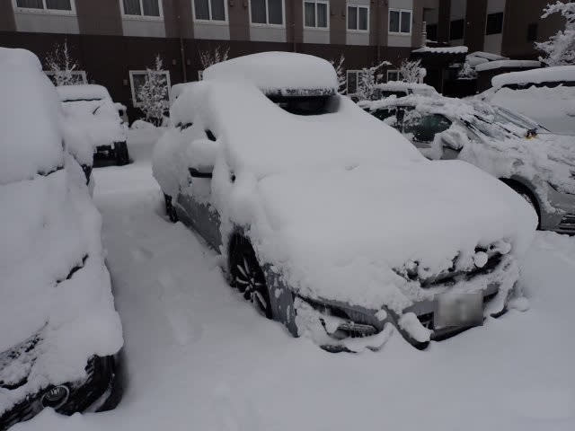

志賀高原に登っていく途中，雪は中野市街より

強い降りで…

道路もかなりの本格雪道で，中野市街より

かなり積もってますね…！

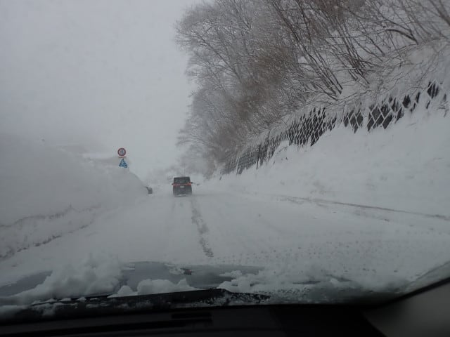

で．

朝8時前に志賀高原に到着したけど…

なぜか焼額の第2ゴンドラの駐車場がすでに

満車．

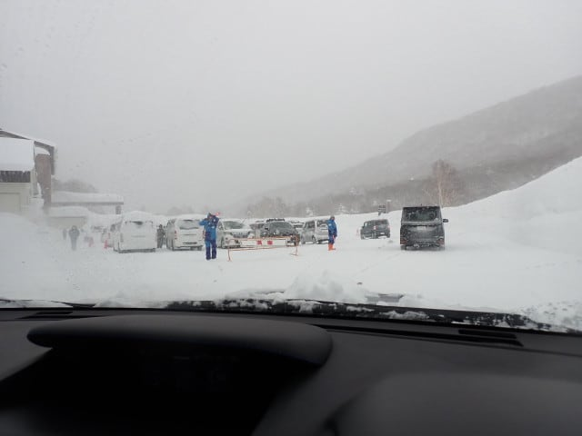

そして，いつもの焼額第1ゴンドラの駐車場に

到着すると…

除雪が間に合ってなくて，いつもの半分ちょっと

くらいしかあいてなかったので．

8時過ぎには駐車場が満車になり，

かなり長い駐車場待ちがあったようです…

私は幸いぎりぎり満車直前に間に合いましたが，

昨晩から止まっている車を見ると，

50cm以上は余裕で積もっていた感じ…

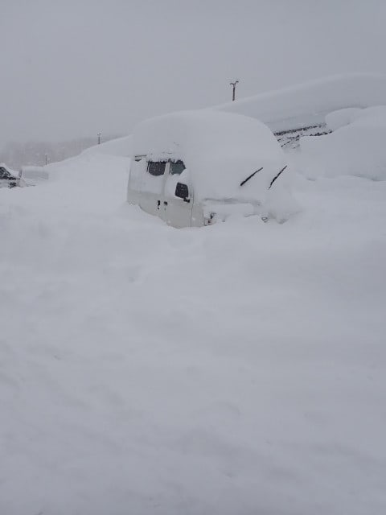

で．

今日の焼額第1ゴンドラ．

8時半の営業開始にはコース整備が

間に合わず，8時50分のオープンだったので．

開始が遅れたぶん，列はかなり長くなって

ました…

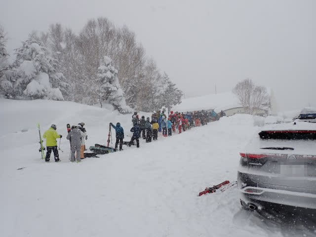

ちなみに，奥志賀も開始は多少遅れ，

一ノ瀬方面はオープンが9時以降に

なったようなので．焼額オープンの

20分遅れはまだマシだったようですが…

とりあえず，営業開始直後のゴンドラで

山頂に行くと…

山頂の温度は-12℃ちょいで，

-12℃～13℃の予想にぴったり！！！

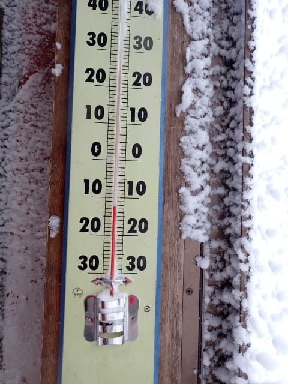

で．山頂の天気は…やっぱり雪降りで

スタートで．

昨晩からの積雪が50cmを越えるレベル

だったので，圧雪コースも圧雪後の雪降りで，

新雪がかなり積もっています…

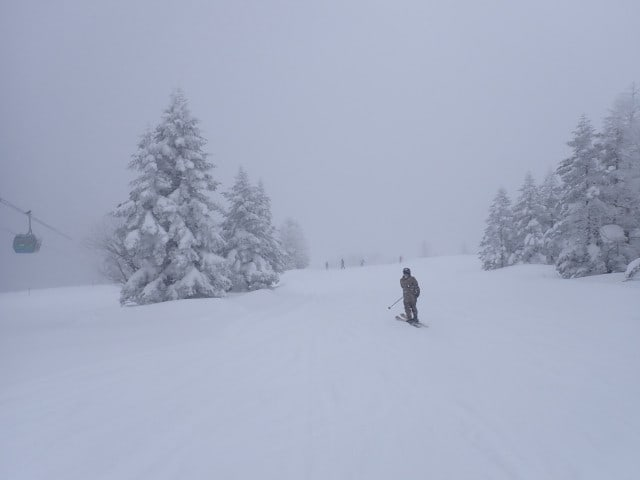

もう，圧雪バーンでもこんな感じ！！

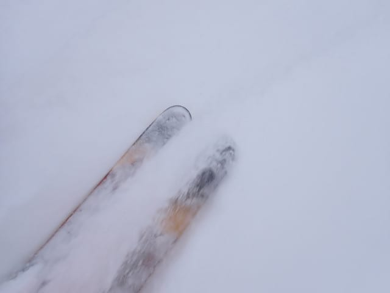

ちょっとコース脇にずれるだけで，

もうパフパフパウダーですね…

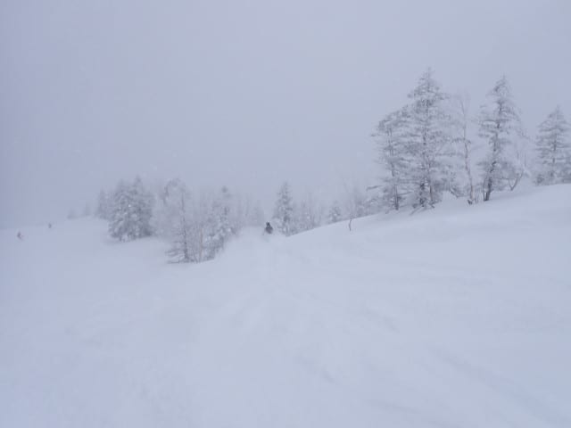

とりあえず，こういう日は夕方圧雪で，

先日からの50cm越えの新雪がつもった

オリンピックコースへGo！

…この写真だとどのくらいの積雪か

わかりにくいですが…

一応太ももパフのパウダー！！

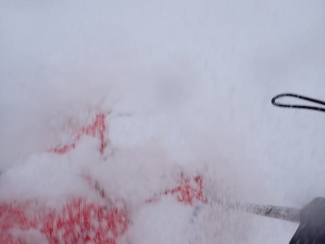

雪は昨日と同じで，ちょいと重めで，

緩斜面だと勢いをつけないと止まる感じの

雪でしたが…

でも，腰パフ！！

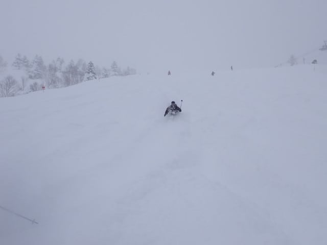

パフパフパウダー！！

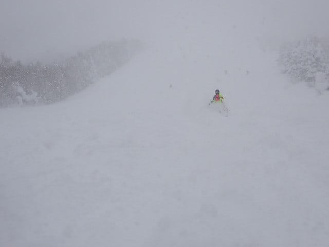

パフパフパウダーですよ！！

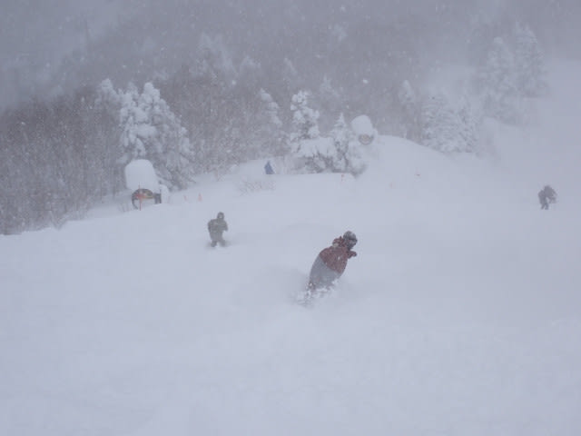

…でも．

パフパフパウダーだったのは

2－3本くらい…

3本も滑ると，人も増えてきて．

ほとんどパウダーは終わってしまい

ました…（涙）

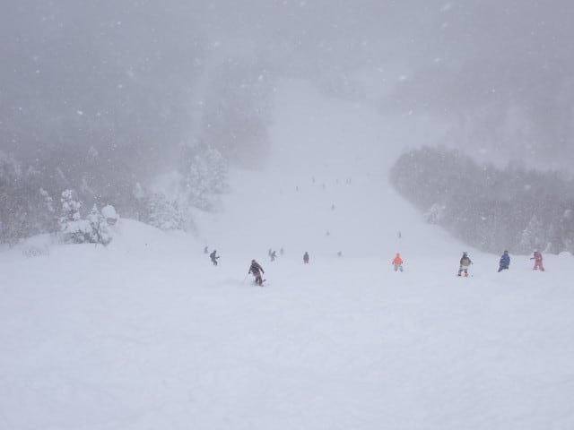

ただ．

雪は結構強めに降っているものの…

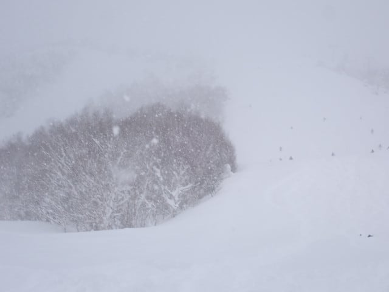

昨日よりは雪の降りは弱く，空も

明るめで．風もよわかったので…

昨日ほどの，根性のないスキーヤー

ふるい落とし状態ではなかったですが．

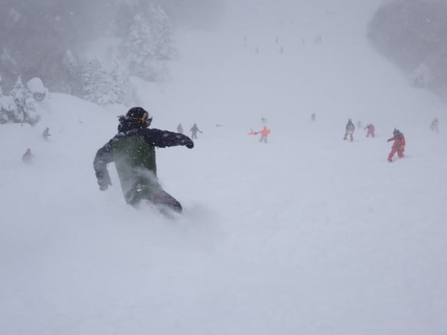

でも，

逆にバーンの人は昨日より多くて…

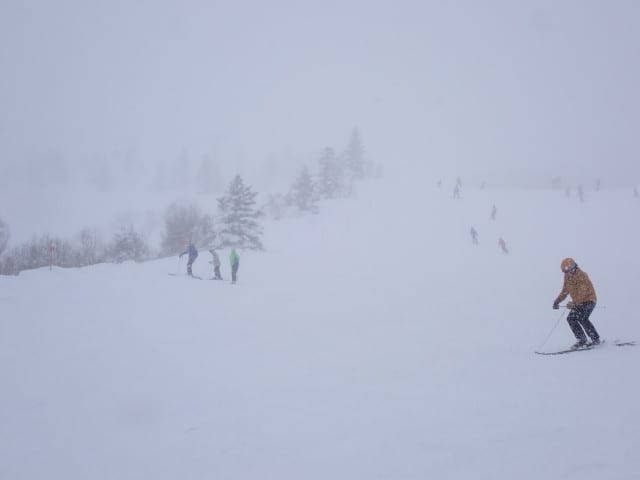

10時過ぎのゴンドラ待ちはこの程度で

5分待ちを越えて．

昨日より混みましたね…

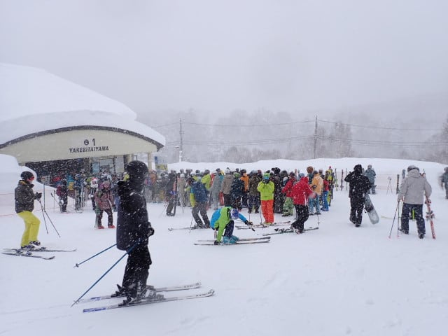

バーンの人も全体的にこんな感じで多め

ではあったものの．

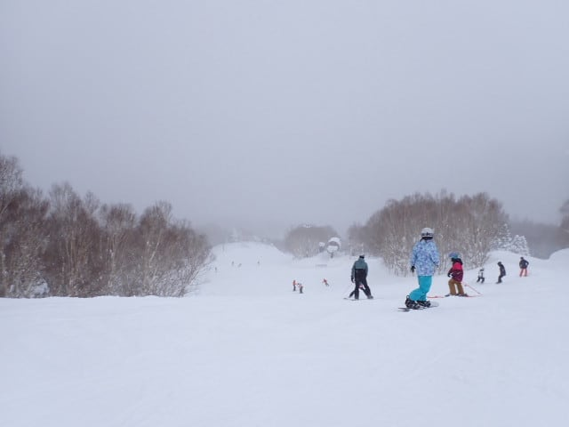

でも，ゴンドラ待ちのピークは30分程度で．

11時を過ぎるとゲートの外まで出るかどうかの

混雑に納まり，昼過ぎにはこの程度まで減りました…

でも，午後はゲートの前後まで人がいて，

いつもの日曜よりは人が多かったかな．

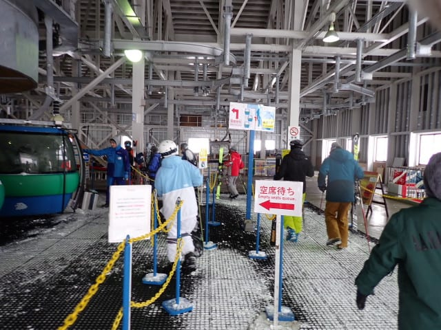

で．

この日の天気は雪が降ったりやんだりで，

時折視界が悪くなることがあるものの，

昨日よりはましな天気で…

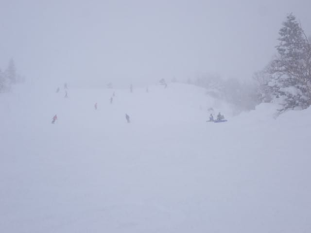

昼間も雪が降り続けたものの，昨日みたいな

エンドレスパウダー供給デーみたいに，

圧雪バーンが新雪モサモサになるほど積もる

ことはなく．

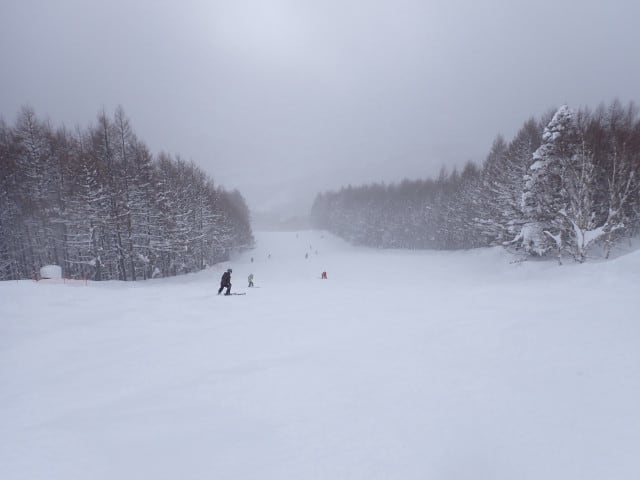

パノラマコースやサウスコースなどの

圧雪バーンは，午後はしっかり踏まれて

滑りやすくなり．

昨日みたいにひどいボコボコになることは

なくて．

GSコースはちょいとボコボコになったものの，

パノラマやサウス，唐松は午後になっても

意外と滑りやすかったですよ～！！

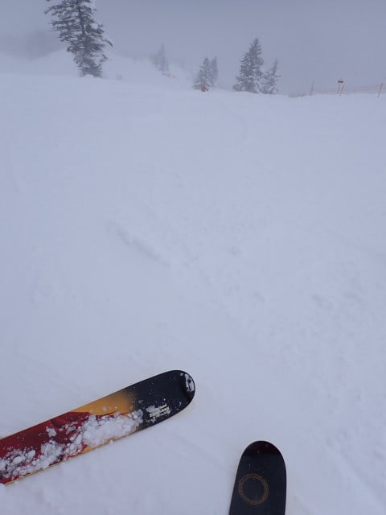

午後になっても，バーンの人口密度は

飛び石4連休なだけあって，普通の日曜の

午後よりは」多かったものの…

リフトは午後になっても全然ガラガラだし．

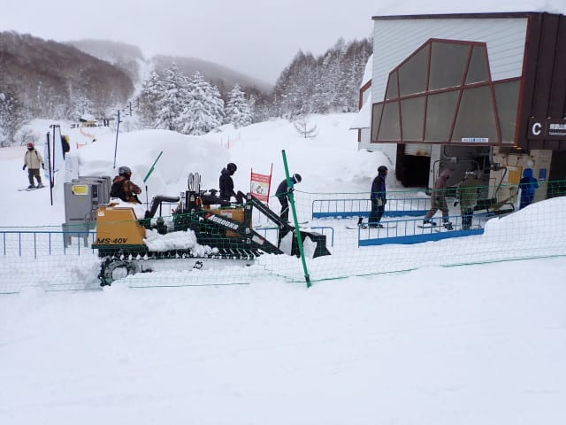

今日は，午後の圧雪バーンは結構楽しめ

ましたよ～！！

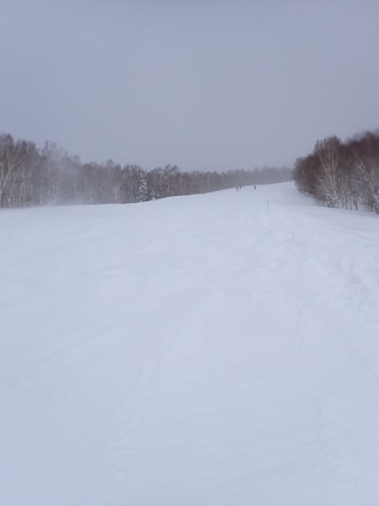

ってなことで．

今日の午後はちょっと雪が強く降り，

視界が悪くなるタイミングもあったり

したけど．

まぁ，昨日ほどひどい降りになることもなく，

バーンがあれあれになることもなかったし．

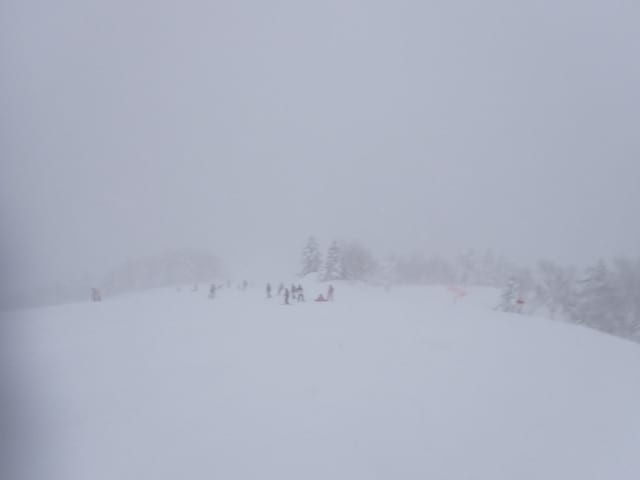

今日はいつも通りの4時15分まで営業して

くれたので，いつも通りのラストリフトまで

滑り倒したのでした…

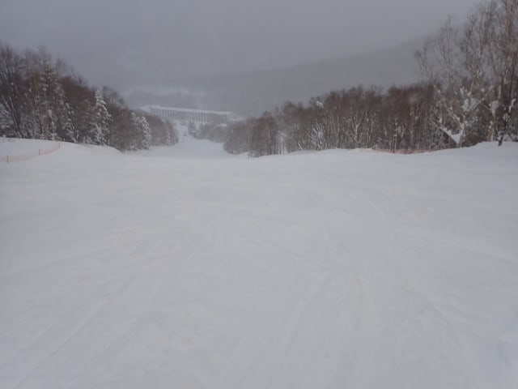

ということで．

今日は帰宅日恒例の速報モードじゃ

なかったことでお気づきと思いますが．

今日は帰宅しておらず，志賀に滞在中です～！！

明日も志賀高原で滑ってます～！！

## 💬 コメント一覧

### 💬 コメント by (地元民)
**タイトル**: Unknown
**投稿日**: 2025-02-10 06:49:48

あそこに宿泊されてらしたんですね。

すぐ近くじゃんか🤣←心の声

### 💬 コメント by (アルセウス)
**タイトル**: Unknown
**投稿日**: 2025-02-10 07:16:08

いつも見てます

すごい気力ですよね

仕事しながら志賀高原に行く気力に圧倒されます

### 💬 コメント by (SSSスキークラブ中村)
**タイトル**: Unknown
**投稿日**: 2025-02-10 17:20:13

毎回楽しく読んでます。志賀は60年位毎年行ってましたのでコースがよくわかるので楽しいです。若い時は朝から夜まで同じようなことをしてました。今は年に２回程度乗るだけです。（85歳なので）どうか体に気をつけて楽しい報告を、あまり無理をしないでください。

### 💬 コメント by (副院長)
**タイトル**: Unknown
**投稿日**: 2025-02-10 19:10:21

手を振りましたが、深緑のウエアーだったので、誰だ？とおもわれたようで。追いかけましたが、追いつけませんでした。😞

### 💬 コメント by (アツシ)
**タイトル**: Unknown
**投稿日**: 2025-02-10 19:53:49

泊まりはここだったんですね。私の定宿じゃないですか！ただ、この土曜日だけ予約取れず、違うところに泊まってました。日月と、ここに連泊してます。

ていうか、すれ違いも甚だしいですね。お互い3日間、焼額を一歩も出ず、1ゴンを中心に、休憩も取らず滑り続けて、一回も会わないって❗️

### 💬 コメント by (Skier_S)
**タイトル**: 久々平日スキーしてきました！
**投稿日**: 2025-02-10 21:22:15

＞地元民さま

この写真だけでどこかわかるんですね…

そうです．

ここしばらくはここに泊まることが多いです…

＞アルセウスさま

仕事しながら志賀に行くというより，志賀に行かないと

仕事する気力がわかないんです…(笑)．

だた，確かに肉体的には結構きついかも．

＞SSSスキークラブ中村さま

コメントありがとうございます～！

60年も志賀に通われてたんですか！！すごいですね…

85歳にして志賀を滑ってらっしゃるのがさらにすごい！！

ぜひこれからもスキーを続けてください…！！

＞副院長さま

あ，手を振っている方がいるな，と認識はしていたのですが，

私に振ってるのかどうか自信が持てず…

ウェアが変わるとわかりにくいですよね…

＞アツシさま

土曜は泊りはそこだったんですよ…

ただ，日・月は知り合いの家に泊めてもらってます…

見事に行き違いですね(笑)

### 💬 コメント by (RYO)
**タイトル**: Unknown
**投稿日**: 2025-02-11 02:27:32

ステッカー、どうもありがとうございました！

いつも楽しく読ませていただいていましたので、お話しできてうれしかったです

まだまだお聞きしたいことがありますので、ぜひまた見つけさせていただきたいと思います（笑）

### 💬 コメント by (Skier_S)
**タイトル**: こちらのコメント回答遅れました…
**投稿日**: 2025-02-13 00:49:14

＞RYOさま

余りゆっくりお話しできませんでしたが，声をかけていたいてありがとうございます…

またどこかで見かけたら声をかけてください！

