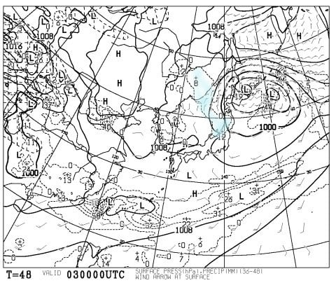
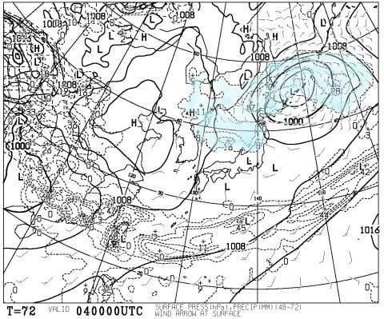

# うーむ．今週末の月山は雨＆ガスっぽい…今週末のスキーは休みだな（涙）

📅 投稿日時: 2017-06-02 00:59:47

ということで．

かぐらも渋峠も営業が終わってしまい．

リフトで滑れるのは，残るは月山のみ…

という状況になってしまった，今週末ですが．

3日，土曜の地上天気図を見てみると…

はぅぅ？？

…見事に．

見事に東北地方を狙ったかのように，水色の

降水域が掛かってます（涙）．

これは…

ダメっぽい．

土曜の月山は，朝から雨．

終日ガスに襲われそう…

そして．

4日，日曜の天気図を見ると．

うぎゃーーーっ！！

水色の降水域，広がってるよ…（泣）．

ダメだ…

ダメです．

日曜の月山は，午後に向かっては回復傾向ではあるものの．

朝は雨が残り．

午前中はガスに覆われそう…

ということで．

おそらく．

この週末の月山．

とても楽しいと言えない天気になりそうな予感…（涙）

…ということで．

今週末は，久しぶりにスキーに行かない週末に決めました．

ええ．

決めました．

志賀高原に行くときの倍近い高い交通費と，

1.5倍以上の運転時間をかけて，

わざわざガスと雨で苦しんでくる…というような．

そういうマゾヒスティックな趣味は私には無いはず

ということで．

行かないことに決めましたよ…

そうです．

行かないことにしました←自分に何度も言い聞かせている

しかし．

実に…

実に久しぶりの，スキーに行かない週末です．

妻と娘が揃って風邪をひいてしまった，

11月19日の週末以来なので．

実に半年以上ぶりの，スキーに行かない週末ですね．

…はたして．

禁断症状に耐えられるのかな…？？

## 💬 コメント一覧

### 💬 コメント by (komu)
**タイトル**: 月山
**投稿日**: 2017-06-04 07:08:39

金曜土曜で月山行って来ました。

金曜は朝からしっかりと雨…

カッパ着てリフト乗り場まで登りましたが強風でリフト運休…

その日は玉コンつまみにビール呑んだくれました。

土曜は雨は弱いものの風が強目。リフトは通常営業。板履いたままで滑れるし、フラットバーンが多くて小回り楽しい。しかし午後になると雨が強くなり、多分山頂は氷点下となり、雨が凍ったモノが降り出し、挙げ句の果てにはリフト停止…

エス殿の予報見事にアタリでした。

消化不良ですがこれで今シーズン終わりです。

いろいろお世話になりました。ては、また10月のイエティで会いしましょう。

### 💬 コメント by (Skier_S)
**タイトル**: komuさま
**投稿日**: 2017-06-04 09:14:30

月山まで行ってきましたか…！！

土曜は雨が降るだけじゃなく，かなり

冷えそうだなぁ…

前線通過時は風も強まりそうだなぁ…

と思ってましたが．

かなり悲惨な天気だったのですね．

行かなくて良かった…

でも，ガラガラだったんじゃなかったですか？

月山はまだまだ滑れますよ～！

これでシーズン終了とせず，

もう一度くらい，いかが？

