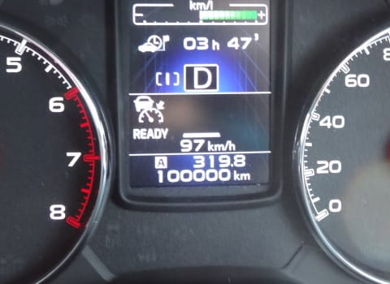
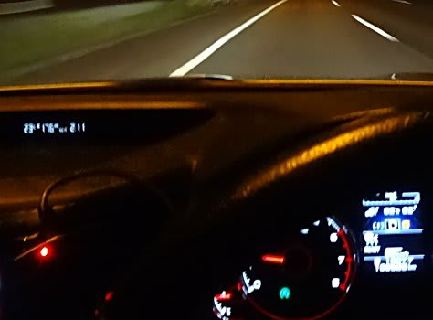

# BRレガシィ君，やっと10万km突破っ！！

📅 投稿日時: 2016-08-15 01:09:25

ということで．

[1回目の車検](e0d9f436b430d412c9b9a303445077c66.md)までに10万km超えるなぁ…

と，思っていたわがBRレガシィ君ですが．

この週末に，やっと10万kmを超えましたよ～！

うむ．

10万km走るのに，3年と2か月かかりましたな…．

しかし．

我がBRレガシィ君．

相変わらず無故障で，絶好調ですよ～！

この写真…

左側の燃費計，リッター17.6kmを指していて．

そして，トリップメーターは1000kmを超えてるんですが…

＃1027.7kmを指してるけど…ちょいとわかりにくいですね

とりあえず．

お盆の渋滞に多少巻き込まれながらも．

高速主体なら，燃費重視の走りでリッター18km近く走り，

フルタンク65リッター，無給油で1000km以上行けるという…

＃高速でスピードを80km～90kmに押さえて

＃気合のエコランすると，リッター19km行きます

排気量2.5Lのワゴン車．

それも4WDと考えると…

いや．

十分満足できる燃費かな～．

＃レギュラーガソリンなので，お財布にも優しい

そして．

気のせいでなければ．

10万km走って，ブッシュがヘタってきたからか…

なんだか，新車の時よりゴツゴツ感が減って．

乗り心地がだんだん良くなってきた気がするのは，

気のせいかな？？

ってなわけで．

10万kmで買い替えかな…？

と思っていた，BRレガシィ君ですが．

かなり快調なので．

少なくとももう1シーズンは付き合ってもらいましょうか…

＃あくまでBRレガシィ君が気に入ったからであり，

＃引っ越しやら何やらで車を買い替えるお金がないからというわけでは無い！

＃…と，自分に言い聞かせておく

## 💬 コメント一覧

### 💬 コメント by (まいる)
**タイトル**: 10万kmですかぁ
**投稿日**: 2016-08-17 15:40:46

かなり御無沙汰してます。

もう10万kmですかぁ、スキーでかなり距離を稼ぎましたね。私のアウトバックは、4万kmになりました。燃費は、15くらいでSさんのレガシィほどではないですが。

引っ越しされてから仕事がたいへんそうですね。体調に気を付けてください。

### 💬 コメント by (Skier_S)
**タイトル**: まいるさま
**投稿日**: 2016-08-18 22:14:08

コメント返信遅くなりました…

現在モアルボアルのホテルです．

そちらは4万kmですか～

まだまだ大丈夫ですね！

10万km超えても，全然元気に走りますよ～！

＃うちの車が実証済み

新しい職場は大変ですが…

スキーシーズンまでには一区切り

ついて，ちょっと楽になるのでは，

と期待しています．

