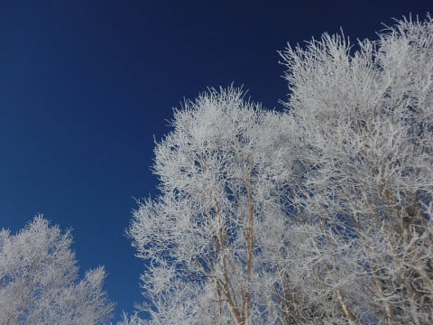
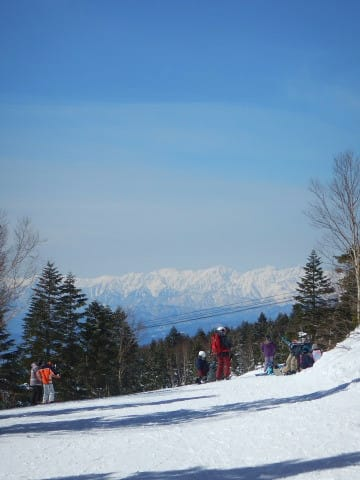
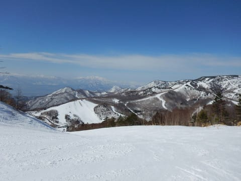
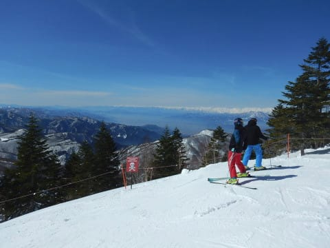
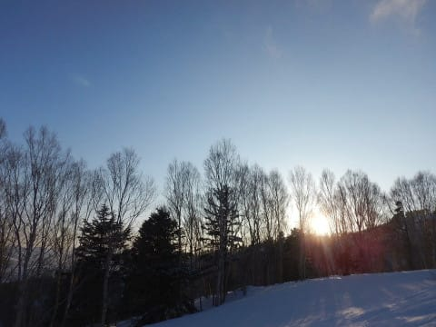
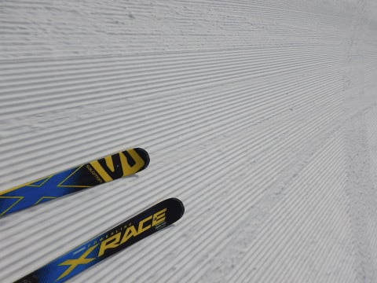
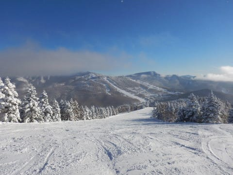
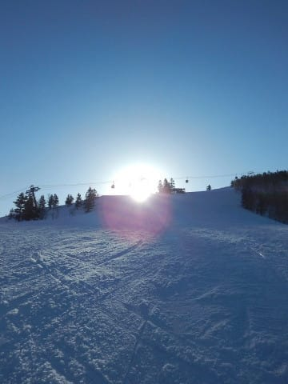
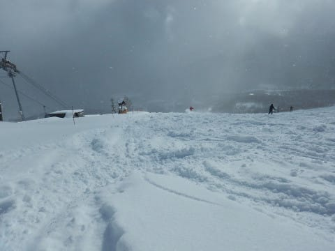
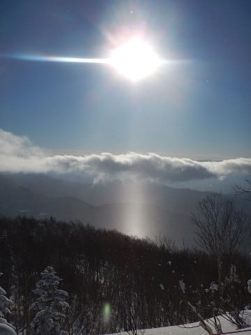

# 2018シーズンを終えて…シーズンの総括

📅 投稿日時: 2018-06-29 01:14:26

🏷️ カテゴリ: [スキー雑談](c1f9d2cb7478308da16419928ea3945e9.md)

はいはいはいはい．

今シーズンも行きますよ～．

シーズン終了時の定番．

シーズンの総括記事です…

…あぁ…

こういうシーズンのまとめ記事を書いていると．

シーズンが終わったんだなぁ…

と，寂しくなってきますね～．

ホントにスキーシーズンが一年中続けば

いいのになぁ…←だから，間違いなく家計が破綻するし体壊すってば

では，今シーズンの総括です！

○シーズン滑走日数　68日

うーむ．

昨シーズンから2日減りましたか…

でも．

雪が多かった昨シーズンと比べて，2日しか

減ってないってのは，まぁ頑張ったのかも．

30時間フライトのあとそのままYetiに行ったり…

まぁ，いろいろ頑張った．

…とはいえ．GWに入ってからは．

ゲレンデコンディション，ひどかったなぁ…（涙）

○行ったスキー場

志賀　52日

Yeti　7日

アサマ2000　2日

かぐら　6日

月山　1日

もう，いつも通り偏ってますね（笑）

毎年恒例と化してきた，5か所のみですか…

志賀高原のシーズン前はYeti＆アサマ2000，

シーズン後はかぐら＆月山という，例年パターン．

でも．

今年はGW後半にまともに志賀で滑れなかったので．

かぐらを滑った日数が増えてますね～．

あと，Yetiが10月頭オープンだったので，

Yeti日数も増えてますね．

Yetiが10月頭オープンじゃなければ，

シーズン滑走日数が2-3日減ってましたか…

○ナイター滑走日数　20日

昨シーズンより1日減ってますね～．

うち，イエティナイターが4日．

残り16日が志賀のナイター．

志賀高原ナイターをさらに詳しく分けると，

焼額，3日

サンバレー，5日

一の瀬ファミリー，2日

一の瀬ダイヤモンド，6日

となります．

サンバレーがペアで営業だった一昨年までは，

ほとんどダイヤばっかり滑ってましたが．

サンバレーがクワッドリフトでナイター

営業になってから，志賀高原では

サンバレーナイターが一番面白いので．

今シーズンはサンバレーの率が

上がりましたね…

○早朝滑走日数　10日

ありゃりゃ？

今年はGWの早朝がほとんど滑れなかったのに，

去年の7日から増えてますよ…？？

と，思ったら．

そうか～！

去年は焼額，春営業やってなかったんだ…

今年は焼額が4月に入っても営業してくれたので．

3月11日の早朝開始以降，GWまでほぼ毎週

早朝に参加しましたから，増えたんですね～．

これでGW後半まで焼額の雪がもってくれれば，

あと3-4日は増えてたかも…

そして，

早朝からナイターまでぶっ続け

ってのも[一回だけやっちゃいました](e88a135f694d88ef49cb5ab33e5bcee51.md)…

○トータル滑走標高差　752700m

昨年は795kmだったので．

うーむ．40km以上減りましたね…

[Skilineロス](e74682e0742f8c28f0de1863a69f65139.md)のせいで．

20000mクラブな方々は．

今シーズン，軒並み滑走標高差が減ったのではないでしょうか…

'15…659km

'16…689km，

'17…795km，

'18…752km

ということで．

減ったとはいえ，それでも歴代2位の標高差なので．

春先に雪が無かったことを考えると，

割と滑った方かな～．

○一日滑走標高差20000m突破回数　3回

あれ？？

Skilineが無かったというのに．

今シーズン，3回も20000mを超えていたとは…っ！！

うち1回は，[友人と一緒の20000m超え](e88a135f694d88ef49cb5ab33e5bcee51.md)．

でも．

全てナイター含みなので…

未だに昼間のみで20000mは超えてません（笑）

○自動車走行距離　約26000km　

まぁ，よく走りましたね…

○転倒回数　4回

[昨日の記事](e79d753ffc5e20ae5b20a77c793786bf9.md)で描きましたが．

自損転倒1回

誤開放転倒2回，

情けない転倒1回（涙）の，計4回．

昨年の2回から，倍増です（涙）

それも，超久しぶりに，板を外すような転倒も…

とはいえ．

シーズン68日滑ることを考えれば．

少ないほうかな．

うん．

きっと，少ないほうだと思う…

○かかったお金

…Priceless．

いや，今シーズンも計算してみたけど…

現実として認めがたい金額です（涙）

でも．お金に代えがたい何かを得ている

ということで．

正当な出費と認めます！！

…そもそも，

「寝たい，食べたい，滑りたい」は，

人間の3大欲求ですから．←何か違ってないか？

これをやめると，生存が脅かされるので…

もう，生きるためのやむなしの出費です．

…もしかすると．

プロジェクトX2の費用も．

ほとんどスキーのための出費のような気もするので．

これもスキー費用と考えると…

…

…うぎゃーーー！！！

…ってことで．

7か月半に渡った，2018シーズン．

これにて終了です…（涙）

　

　

　

　

　

　

## 💬 コメント一覧

### 💬 コメント by (michi)
**タイトル**: Unknown
**投稿日**: 2018-06-29 10:36:18

レヴォーグ購入おめでとうございます🎉

あまりに速い決断にビックリ。

2.0は羨ましいです。

昨シーズンはお世話になりました。

知り合いも増え、ゴンドラ内の会話も楽しいし、集団爆走も楽しいので気付けば毎週末志賀高原に行ってました（笑）

お気楽スキーヤーだった私がいつのまにか早朝からラスリフまで滑るようになり、スキーライフが変わりましたね。

息子もSさんの娘さんや他の子供たちと一緒に滑るのが楽しいようです。

また来シーズンもよろしくお願いします🙇‍♂️

### 💬 コメント by (olaf2125)
**タイトル**: Unknown
**投稿日**: 2018-06-29 13:03:00

なんだかもう梅雨明けしたようですね。

この分だと9月ぐらいに来シーズン始まるんじゃないですか？ (^^)

### 💬 コメント by (山ノ内の小林です)
**タイトル**: レガシーのキャリア
**投稿日**: 2018-06-29 17:40:59

ご無沙汰しております。

レガシーのベースキャリアですが

どこのメーカーをお使いですか？

冬はキャリアは使いませんが、夏の間はキャリアをつけてカヤックを積みたいのでキャリアの購入を検討しております。

よろしくお願いいたします。

### 💬 コメント by (838)
**タイトル**: Unknown
**投稿日**: 2018-06-29 17:55:02

はじめまして。

いつも、楽しく、そしてとても参考にさせて頂いて拝見しております。私も奈良からはるばる志賀高原まで冬中何度も行くのですが、記載された様々な数字に遠く及びません。今シーズンは、二度ほど、軽快に焼額を滑り降りられるskierS様であろう姿をお見かけして、ひとりうれしく思ったりしました。あと7月、8月、9月、10月、11月、志賀高原に雪が降るにはしばらくかかりますが、早期スキーを楽しまれる記事を見ながら待ちたいと思います。私もさすがに19万乗ったエクストレイルでは、志賀高原に行くのが不安になり、来シーズンまでには、レヴォーグかXVに乗り換えたいと考えております。また、納車記事等楽しみにしています。それにしても楽しいブログです。

### 💬 コメント by (Goku)
**タイトル**: お疲れさまでした～
**投稿日**: 2018-06-29 19:37:20

2017/18シーズンお疲れ様でした。

（がんばれば乗鞍って手もありますが・・・）

でも、あっと言う間に３ヵ月が過ぎ、Ｓさんの18/19シーズンが始まるんでしょうね。

そして来シーズンこそ、ＧＷ終了までヤケビが全面滑走できることを期待せずにいられません（気が早すぎ）

また志賀でお会いできる日を楽しみにしています。

### 💬 コメント by (しんちゃん)
**タイトル**: いい景色
**投稿日**: 2018-06-29 23:56:02

最後に掲載されている写真、どれもいい景色ですね。

美しい山々、シマシマバーン、ふかふか新雪等々。

そんな一瞬、一コマを記録していたＳ様は、滑り以外でもすごいなぁと感心しています。

深い青空とシマシマバーンの下、18/19シーズンに皆様と再びお会いできる日を楽しみにしております。

来シーズンはスタッドレスタイヤを更新しないといけない年です。色々大変だ。。。

### 💬 コメント by (Skier_S)
**タイトル**: 来シーズンが待ち遠しい…
**投稿日**: 2018-06-30 03:41:39

＞michiさま

いやー．

レヴォーグ買っちゃいました…

レヴォーグ仲間としてよろしくお願いします！

そして．

来シーズンもまた一緒に爆走お願いします～！

うちの娘も，みんなと一緒に滑るのが楽しくて

仕方がないようですので，また来シーズンも親子連れでご一緒させてください…

＞olaf2125さま

いや…

季節の進みが1か月くらい早まってる感じですね．

ホントに．

9月と言わず，8月くらいにシーズンが始まってほしいところです（笑）．

＞小林さま

BRレガシィのベースキャリアですが，

ルーフボックスがINNOなので，

INNOのシステムを使っています．

BRレガシィはルーフにベース取り付けポイントが

あるので，

ベースポイント台座

http://db.carmate.co.jp/matching/output/carrierimg/pdf/TR128_LegacyForester.pdf

ステー，

http://www.innoracks.com/jp/pdf/instructions/INXP-D01.pdf

バー　128cm（INB-128）

という組み合わせです．

今のところ，特に不満もなく使えています…

＞838さま

初コメントありがとうございます～！

ご愛読いただいているようで，ありがとうございます…

しかし，奈良からですか！

遠いですよね～！

ここの読者の某氏も，奈良ナンバーの車で志賀に来ていらっしゃる

方がいますが…

遠くから来られる方の話を聞くと，関東からの

300kmが近く感じちゃいますね．

来シーズンはスバル車購入ですか…！

高速を走るにはアイサイトも便利だし，

スバルの4WDは良くできてますよ～！

今度，志賀高原で見かけた際にはぜひ

お声がけください．

これからもご愛読よろしくお願いします～！

＞Gokuさま

いや，ホントに．

来シーズンこそ，GW最後までヤケビのGWコースの

早朝でかっ飛ばしたいものです…

また，志賀高原で…

というか，その前にオフシーズン中にもどこかで

お会いしたいですね（笑）．

今年は大蛇祭りがダイビング旅行と重なってしまったので，

大蛇祭りに合わせて志賀高原には行けなさそうですが，

夏の間に長野方面には遊びに行きたいと思っています．

またその際には連絡します～！

＞しんちゃんさま

おっと．

写真に言及していただきありがとうございます…

写真は私の趣味の一つだったので←一体いくつ趣味があるんだ…

今ではすっかりコンパクトカメラオンリーになっちゃいましたけど，

昔はカメラをぶら下げて風景写真を撮りまくっていた時期が

あったんです…

だもんで．

ついついいい景色があると，滑っている途中でも

写真を撮っちゃいます．

一番最後の写真とか，分かりにくいんですが．

雲の下，すごいきれいにサンピラーが立ってるんですよ．

これ，拡大すると．

雲の下のダイヤモンドダストが棒状に照らされて輝いている，

すごいきれいな写真なんですけど…

この大きさだと分からない（涙）

とりあえず．

今シーズンもいろいろお世話になりました．

また来シーズン，焼額でお会いしましょう！

