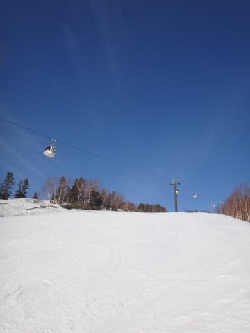
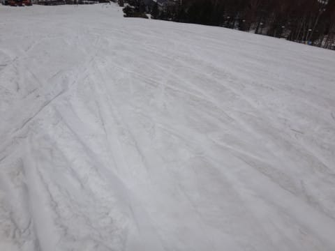
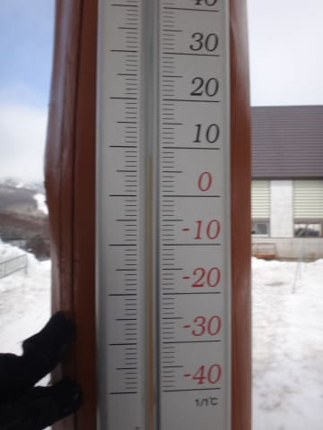

# ついに5連休ラスト！5月7日の志賀高原は…朝は晴天，午後はうっすらガス．人が全然いなくて寂しかったよ

📅 投稿日時: 2017-05-08 01:18:06

はいはいはいはい．

まだまだ続きますよ～，

志賀高原レポート．

読者の皆さんが飽きているだろうことを

全く考えることなく．

私が志賀高原で滑る限り続くのだ！！

…ということで．

本日は，奥志賀高原からスタートですが…

うむ？

このチケットは…？？

…どうやら，今日も知らぬうちに，

朝6時スタートの早朝スキーに

来てしまったようです…

朝6時のゴンドラ乗り場の気温は+2℃．

朝早くは氷点下まで落ちたようで．

ゲレンデの雪は…

うはははは！シマシマ！

そして…

かなりしっかり固まってますよ～！

今日の早朝朝イチは，

しっかり固いよ！

ちょいとピステンが荒いところも

あるけど…（涙）

硬い斜面でこんな感じだと，ちょいと

こわいけど…

でも．

まだまだ雪はたっぷりで．

第3高速ペア沿いも気持ちいいし．

普段ならGW最後の日，

雪を寄せてコースを残すゴンドラ乗り場に

降りていく3壁も，まだ雪は売るほど残ってます！

パークもまだ雪がいっぱいあって，

キッカーなんかのアイテムは，最終日まで

パーフェクト．全然いけます．

…ということで．

まだまだ雪がたっぷりある奥志賀高原．

営業が一週間伸びましたが…

月，火は第2高速ペアのみ，

水～金は第2＆第3高速ペアの2本，

土日は第2，第3，第4ペアの3本が動くようで…

さらに土日は，朝6時からの早朝営業（別料金）も

やるようです…

…ってな感じで．

ピカピカ晴天の中，気持ちよく早朝スキーを

滑ってるわけですが．

朝6時にはカチガチだったバーンも，

この日差しで6時半には緩みだし…

いや～．

ちょうどいいな！！

…と，思っていたけど．

8時の通常営業開始のころには．

かなり緩んできまちゃいました…

だもんで．

通常営業開始後は，一の瀬へ移動！

一の瀬も緩み気味だったけど，

奥志賀よりは下地がしっかり硬い状態が

長めに続き．

気温も昨日より低めだったので．

なんと．

10時過ぎまでかなり快適な大回りバーンを

キープ！

いやー．

5月のこの時期．

10時近くまで，こんなフラットなバーンを

滑れるとはっ！

…そして．

昼に近くなっていくと．

一の瀬ファミリーのゲレンデは，だんだんと

人が減っていき…

うむ．

11時の写真に，もう一の瀬正面バーン．

誰も写っていないんですが…

そして，一の瀬正面バーン下半分．

滑っている人が少ないので，

雪の表面に汚れが浮いてくるほど．

で．

12時を過ぎると…

ホントに，ゲレンデに全く

人がいなくなりましたよ…

さみしいほど，人がいなくなりましたよ…

…スキー場を貸し切ってみたい！

という夢を持っている人もいるかもしれませんが．

ホントに貸し切って他に誰もいないと，

めちゃくちゃさみしいんだなぁ…

と，思ってしまうほど，

無人のゲレンデは，さみしさが漂います…

昼間の気温は+8℃と，昨日よりは低く，

ちょっとひんやりと感じる程度でしたが．

でも，昼間の日差しで雪が解け，

粘つく感じになり．

ちょっと板の滑りが悪くなってきましたか…

…しかし．

本日が営業最後の一の瀬スキー場．

まだ，コース脇コブレーンのコブ溝に，

全然土も出てきてないし…

パーフェクターコースも，

取りつき部分の土がかなり出てきちゃったけど．

落ち込み部分も，ところどころ雪が薄く

なったところもあったけど．

まだコース幅いっぱい雪がついているし．

そして，ダイヤモンドスキー場も．

まだたっぷり雪が残ってます！

…これで，今日で営業終了とは！

もったいない…

午後はちょっとダイヤモンドスキー場を滑ってみたけど．

いや…

ホントに誰もいない．

スキー場に，私一人しかいません．

リアルに貸し切りです．

自分だけのために，リフトが動いてます…

誰も滑ってないので．

雪はまだシュプールがついてないところが

残ってるほどでしたが…

ただ，残念ながら，板の滑りが

悪い雪だったので，数本で退散．

GW最終日まで，一の瀬ファミリーに戻る

サンキッドが動いているとは…

そして当然，このサンキッドも貸し切りです（笑）

午後3時ごろ，一の瀬ファミリーへ戻ると…

一瞬ガスがでたものの．

視界が悪かったのは一瞬で．

じきに晴れて…

…やっぱり，誰も滑ってません（笑）

もう終わり感が漂う，さみしいゲレンデです…

そして，午後4時30分．

今シーズンの一の瀬，営業終了タイムです…

このころになると，さすがにゲレンデは

そこそこ荒れて，雪も重く，かなり疲れる

ゲレンデでしたが．

今シーズンも長らくお世話になった志賀高原．

シーズン券ラストの1本．

あぁ…長かったようで，短かったシーズンが

終わってゆく…

と，感傷に浸りながら，

かみしめるように滑ったのでした…

しかし．

まだまだ雪がたくさんあるので．

延長営業する奥志賀，熊の湯，横手を除き．

志賀高原のシーズンが事実上終了とは，

とても信じられない，Skier_Sなのでした…

## 💬 コメント一覧

### 💬 コメント by (YUMI)
**タイトル**: ごあいさつ出来ませんでした。。。（淋）
**投稿日**: 2017-05-08 16:16:31

GWラストの日もお留守番の赤いATOちゃんを見かけましたが、Sさんは見つけられず・・・

・・・ってか、

見つけても！あっ！！！で終わってしまうんですけど・・・

実は奥ゴンで、一度だけ向かい合わせ（先発下向きと次発上向き）になり、手ぇ～振ってみたのですが・・・

わたしはシーズンが終わり、今朝出発で、関西某所の本宅に戻って参りました。また、来シーズン探してみます。♪

### 💬 コメント by (サトシ父)
**タイトル**: 楽しませていただきました
**投稿日**: 2017-05-08 20:28:21

はじめてのコメント失礼します。

毎週の天気情報ありがとうございました。土日に息子二人で最後の志賀高原に行きました。昨日の午後は貸切状態でしたね。無理せず情報発信これからもよろしくお願いします。

### 💬 コメント by (MARICA)
**タイトル**: 羨ましいの一言です
**投稿日**: 2017-05-08 21:12:32

お友達にも拡散して  楽しく一緒にskiをしていた気分でした

この頃のあのゲレンデは 〜

なるほど  あそこに移動したんだ〜とか  GWの志賀を思い出しながら読んでいました〜〜

### 💬 コメント by (しんちゃん)
**タイトル**: 連休最後のレポート
**投稿日**: 2017-05-08 22:39:16

連休最終日のリストストップまでお疲れ様でした。

志賀高原ゲレンデレポートを最後まで楽しく拝見させていただきました。シーズン終了し抜け殻になってしまい、さらに現実社会にまみれてすさびれた心に、元気なレポートで癒されています。

今後、試乗レポートに期待しています。(^^♪

### 💬 コメント by (Unknown)
**タイトル**: 自然淘汰…
**投稿日**: 2017-05-08 23:51:20

「大回りのくせに遅いんじゃあ、オラオラ」

と午後一に暴走小回りで三本滑ったところ、なんか腰に違和感が出てきました。

横に流して衝撃は減らしたつもりだったのですが、

ファミリーB線ラインでの停止が良くなかったようです。

騙し騙し滑っていましたが、雪が沈む衝撃に耐えられずゴール一時間前にピットイン、そのままリタイヤ。

翌日にはほとんど痛みがなくなったので、？連休滑走の筋疲労だったようです。

「自然淘汰に生き残る」心に残る言葉となりました。

### 💬 コメント by (Skier_S)
**タイトル**: GW連休，終わりました…（泣）
**投稿日**: 2017-05-09 00:26:55

＞YUMIさま

今回はお会いできずに残念です…

ってか，そちらは私のことを見つけて

らしたんですね？？

あれ？奥ゴンで手を振っていた方？？

自分に向かって手を振られたのかな？？

という気がした時があったんですが…

あの時かな？

私の方が上でしたか？

もし，その時だとすると…

ガラスの反射でどんな方が乗っているのか

確認できてませんでしたが（笑）

また来シーズン，お会いしましょう～！

＞サトシ父さま

初めてのコメントありがとうございます～！

土日いらしてたんですね…

一の瀬ですか？

もしかしたら，お見かけしているか

もしれませんね…

今後も天気予想，参考にしてください～！

そして，また志賀高原でお会いしましょう！

＞MARICAさま

楽しみに読んでいただけたようで

有り難いです～！

志賀高原には最近は滑りに来てないのですか？

ぜひ，志賀高原に滑りにきてください…

＞しんちゃんさま

いやーー．

GW明けの今日まで滑っちゃいました．

明日から職場復帰できるのか…

私は明日から抜け殻になりそうです．

＞Unknownさま

あら．

腰，やっちゃいましたか…

やったのがシーズンラストだというのが

不幸中の幸いでしょうか．

おそらく，滑りすぎかと（笑）

私は無事，自然淘汰に生き残れました…←それは単なるバカの選別に残った，ということでは？？

