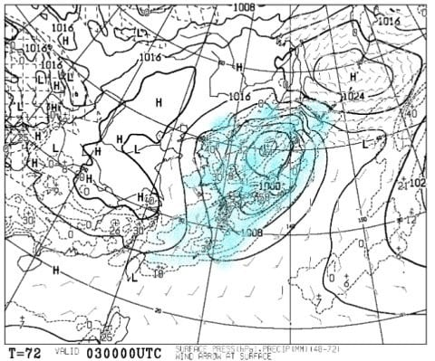
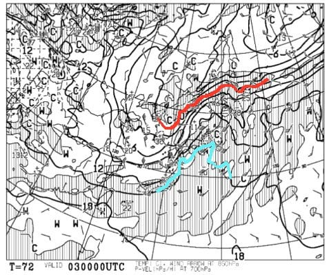
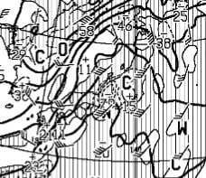
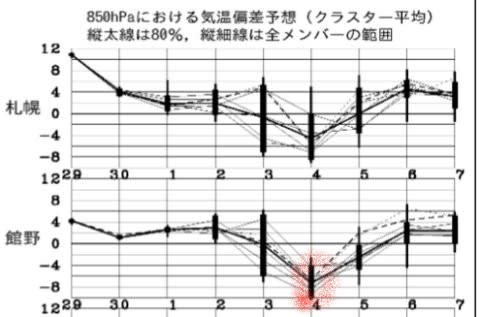
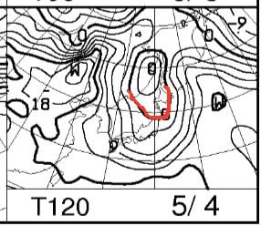
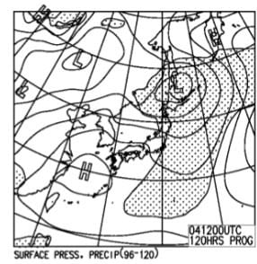
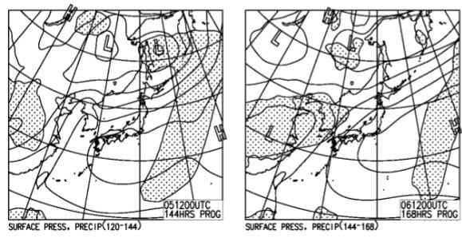
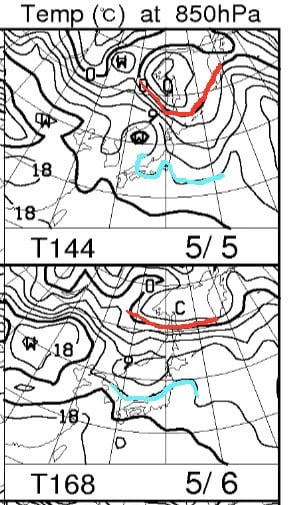

# GW後半4連休と，それまでの天気は？…本日2件目の投稿！

📅 投稿日時: 2018-04-30 21:52:48

🏷️ カテゴリ: [スキー天気予想](c6554f5c3c106093b511a8daae23757e8.md)

先ほど，今日の[奥志賀のゲレンデレポート](eae038d95b47289adbf62025df62701bb.md)を

したところですが．

GW後半の天気が気になる方もいると思うので．

…

…いると思うので．

…

…いや，もうほとんどの人が，スキーは

あきらめているのはわかってますが．

ごく一部の，チョー終わった方向けの

スキー場天気予想です！

まず．

GWの谷間，1，2日ですが…

1日は晴れで．

2日は曇り．2日も，昼間は降らずにもちそうです．

気温はどちらも高めで，昼間の気温は

+15℃近くまで上がっちゃいそう…（涙）

高温で雪が解けていく2日間になりそうですが．

しかし．

問題は．

4連休の初日，5月3日なのだ．

地上天気図を見ると…

見事に降水域が日本中を覆ってます（涙）

この日は，雨です（泣）．

雨が降るのは…

3日の明け方からかな．

激しい降りは長くは続かなさそうですが…

でも，終日ぽつぽつと雨が降り続けそう…

で．

3日の850hpa図を見ると．

赤い0度線は北海道より北．

それどころか，水色の+15度線が近づく

ほどなので…

かなり高温の，致命的な雨が降ります（泣）

それも，天気図を拡大すると…

かなり強い南風が吹き込むので．

高温・雨・強風の3拍子が揃いますね…

いや，揃わなくてもいいんですが．

揃っちゃいます（泣）

おそらく…

3日は強風で営業できないリフトもありそうなくらいなので．

この日で息絶えるゲレンデも多いでしょう…

というか，この日を乗り越えられたサバイバル

ゲレンデは，かなりの根性をもったゲレンデと

認定していいと思います．

そして．

4連休2日目の4日ですが．

なんだか，この日だけ．

異常に低い気温が予想されてますけど！？？

4日の850hpa気温図は…

久々に赤い0度線が，志賀に近づいてます．

朝は路面凍結に注意が必要なレベルですね…

そして，昼間も寒いと思うので．

ウェアのジャケットをもって行った方が吉．

4日の地上天気図はこんな感じで，

降水域の網掛けがぎりぎり志賀や

かぐらにかかってないので．

おそらくこの日は，朝は雨が止んでいそうですが．

もしかすると，明け方にうっすら雪が

降ったのが積もってるかも…？

そして，5，6日ですが．

この日は，どちらも晴れそうですね…．

で．

気温もすごい上がりそうですね…(涙）

水色の12度線が近づいてるので．

昼間はまた+15℃くらいまで行く，

暑い一日になりそう…

ってな感じで．

まとめると．

初日5/3：朝から雨．終日雨．昼前ごろザーッと降る．

　気温は高く，強い南風が吹き付けるので，

　風で営業できないリフトもあるかも…

　この日は滑りに行こうと思わないほうが吉．

2日目5/4：意味もなく冷える一日．

　朝は路面凍結に注意！

　もしかすると，うっすら積雪もあるかも…

　寒いので，ウエアのジャケットを忘れずに．

　午前は曇りだけど，午後は晴れていく．

　3日の雨に生き残ったゲレンデは，

　朝は硬く締まっているかも…

3日目5/5，4日目5/6:2日ともおそらく晴れ．

　暑く感じるような一日．

　午前早くから，雪はドボドボに融けていき，滑らない

　雪になるでしょう．

ってな感じでしょうか…

とりあえず．

1，2日の高温でゲレンデは痛めつけられ．

3日の高温・大雨・強風のコンボで

とどめを刺されそうですが．

雪がなくなった後の4日に，意味もなく冷えそうという…

うがーーー！！

なんなんだ，

この天気は…っ！！

一体なんの嫌がらせだ～っ！！！

うーむ．

4日のような気温が毎日続いてくれると

良かったのに…

うまく行かないものだ…（泣）

## 💬 コメント一覧

### 💬 コメント by (マルハバ)
**タイトル**: 昨日
**投稿日**: 2018-05-01 07:35:31

かぐらへ行ってきました

志賀の終末的？な状況に比べると

こちらはまだまだ平和な空気に溢れていましたよ

かなり混んではいましたが

志賀から流れてきた方も相当数いたのでは？

### 💬 コメント by (Skier_S)
**タイトル**: マルハバさま
**投稿日**: 2018-05-02 01:11:24

かぐらのほうが雪がありそうですね…

でも，やっぱり混みますよね…

混んでなければかぐら一択なのですが．

私もシーズン券がなければかぐらに

行きたいところですので，かなりの人数が

志賀から流れたかと(笑)

