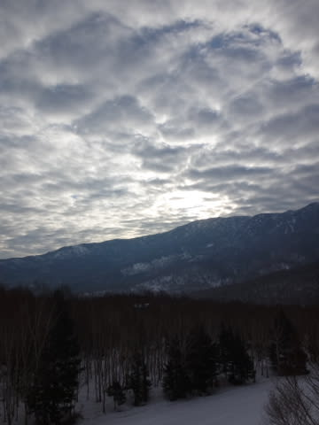
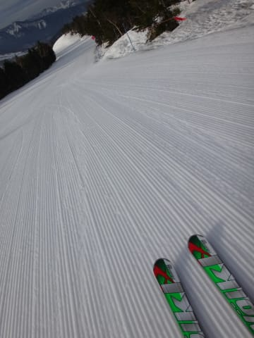
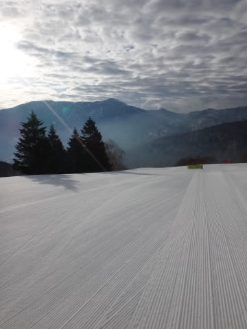
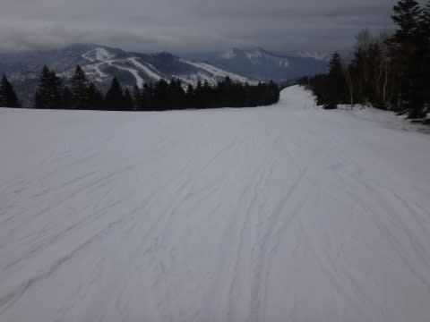
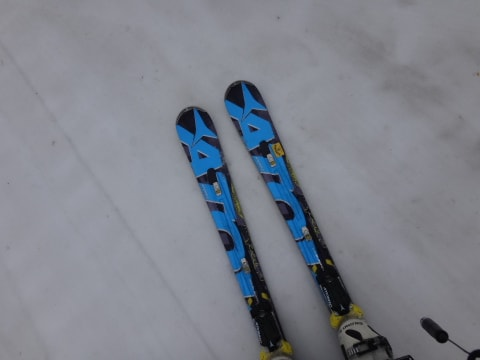
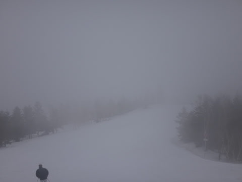
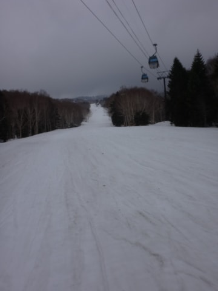

# 4月29日，GW前半最終日の志賀，速報モード

📅 投稿日時: 2014-04-30 00:25:52

🏷️ カテゴリ: [2014スキー滑走日記](c992167609b6415052179ee69ea1ea7d8.md)

えー．

本日．

4日間過ごした志賀高原からいったん帰ってきました．

中3日，家で過ごしたら，また志賀に舞い戻ります．

…これって．

ほとんど志賀高原に住んでいるのでは…？？

という気がする今日この頃．

皆様いかがお過ごしでしょうか．

ってことで．

GW前半4日間の最終日ですが…

…

本日も，帰宅が遅かったので．

速報モードで…

今日も早朝から繰り出すわけですが．

朝は，雲が多かったものの薄日も射し…

早朝は相変わらずのシアワセシマシマバーン！

3日連続の，ウハウハ早朝バーンです！

で．

早朝営業が終わった後も．

人が恐ろしく少なかったし．

9時くらいからは雲が出て，太陽がほとんど隠れちゃったので．

日差しで雪が緩まず，ゲレンデは昼頃までは

ほとんど荒れなかったですね～．

でも．

今日は気温が低かったものの，風が強く．

雪の表面に汚れが浮いてきて…

強烈なストップスノーってほどではないけど．

なんだか滑らない雪でした…（涙）．

午後3時過ぎには，山頂付近にガスが出て来ちゃったけど．

でも．昨日のレポートの最後にちらっと，

本日の天気を予想してたのですが．

その予想通り，夕方まで，降らずにもちました！

いやー．

これは．

そうです．

みなさんの予想通り．

私の日ごろの行いが良かったからです．

…ってことで．

詳細レポートはまた明日…

＃これで十分詳細な気もするが

## 💬 コメント一覧

### 💬 コメント by (はなげ親分)
**タイトル**: 初めまして
**投稿日**: 2014-04-30 10:10:06

伊豆から通っている、はなげ親分といいます。

先日偶然ゴンドラに乗り合わせ、声かけさせていただきました。あまりに突然だったので名乗り忘れ、失礼しました。

緑の板とあのグローブでSさんだろうと推測しました（笑）残り少ないシーズンですが、予報を頼りにしておりますのでよろしくお願いいたします。

### 💬 コメント by (Skier_S)
**タイトル**: はなげ親分さま
**投稿日**: 2014-05-01 00:27:15

なかなかユニークなハンドル名ですね…（汗）．

先日は声をかけていただきありがとうございました．

天気予想，役立っているようで何よりです．

かぐらの営業が終わるまでは毎週続きますので，

5月末まではご参考にしてください

しかし，伊豆からですかっ！

うちも遠いと思ってましたが，さらに遠いですね…

また，スキー場でお会いしましょう！

