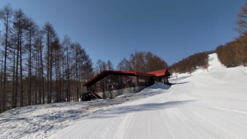
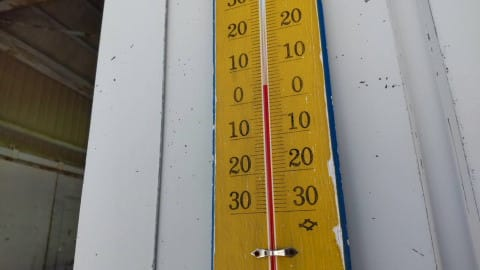
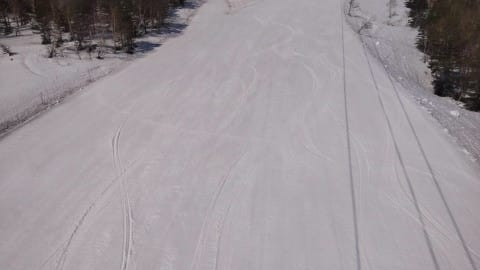
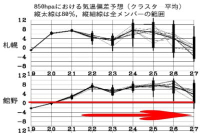
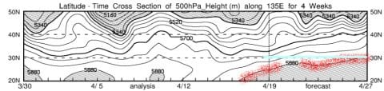

# 4月23，24日の志賀高原スキー場の天気は…土曜は晴れるかな？日曜は曇り．土日とも「夏か？」という高温（涙）

📅 投稿日時: 2022-04-21 00:35:48

🏷️ カテゴリ: [日記](cc4b5682fb7b8b144980957a978653fb0.md)

切羽詰まっていて昨日Blogを更新

できなかったSkier_Sです…（涙）

まだクリティカルな状況が続いてます（泣）

週末にスキーに行くためには，Blogなんか

書いてないで，さっさと仕事を仕上げないと

いけないんですが…

でも，昨日更新してなかったので，今日は急ぎ更新！

えー．

本日水曜の志賀高原ですが．

朝からすっきり晴天で…

そして，気温も朝から高め（涙）

いつもこの時期なら，朝イチはまだ

締まっている時も多いのに．

今シーズンは朝から雪が緩んだ日が

続いてます（泣）

バーンは緩かったものの，雪はひどく

貼りつくほどではなく．

緩斜面は多少スピードが緩んだものの，

そこまでひどい雪じゃなかったようです…

ってなことで．

4月28日からGWが始まるわけですが．

これから4月27日までの850hpa気温を

みると…

ダメだこりゃ（涙）

赤矢印で示した4/22からGW前日の4/27まで，

平年比+6℃くらい高い日がひたすら

続くという，異常高温が続きます（涙）

で．

[FXXN519](https://www.hbc.co.jp/tecweather/FXXN519.pdf)の一番下，500hpa高度線が

緯度何度にあるかの図面を見ると…

赤く印した5880mの高度線．

この線より下の網掛け領域がこの図面

に出てきたら，

「冬が終わったな…」って感じで．

北緯30度（30N)を越えたら

「夏だ！」

って感じなんですが…

27日あたりを見ると，30Nより上に

行っちゃってるんですが…！！（涙）

これ…26，27日はほぼ夏ですね（泣）

気温がすごい上がります…

ってなことで．

これからGWまで．

「夏か？」と思う高温が続きそうです．

…だめだ…

この4月，ダメすぎる…

で．

水曜深夜恒例の天気予想をするわけですが．

ちょいと時間がないので，天気図解説無しで

予想だけ書いておきます！

21日（木）：朝は晴れ．気温は朝から+5℃以上．

　昼間は+12℃くらい？

　雪は朝から緩く，ひるはもうザブザブ．

　午後に雲が増え，夕方から雨になりそう…

22日（金）：雲が多いけど，

　おそらく晴れる一日．

　朝から気温は高く+5℃以上．　

　昼間は+10℃越え．

　朝から雪は緩く，雪質は期待しない方が

　いい．

23日（土）：金曜夜にちょっと雨がぱらつくかも？

　おそらくこの日は晴れると思うけど…

　朝は雲が多めか？

　朝の気温は+3℃くらい．

　早朝はわずかに締まってるかもしれ

　ないけど，通常営業時には緩み，

　昼間の気温は+15℃近く．

　暑い．昼間はザブザブ荒れ荒れ雪に．

　夏の格好をしていった方がいいくらい．

24日（日）：たぶん晴れ．朝から気温は高く

　早朝から雪は緩め．

　通常営業開始時には雪はユルユル．

　昼間の気温は+15℃を超えるかも．

　暑い！！

　昼間の雪はもうザブザブ荒れ荒れ．

…って感じでしょうか．

天気図を見ても，

「6月くらいの天気図かな？」

という感じの天気図になっていて，

土日は異常気象レベルに気温が上がりそう（涙）

この週末は，志賀高原で夏スキーの気分が

味わえそうです…

いや．1，2月，雪が多くて良かった…

普通の年だったら，4月のこの高温で一気に

雪が無くなっちゃうところ．

でも，今シーズンの焼額はまだまだコース幅

いっぱい雪があるし．

コンディションは恵まれてますよ～！！
