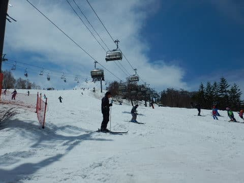

# 2019/5/18(土)のかぐらスキー場は…まだ雪はあるけど，そろそろ薄くなってきたかな．先週より混んだよ

📅 投稿日時: 2019-05-19 00:19:19

🏷️ カテゴリ: [2019スキー滑走日記](c3e4496fc0fb7f9c17ff21214a35b1ace.md)

ということで．

本日はかぐらスキー場で滑ってきましたが．

メインバーンは，まだまだ雪がたっぷりありますよ～

…でも．

やっぱり先週よりは雪が減りましたね（涙）

ってなことで．

今日のかぐらレポートですが．

営業スタートの朝7:30時点で，ロープウェーに

並んでいる人はせいぜいこの程度なので．

例年に比べると，少ない感じですね…

そして．

ロープウェーでみつまたエリアにやってくると…

先週はまだ雪が残っていたのに．

もうほとんど雪が消えてます（涙）

でも．

ロープウェーを降りてから，

みつまたリフトまではまだ滑っていけますし…

みつまたの下山用コースは，

廊下1本分ながらも，まだ雪が

残ってますね～．

うーむ．

でも，これ．

来週までもつかなぁ…

そして．

リフトを降りてからゴンドラまでも，

先週に比べて幅が狭くなりましたが…

ここも何とか，

ぎりぎり来週までもってほしいけど…

きわどいところ．

大雨か何かあったら，ちょいと

厳しい感じ．

そして，ゴンドラに乗って．

今日もやってきました，かぐらエリア！

メインゲレンデは，まだまだ雪が

残ってますね～！

朝イチは，和田小屋から高速リフト

乗り場までも，まだ全面雪がついてますよ～！

…ただ．

高速リフトから見えるテクニカル

コース．

先週は完全に真っ白だったけど．

今日はかなり土が出てますね（涙）

とはいえ．

メインバーンを見てみると．

来週で営業終了と思えないレベルで

雪が残ってます！！

人工雪を打っているメインバーンは，

まだ雪の厚みもたっぷりある感じ…！

では，朝イチのシマシマバーン，

いただきま～す！！

…が．

気温が高いので．

朝からかなりやわらかい雪で．

残念ながら，日差しが強いのもあって．

朝イチからかなり滑りが悪い

雪です…（涙）

そして．

30分も経つと，ゲレンデの人も増えてきて…

朝9時には．

早くもかなりのリフト待ちが…（泣）

先週より，人が多いよ…（涙）

混んできたので，パノラマコースへ

逃げよう！

…と．高速リフトに乗らずに済む，

第4ロマンス沿いのパノラマコースに

行ってみますが．

！！！！！

ええええ！？？？

先週から，一気に雪が解けてるん

ですが…！！

一部はこんな風な，もうすぐ切れそうな

部分を渡る必要もあり…

コース真ん中にポッコリ穴が

開いちゃってるので．

もう，これはたぶん明日で終わりな

感じですね…（泣）

で．

次はテクニカルコースを見に

行ってみますが．

上部はまだ雪があって．

コブ溝に土も出てませんね…

中間部も，まだ土は出ておらず，

コブを攻めることができますが…

ただ，リフトから見て，雪が

無かった下部．

ここはもう終わった感じですね…（泣）

この，下部は．

おそらく，来週は滑れなくなり

そうです…（涙）

でも．

上部はまだ来週まで行けそうですね～．

そして．

次はジャイアントコース．

ここも，雪が減りましたね…（涙）

取りつき部分，かなり土が出てきてます．

上部は一部，土が出ているところも

ありますが…

 

でも．

真ん中部分．

まだコブ溝に穴は開いてないです．

とはいえ…

人工雪がないこのコース．

雪はそんなに厚くないので．

コブ溝がそろそろヤバそうなところも多く．

明日までは問題なくもつでしょうけど．

来週までもつかは微妙な感じ…

でも．

雪が薄いながらも．

今週はまだ，一番下まで雪が

着いてますよ～！

そうこうしている間に．

午前10時過ぎに，高速リフトと並行している

ペアリフトが動き出し…

さらに昼近くになると．

お昼休みを取る人が多かったのか．

高速リフト待ちがかなり短くなってきました！！

…とはいえ．コース上の人が減ったわけでは

無いのがちと残念…

焼額のトップシーズンより，人が

多いですね（泣）．

午後はリフト待ちが減ったのもあるのか，

ペアリフトが止まってしまい．

今日の午後の高速リフトは，

大体この程度のリフト待ちでしたね～．

まぁ，例年より短いかな？？

短いペアリフトはこんなくらいの

待ち時間ですかね．

そして．

昼を過ぎてくると．

今日は人が多かったのもあるのか．

雪が薄かった，和田小屋から

高速リフト乗り場に向かう部分．

うげげげげげ！！

かなり大きな穴が開いてきちゃったん

ですけど…！！！（涙）

うーむ．

朝は全面真っ白だったのに．

穴が開き始めると，一気に

広がりますね…（泣）

とはいえ．

人工雪をつけてあるメインバーンは，

まだ全然安泰だし．

パークもまだまだいけますね！

…そして．

今日は午後は曇り空となり，

太陽も隠れたので…

午後はTシャツやトレーナーだと，

ちょっと寒さを感じるくらいになり．

それ程ひどく雪も解けず．

最後のメインバーンは，

やっぱりいつも通りの全面

コブ祭りと化しましたね～．

まだテクニカルもジャイアントも

滑れるので．

コブ好きはそっちに行っちゃうのか．

メインバーンのコブは，

いつもより浅い感じですが．

コブ溝もまだ全く土が出てくる気配はなく．

メインバーンは来週まで，問題なく

行けそうですね～…

…ってことで．

いつも通り，15:45のかぐらクワッド終了まで

滑り倒し．

下山するわけですが…

今日もまだ，ゴンドラコースは

問題なく滑って降りられます！

とはいえ，途中にちょっと幅が

細くなってるところがあるので．

うーん．

ちょっと頑張らないと，来週の

ファイナルまでもたない感じかな…

ただ，細いのは一部のみで．

ゴンドラ乗り場まで，まだ雪は

結構あるので．

何とか来週まで頑張ってほしいところ…

そして．

今週はゴンドラ乗り場からみつまたエリアへ戻る

リフトが1本しか動いておらず．

すごい列になってましたが…

まぁ，最後のみつまたエリアが

こんな廊下状態なので．

ここに向かって，2本のリフトで大量に

人を送り込んだら，危ないよね…

でも．

このみつまたの連絡コースも，

来週までもってくれるのかなぁ…

ってな感じで．

最後はロープウェーで下山．

今日も最後までしっかり滑りました～！！

ってな感じで．

そろそろ雪が薄くなってきたところもあり．

来週はテクニカル下部・パノラマは死亡確実．

みつまたは微妙な感じですが…

明日なら，まだまだ結構滑れそうですよ～！
