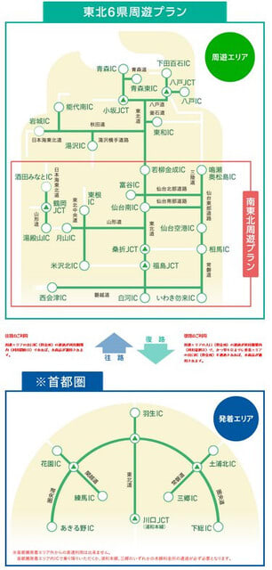
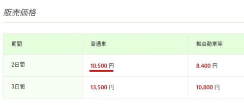
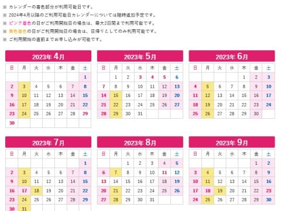
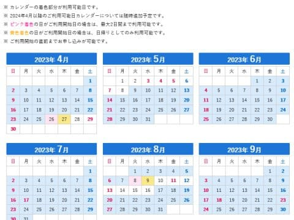
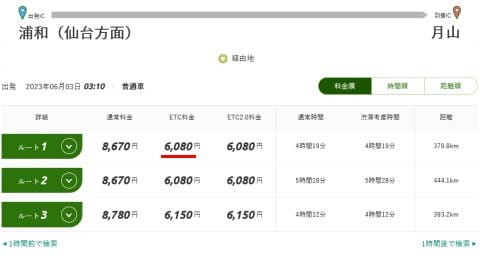

# 首都圏から車で月山にお安くいく方法！！…ドラ割，東北観光フリーパスの首都圏発着南関東周遊プランなら往復で10500円！

📅 投稿日時: 2023-06-04 00:02:52

🏷️ カテゴリ: [日記](cc4b5682fb7b8b144980957a978653fb0.md)

えー．

リフトを滑れるのは月山しかない今．

首都圏から遠い月山．

交通費を抑えていかに安く月山に行くか，

首都圏の人は気になるところですよね…

そんな時は．

てれれってってれー

「どら割　東北観光フリーパス～！」

…ほとんどの方は，なんじゃそりゃと

思うでしょうが…

これ，ETCを使う人が事前登録しておくと，

下記の首都圏エリアから，東北エリアを

往復する場合に割引がきくという，特殊な

事前申し込み方式のETC割引です…

（[ドラぷらホームページ](https://www.driveplaza.com/etc/drawari/tohoku/index.html)より）

南関東周遊プランと東北6県周遊プランがあって，

有効期間内（2日または3日）なら，東北の周遊

区間なら何度乗り降りしてもお値段定額！

2日券だと…

普通車10500円．

3日券だと

普通車13500円です！

南関東周遊プランなら，首都圏から月山ICまで

行って来れるし．

月山で滑って，さらに滑った後は高速で山形まで

行って山形市内で泊まって，また翌朝高速で

月山に戻って滑って…

ってやっても，高速料金は一定のまま！

ちなみに．

2日券だと，使えるのは週末をはさんだ

金，土，日，月のうち2日間．

（[ドラぷらホームページ，東北観光フリーパス料金](https://www.driveplaza.com/etc/drawari/tohoku/minami_shutoken.html)より）

3日券だと…

GWとお盆以外なら，連続する3日間で

平日だろうが休日だろうが使えます！

（[ドラぷらホームページ，東北観光フリーパス料金](https://www.driveplaza.com/etc/drawari/tohoku/tohoku_shutoken.html)より）

ちなみに．

浦和から月山までは，平日だと8670円．

休日割引でも6310円．

土日の往復を考えると…

深夜割引だと6080円．

休日割引6310円で．

往復深夜割引で頑張っても12160円もするところ，

ドラ割だと10500円！！

平日だと，

昼に移動すると往復17340円のところ，

3日券で13500円！

これで，現地で何度高速乗り降りしても

追加料金がいらないので…結構お得です！！

申し込みは，ドラぷらのホームページ

[https://www.driveplaza.com/etc/drawari/tohoku/minami_shutoken.html](https://www.driveplaza.com/etc/drawari/tohoku/minami_shutoken.html)

に申し込みボタンがあるので，

ここの申込フォームで

利用開始日，名前，電話番号と

ETCカード番号などを入れるだけで

OKです！！

…ってな感じの，安い料金が見つかったので…

明日日帰りで月山に行ってきます～！！

今日も睡眠2時間しか取れない…（涙）

そして日曜深夜に帰ってきて，月曜から

仕事に行けるのか…？
