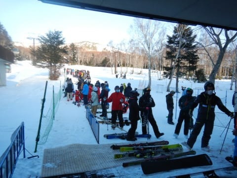
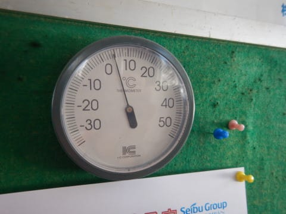
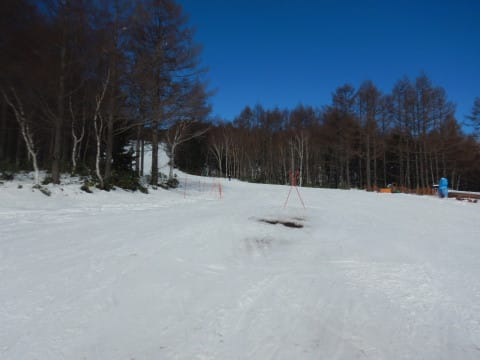

# 2021/12/12(日)志賀高原焼額山スキー場詳細レポート！…晴天で気温は高くて雪は緩み気味(涙)．でもこの時期としては恵まれてたかな

📅 投稿日時: 2021-12-14 01:00:31

実は，日曜は100%復調と言い切れない

状態で志賀に行ったんだけど．

スキーをしたら完全復調したので．

スキーには病気治療効果がある

と信じて疑わない，Skier_Sです←ないから

ってなことで．

昨日の志賀高原は気温が上がって

雪が融けちゃったと報告しましたが．

本日，特派員より送られてきた写真を

見ると…

朝は4~5cmくらいの積雪だったようです．

うーん．

もう少し積もってほしかった…

朝の気温は-6℃と，かなり冷えたようですね…！

下地は硬めだったものの，上に新雪が

薄っすら乗ったおかげで，ゲレンデは

滑りやすかったみたいですね…

そして，昼間も一日雪は降り続け．

昼ごろには，朝より積雪が増えて，

おこみん全身がうまるほどになり…

ゲレンデの上は，昨晩から計10cm

くらい新雪が乗ったようです…！

…まだ積雪は十分じゃないけど…

このまま週末まで行ってくれれば，

週末までにゲレンデは改善するかな？

と思ったら…

なんですか？

この18日の850hpa気温は！！

水色の線は，-9℃！！

これは…

かなり本格的な寒気が降りてきます！！

そして…

17日夜9時の地上天気図は…

激烈な冬型の，縦縞等圧線！！

…これは．

降る．積もる．

17日午後から18日にかけて．

かなり積もります！！

18日は冷え冷えパウダーが来そう！！

…ってか，18日の土曜の朝，スキー場への

アクセスの道路が積雪でヤバいことに

なりそうなくらいなので，覚悟した方が

いいかも…

とりあえず．

週末までの天気は，明日詳しく予想

します～！！

ってな感じのいいニュースのあとは，

本日の本題．

日曜の焼額山の詳細レポートです！！

えー．

まず．

今日も朝イチの第2ゴンドラは，すごい列が

並んでました…(涙）

営業開始8:30頃に着いた人は，ゴンドラに

乗るまでに15分以上待ったんじゃないかな？

で．

営業開始20分前の8時過ぎに並んだ私でも，

ゴンドラに乗るのに10分くらい待たされて，

ようやっと山頂へ…

山頂の気温は，すでに0度とかなり高め(涙）

　朝の気温は0度をちょい下回るくらい

という，先週の水曜段階の予想は

大体当たってるんだけど…

天気は朝から雲一つなく，太陽が

サンサンと照ってます…（ちょい涙）

…いや．

晴れてることは悪いことではないんだけど．

すでに気温0度でこの日差しだと，

間違いなく雪は緩んでいくし．

…何より，予想外した…（泣）

で．

ゴンドラに乗るまでに10分待たされたので．

すでに朝イチのきれいなシマシマは崩れ．

あさイチ最高ピカピカシマシマを味わう

ことはできませんでした…(涙）

でも．

あさイチはエッジがガッツリ嚙む，

ちょうどいい固さのいい感じのバーン！！

あぁ…

病み上がりで志賀日帰り往復なんて

するべきじゃないと思ってたけど．

やっぱり来て良かった…！！←いや，常識的には日曜もゆっくり休むべきだと思う

ゴンドラに行くと混むので，

第2高速側の唐松コースを滑ると…

こちらはそれほど混んでないし．

リフトもそんなに混んでないよ！

…ただ．

ちょっと一瞬，ゲートの外まで

かなり長く列がついたこともあったけど．

これは一回だけ．

あとは大体ゲート内に待ち時間は収まって

ました…

だもんで．

「15分待ち」という案内が出ている

ゴンドラには寄らずに．

第2高速をグルグル滑ってましたが…

第2高速側の唐松コースは，南側で

日当たりがいいので…

ちょっと雪が重くなり，ボコボコに

なってきました…(涙）

いつもの志賀高原なら，日曜は昼で

帰る人が多いので．

さすがに昼にはゴンドラが空くだろう！

…と，昼ごろにゴンドラに下りてみますが…

甘かった．

読みが甘かった．

今日は，午後になってもゴンドラ待ちは

続きます(泣）

しかたがない…

もうしばらく第2高速を回そうか…

と，唐松を滑っていると．

誰かの予想を，

「曇り～雪の予想だぁ？そんなもん知らないよ」

とばかりに，完全に無視を決めたお天気の

神様は，無情にも雲一つないカンカン照りを

続けてくださり…

さらに，昼間の最高気温は+5℃と．

この点に関しても，昼から気温が下がって

いくという誰かの予想を，お天気の神様は

見事に無視してくださったため．

雪はかなりの勢いで緩んでいき…

まだ人工降雪が十分に着けられてない

唐松コース．

ところどころに，ブッシュ…というより．

地面そのものが出てきてますね(涙)

場所は数か所で，回避可能とはいえ…

これらの写真の場所以外にも，

ちょっと雪が茶色くなりかけている

ところも…

…てなことで．

唐松コースは，日差しをもろに食らって

重い荒れたバーンになったのと．

地面が見えてきたのとのダブルパンチで．

第2高速は，午後は完全飛び乗りになりました…

リフトはがら空きなんだけど．

やはりゴンドラ側のコースの方がまだ

雪のコンディションはいいよね！

と，午後はゴンドラ待ちを覚悟で，

ゴンドラ側のパノラマ～サウスコースを

グルグルしましたが．

ゴンドラの方は，なぜか時々ものすごく

列が短くなったり…

そして混んだりを繰り返したりしながら，

午後の平均で5分～10分待と，ちょっと

待ち時間は長かったものの．

ゴンドラ側コースは雪が緩んだ割には

それほど荒れず，午後もフラットで．

雪は緩み気味とはいえ，スピードが

出せる大回りバーン！

ゴンドラも知り合いグループ以外は

3人までの乗車制限ということで，

ゴンドラ待ちは長かったものの，

コースはそれほど混まず．

ゴンドラ側のパノラマ-サウスコースは，

ゴンドラ待ちさえ我慢すれば，

人口密度が低いフラットバーンを．

日が暮れかけるリフトストップまで，

思いっきり楽しめたのでした…

あぁ…良かった…

ゴンドラ待ちは長かったけど．

でも，この時期にゴンドラがコース幅

いっぱい滑れて．

夕方までフラットバーンを大回りできたので．

満足…

病み上がりなのに，無理してきて良かった…！←無理して来ちゃダメだって！！

と．

病み上がりの日帰り志賀にも関わらず．

お約束通り，営業開始から営業終了まで

昼休みもとらずに滑り倒したのでした…←いや，せめて昼休みは休めよ

でも．

やっぱり．

土日とも滑りたかったな…←日曜滑れただけで感謝すべきだと思う…

## 💬 コメント一覧

### 💬 コメント by (レインボー74)
**タイトル**: Unknown
**投稿日**: 2021-12-14 13:08:38

火曜日の志賀高原情報

冷え込みました。朝の上林-4℃　蓮池-7℃。

雪もいいし人も少ない。焼額は快適なキメの細かいさらさら雪を圧雪してある。奥志賀はエキスパが非圧雪だけど、その上にさらさら雪が乗っているそうな。

３本目から小さなコロちゃん発生。だけど滑るに支障のないレベル。

よく晴れ渡って時間を追うごとにポカポカしてくる。

11時まで滑って、愛車鮎号で高天が原のホテル銀嶺でザル。

私らはそれで帰ったけれど、レインボー特殊部隊員はそのまま滑り続けました。

高天はクワッドが動いているものの、正面バーンは閉鎖でNHKのみ。それもぼこぼこで今一とか。

一ノ瀬の天狗コースは、修旅生のプルークが主なので掘り起こされずに、昼になってもいい状態を保っているそうな。

天狗からファミリーに出ると、そこはもうパラダイスらしい。

今夜はバスの時刻表を確認して、明日からはいよいよ移動を考える時期が来た！

### 💬 コメント by (かず)
**タイトル**: Unknown
**投稿日**: 2021-12-14 17:39:17

シーズン初日は足慣らしとBでお祝いって感じが理想なんですけど…風も強そうですね…

### 💬 コメント by (FCAMEL)
**タイトル**: シーズンイン
**投稿日**: 2021-12-14 20:27:52

お久しぶりです。

天気がよさそうだったので、休暇をとって本日遅ればせながらシーズンインしました。

少し遅めのスタートでヤケビ、横手山、奥志賀と流しました。

やはり焼額が一番。スピードも出せるし、端にはふかふかのパウダーも少し残り、突っ込むと足がウレシイ！こんな幸せなシーズンイン久しぶりです。

本日は快晴で横手山デーでしたので、11時ごろ横手山へ移動、山脈眺めるのが目的でしたので2、3本で終わりましたが、やや硬めでした。

奥志賀はエキスパートが非圧雪で朝一は敬遠しましたが、一応あいさつのつもりで昼食後に2本ほど。

もう平日圧雪する気はないのかしら、、と思いましたが、圧雪車故障で明日は圧雪予定とのことでした。

今シーズンもよろしくお願いします！

### 💬 コメント by (ワックスマン)
**タイトル**: Unknown
**投稿日**: 2021-12-14 21:32:51

スキーヤーsさま

いつも楽しく拝見し、初めてコメントさせていただきます

今週金曜から関西より長野に遠征予定です

17-18の積雪はどれくらいの予想でしょうか？

中央エリアが建前18オープンですが、降雪次第でうまくいけば、中央エリアだけでなくヤケビ1ゴンや、奥志賀の連結とかも始まれば！と思ってます

風向きでは白馬有利のような気もしますが。。

予想をご教示願います

### 💬 コメント by (Skier_S)
**タイトル**: 18，19の週末は寒そう
**投稿日**: 2021-12-15 01:47:37

＞：レインボー74さま

あら．高天ヶ原コンディション良くなかったんですね…

でも，ヤケビは今日もコンディション良かったみたいですね！

＞かずさま

18日，朝のうちは風が強いかな…

どちらにしろ吹雪っぽい，寒い天気なので，パウダーが滑れるのは嬉しいけど

寒そうです…

シーズン初日にはつらいかも？？

＞FCAMELさま

お久しぶりです！

今日からシーズンインですか！

今日は天気も良かったし，なかなかいいタイミングだったかも．

また今シーズンもよろしくお願いします～！

＞ワックスマンさま

コメントありがとうございます～！

一応今日の記事に，膝パフくらいかな…と予想しましたが，

18日朝の詳細な積雪が予想できる天気図は明日の発表なので，

詳細な積雪量予想は明日までお待ちください…

イチゴンが動いてくれるといいのですが，残念ながらまだアナウンスは出ていません…

山ノ神も，動くかどうかまだ不明です…

