# 子連れコモドダイビングクルーズagain　その10　ギャンブル失敗かっ！？

📅 投稿日時: 2011-09-07 01:52:31

🏷️ カテゴリ: [ダイビング日記](ce3a7a8d424d112fce83ee85c81a0e344.md)

で．

子供を置いていくという恐怖の判断をした，2日目朝の1本目．

えー．

いつもなら，2日目朝は，クルーズ最南端の地点に達しているところ．

…ですが．

今年はルートがこれまでと違います．

新規開発となったマンタポイントが南北中間点にあり．

この日にマンタポイントを攻めるため．

今日もまだ，昨日と同じ中間点にいます．

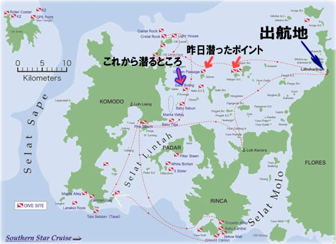

([サザンスター公式ページ](http://www.s-starcruise.com/index.php)のルートマップより拝借)

…この地図を見ると．

2日目なのに，出航地点からまだ20kmくらいしか離れてないのが分かりますね（笑）．

で．

K澤さんがマンタポイントにチェックに行ったようですが，

「マンタがいなかったので，マンタポイントは2本目に潜ることにします」

あららら．そうですか．

っつーことで，急遽ポイント変更．

1本目に潜ることになったポイントは…Batu Bolong．

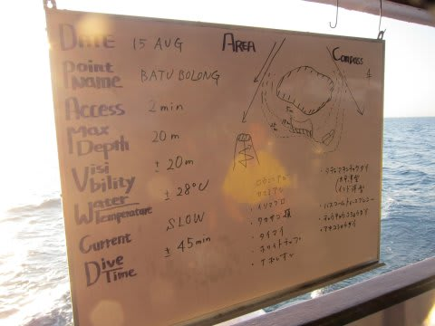

なんと．

ここは，ふだんならコモドクルーズで一番最後に潜るポイントではないですか！

なんか，2日目にして，最終日の気分…

で．

朝日が昇ったばかりの海に潜りに行きます．

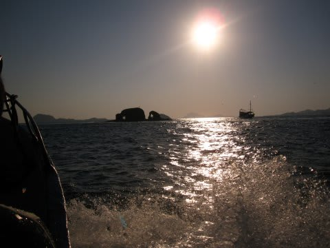

この正面にちょい左に見える岩が，Batu bolong.

インドネシア語で，「穴のあいた岩」の名のとおり，穴があいた岩が

海から突き出てます．

このポイント．

[昨年の説明](ef0aefc1db5d48aaefe1b779883d29d0b.md)を引っ張ってくると…

「コモド島とリンチャ島に挟まれた海峡の中にぽつんと浮かんだ島で．

ものすごい流れがぶつかります．

さすがにこの流れの上流には入れないので，

（二度と浮上しなくていい覚悟なら潜れるかも…）

命が惜しい一般人は流れの下流側に潜ります．」

…って感じで．

今回も，命が惜しいので流れの下流に入ります．

昨年は北側だったけど，今年はスロープのゆるい南側．

いつもだったら昼ごろ，太陽が高い時間に入るポイントなんだけどなぁ…

なんか，日が昇ったばかりのまだ薄暗い時間に入ると新鮮だなぁ…

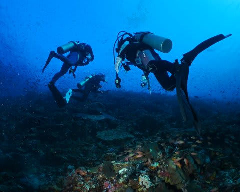

このポイント．

相変わらずのハナダイ系の魚の密度の高い，珊瑚のきれいな海．

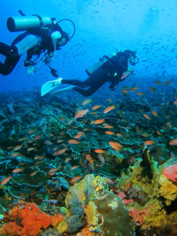

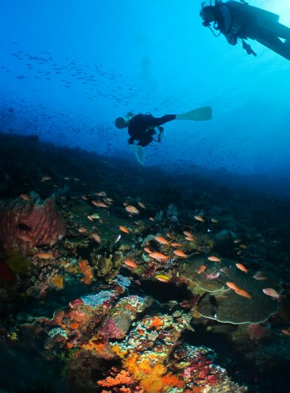

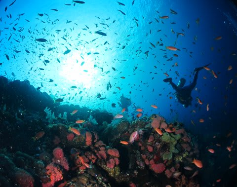

エントリー直後から，頭上にはクマザサハナムロの群れが．

ダイビング前半，ずーーっとダイバーに着いてくるんだけど…この群れ．

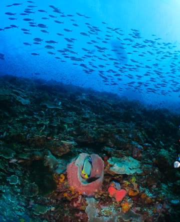

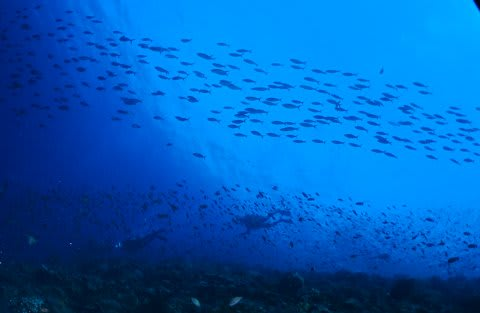

いやー．サンゴがきれいだなぁ．ここも．

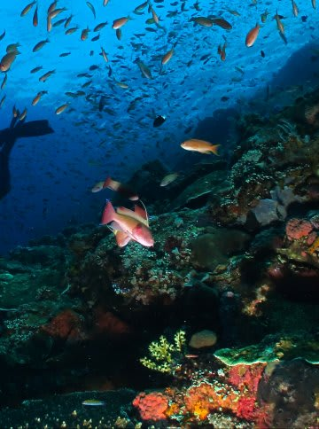

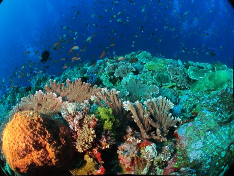

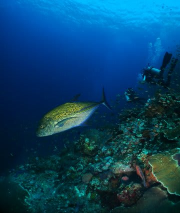

最後に浅瀬に上がってきて…

やっぱカラフルだわー！コモドの海は．

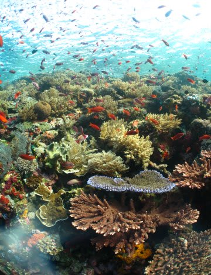

透明度が高く，他チームのエアがきれいに見えるなぁ…

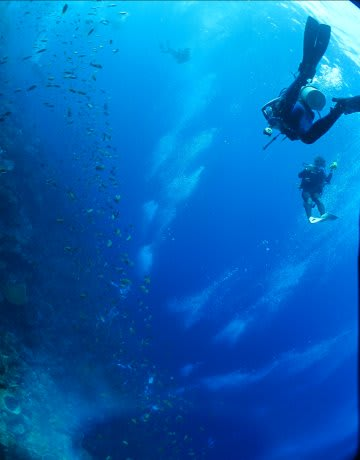

朝イチは，流れのない，癒し系ゆったりダイビングで満足．

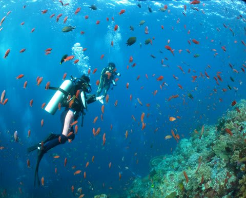

朝食を食べる前から，結構なダイビングでございました…

と，満足してエグジットすると…

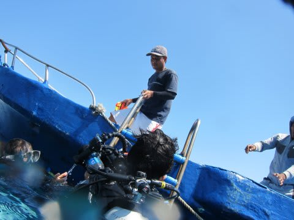

急に娘のことが心配になってきました．

うーーむ．

起きないで寝ててくれてるかなぁ．

それとも，起きちゃったかなぁ．

起きたら，間違いなくギャン泣きしてるだろうなぁ…

最悪，ダイビングに出発したすぐに起きたら．

両親が帰ってくるまで1時間，ずーーーーーーっと泣きつづけじゃ無かろうか…

って，心配が心の中に広がった状態で，

本船に近づくと…

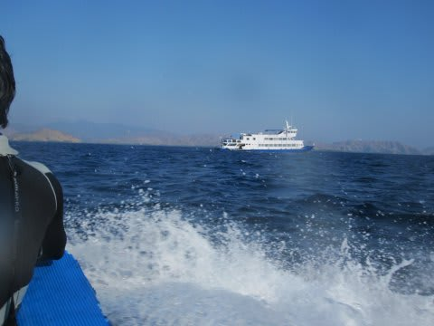

あ．

あれは．

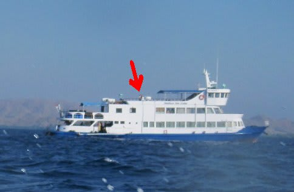

し，

しまった～っ！！！！

む，娘だ！

トップデッキに，リンダさんに抱かれた娘が！！

やっぱり，ダイビング中に起きちゃったんだ～！！

これは，泣いてる．

間違いなく．

ボートが着いたら，「これからもうダイビング行かないで～！」っていわれるっ！

マズい．マーズ～いっ！！！

ボートが本船に着くのももどかしく，

とりあえず，娘のもとへ急がねば…っ！

（続く)
