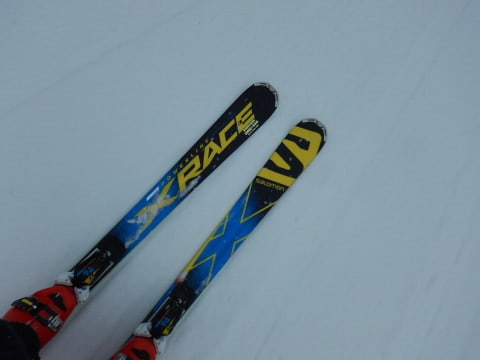
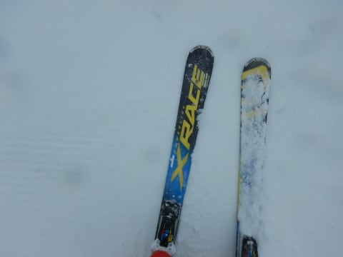
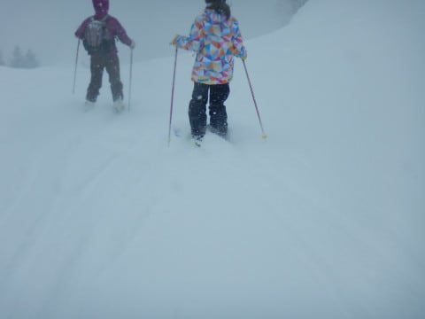

# 2月17日(土)の志賀高原は…激冷え吹雪の一日．予想より激しい降りで，かなりの修行感の一日（涙）

📅 投稿日時: 2018-02-18 02:07:58

全国2億4千万25人の徒然スキーヤー日記のファンの

皆さま．←だから，日本人口より多いから．そして端数の25人って何？？

ようやっと，志賀高原にも．

待ちかねた降雪がありました…！！

でも．

本日はスキーをするには厳しすぎる天気で．

…そうです「吹雪」と，世間では言われる天気でした（涙）

まず，朝．

志賀高原に登ってくる道路は，ほとんど積雪がなく…

いや，やばいね．

今週も積雪がほとんどなかったようですな…

サンバレーまで，雪道じゃない普通の道路って感じで

上がれちゃいます．

…ただ，サンバレーを過ぎるとちょっと雪道に

なってきてました…

で．

本日．

焼額第1ゴンドラ乗り場の到着が．

営業開始の8:30に3分遅れるという，

私にしては致命的ミス（涙）．

朝礼に遅刻状態で山頂に上がると…

うむ．

気温は-9℃と，結構冷え込んでますね～．

水曜の予想の，

　気温は-10℃近くまで冷え込みそう

というのがドンピシャあたりですか…

そして，山頂の天気は…

ゴンドラ営業開始直前まで曇り空だったのが，

ちょうど雪が降り始めてきて．

ゲレンデは，シマシマの上にうっすら新雪が

乗ってる感じで．

おほーーー！

1本目は，うっすら積もった冷え冷え新雪を切り刻む快楽！

…でも．

2本目になると．

なんだかいきなり雪の降りが強くなって来たんですが…

…そして，じきに結構本格的な降りになり．

視界が悪くなってきちゃってるんですけど（涙）

ゴンドラ営業開始前までは，全く雪が降ってなかったのに，

営業開始直後からこんな降りになるとは…

なんてことだ（泣）．

これは，昨日の最終予想の，

　水曜の予想通り朝から雪になりそうです…

　…それも，夜は降らないのにリフト営業

　開始のころから降り始めそう…という

　嫌がらせのような天気（涙）．

というのが，大正解じゃないですか！！

…

…って，喜んでる場合じゃないから．

なんで，こんな悪い予想はぴったり当たるのか…（泣）

こんな予想は当たらなくていいですから～っ！！

って感じで．

天気が悪くなってきたんですけど．

それだけでなく．

さすがのトップシーズンの2月の週末だけあって．

うぎゃーーー！

なんだ，この人口密度はっ！！

こんな人口密度の中，雪が結構な勢いで

降るので，新雪がそこそこ積もっていき…

時折吹き溜まりになったような雪に足を取られる

難しめのコンディションで，これだけの人を

避けながら滑らないといけないという．

うむ．

ちょいと厳しい状況…（ちょっと残念）．

でも．

せめてもの救いは．

焼額第1ゴンドラは，最大でもこの程度で，

せいぜいゲートの外にちょっと並ぶかな…

という感じの，1-2分待ち程度の混雑．

第2ゴンドラは15分待ち程度まで行ったようですけど．

第1ゴンドラはそれほど待たなかったので，良かったかな．

で．

お昼頃になっても．

気温は…-9℃の冷え冷えのまま．

そして，雪は激しく吹き付けるようになってきて．

…これ．

すげー寒いんですけど（泣）．

ここも．

　昼間もほとんど気温は上がらず．

　冷え冷えの一日！

というのが．

過剰に当たっている気が…

さらに，午後になると．

…こ，これは．

もう，完全に吹雪ですね…（激泣）．

そのおかげで．

奥志賀は，午後1時ごろ．

ゴンドラどころか，第2，第3，第4ペアまで

止まっちゃったようなんですが…

　午後は風も強くなりそうで，奥志賀ゴンドラが

　止まらないか心配…

ってのが，これまた過剰に当たりましたね…（涙）

風は北風だったので，北向きの奥志賀は全滅状態でしたが，

北風に強い焼額はゴンドラの減速もなく，

普段通りの運転でしたよ～！

…しかし．

ひどい雪降りのおかげで．

午後に入ると，ゲレンデの人は減っていき…

そして，すごい勢いで降った雪は，

コース上にも激しい勢いで積もり始め．

コース上もところどころプチパウダー状態！

ってか，プチパウダーならいいけど．

どちらかというと，滑っているといきなり

吹き溜まりに足を取られるという．

かなり激しい前後バランスのトレーニングに

最適のバーンになりました！←あえてポジティブに書いてみる

だけども，午後遅くなるにつれ，吹雪の激しさは

だんだん増していき．

娘も午後2時過ぎには

「寒い…」

と言い残し，切り上げてしまうレベル．

おかげで，午後のゲレンデは．

午前と違って，人が減って良かった

かな！！←しつこくもあえてポジティブに書いてみる

しかし．

しばらく雪が積もらなかったので．

降ってくれるのはうれしいけど．

なぜ，営業時間になるまで全く降らず．

営業時間中に，コースわきにこんなに

積もるほど降っちゃうのか…

まさに嫌がらせとしか思えない天気…（涙）

そうです．

今日，志賀高原に来た人に．

強烈に日頃の行いが悪い人がいたに

違いありません！！←それはあなたでしょ

ってな感じで．

寒いし，吹雪くし，視界が悪いし，

吹き溜まった雪で足場が悪い…

という，かなり修行感の強いコンディションが

続きましたが．

なぜ？？

なぜ，今朝まで降らなかったのに．

週末の営業開始とともにこんな天気になっちゃうの…(涙）

と，涙をこぼしながらも．

やはりお約束通り，しっかり

営業終了まで滑り続けたのでした…

そして．

私の悲しみは，これだけでは終わらない．

本日．

悪天候のため，一の瀬ファミリー＆ダイヤモンドのナイター中止

という，トドメまで刺されて．

あぁ…日頃の行いが悪い人は，いったい誰だ…

と恨みつつ．

泣きながら布団に入る，Skier_Sだったのでした…

…本日．

深夜になっても，降り続けてます．

明日朝は，脛パフくらいの新雪が行けるかも…？

## 💬 コメント一覧

### 💬 コメント by (Egu)
**タイトル**: ファーストトラック
**投稿日**: 2018-02-18 06:46:52

土曜日は営業時間の半分くらい休憩してました。そして日曜日のファーストトラック、悪天候のため中止との悲しいお知らせが先ほどありました。

パウダーを独占！と思い昨日申し込んだのに...

通常営業開始時間も遅れるかもとホテルフロントが言ってました。

### 💬 コメント by (いー)
**タイトル**: Unknown
**投稿日**: 2018-02-18 07:17:25

ゴンドラ山頂では久しぶりにごあいさつできました

奥志賀ゴンドラに車を止めたので誰もいないダウンヒルで帰りました。隅っこは脛パウ位で楽しめたかな (笑)

### 💬 コメント by (かず)
**タイトル**: Unknown
**投稿日**: 2018-02-18 19:17:53

楽しかったですね来て良かったです〜人が多くすぐ荒れてしまいましたが　駐車場は凄かったですね　明日はヤケビリセットは期待できませんが　奥志賀があるので仕事休みにしました　今日2本バス乗りましたがコースは普通の圧雪程度　ガスで視界不良でよいました　非圧雪はいい感じになってましたよ！

### 💬 コメント by (はっち)
**タイトル**: Unknown
**投稿日**: 2018-02-18 22:50:33

昼前まではなんとか頑張れましたが、昼過ぎからの修行にはたえられず、14時頃にリタイヤしてしまいました。

また今度、お会いしましょう！

### 💬 コメント by (しんちゃん)
**タイトル**: お世話になりました
**投稿日**: 2018-02-18 23:46:26

この土日、ホントに冷え冷えでしたね。

いろいろとお世話になりありがとうございました。

今回の降雪は、読者の皆さんの降れ降れ踊りが効きすぎている気がしています(笑)

次回は三月中頃になりそうです。

またいろいろとよろしくお願いします。(^^ゞ

### 💬 コメント by (Skier_S)
**タイトル**: コメント回答遅れてすみません
**投稿日**: 2018-02-19 11:06:49

昨晩コメント投稿したつもりが

投稿されてなかったようで…

すみません。今晩改めてコメント回答投稿します。

今しばしお待ちを…(;_;)

### 💬 コメント by (Skier_S)
**タイトル**: 遅くなりました～！コメント回答です
**投稿日**: 2018-02-20 02:06:14

＞Eguさま

日曜はファーストトラックがなかったようで，

残念でしたね…

でも．一の瀬のリフトは営業開始がかなり

遅れたようなので，通常営業開始時に

しっかり1ゴンが動き始めただけでも

かなりラッキーだったようです…

しかし，日曜もさむかったですね！

＞いーさま

久しぶりにお会いしましたね…

土曜は奥志賀ゴンドラがいきなり

営業中止になったらしく，かなりの人が

ゴンドラ乗り場に取り残されたようで…

最後のプチ脛パフ，ちょっとうらやましいです．

＞かずさま

日曜朝は結構積もってましたね…

かなり重めでしたが，朝の4本くらいは

楽しめましたね．

月曜の志賀はいかがでしたか？？

晴天で良かったのではないでしょうか…（羨望）

＞はっちさま

14時にリタイヤですか…

うちの娘も同じくらいの時間に

リタイヤでした．

土曜は寒すぎましたよね…

＞しんちゃんさま

無事宿も確保できて，良かったですね！

でも，この土日．

天候が悪すぎました…（残念）．

土日は積もりましたが，このあと1週間

また積雪がなさそうなので…

それを考えると，まだ積雪が足りない感じ…

もう少しの間，降れ降れ踊りを踊り続けないと

GW営業が安心できない感じです（笑）

