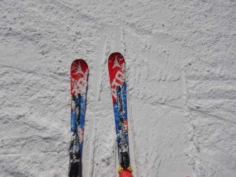
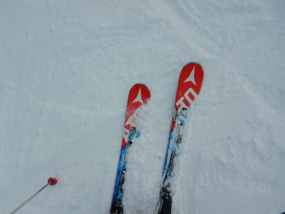

# そして，ATOMIC Bluester SX四朗君をデビューさせてみた…果たして，三郎君はホントにヘタっていたのか？？

📅 投稿日時: 2020-01-31 01:54:11

🏷️ カテゴリ: [スキー雑談](c1f9d2cb7478308da16419928ea3945e9.md)

本日の焼額山ですが．

朝から0℃近い，高めの気温でスタートで．

そして，晴天なれど，硬めのバーンで

スタートだったようですね…

（[焼額山Facebook](https://www.facebook.com/yakebitaiyama)より）

　朝の気温は-2～3℃と，比較的

　気温が高めの朝．

　あさイチは，前日の雨で冷えた雪が固まった，

　ガリガリバーン．コース全面アイスバーン気味（涙）．

　晴れ間の合間に雲が飛んでくる，

　晴れたり曇ったりの天気．

という予想が，概ね当たったようですが．

ただ，気温が高かったので，午後は完全に

春の雪になって．

オリンピックコースやイチゴン乗り場は，

ちょっと雪が茶色くなってきていたと，

焼額特派員から状況が送られてきました…

うーん．

1月の志賀高原で，そんな春の雪になって

しまうとは…（涙）

ただ．

　午後遅く，リフト営業終了のころになると，

　気温が冷えていき，雪雲が飛んできて

　雪が降り始めそう

という予想もドンピシャ正解で，

午後4時過ぎくらいから降り始めて．

志賀高原では，積もり始めている

ようですよ…！！！

（[北信建設事務所道路気象状況ページ](http://hokushin.pref-nagano-roadcamera.jp/)より）

明日までに，10cmは積もってくれるはずっ！！

そして，明日の昼間もさらに10cmくらい

積もると，全身全霊で念じているのですが…

明日，新雪が積もっていたら．

それは全て私のおかげですので，

皆さん，感謝してください←積もって無かったら，半殺しにしていいのかな？

とりあえず．

昨日の予想通り．

今週末は，冷え冷え柔らか雪で滑れるはず…っ！！

ということで．

本題へ．

…[以前の記事](ef0c360ac12bd72263d69f111b44fb947.md)に書いたように．

昨年1月にデビューさせた，ATOMIC Bluester SXの

三郎君．

どうやら，この三郎君に過労の気配がうっすらと見えたので．

その次の週末に，SX4兄弟の末っ子，

四朗君をついに投入しました…っ！

なぜか自己増殖た結果，我が家に4台あったSXの

最後の1台をついに投入したわけですが．

（何度見てもインパクトある絵だな…）

果たして．

三郎君はヘタっていたのか！？？

そして，四朗君の性能や，如何に？？

…と．

四朗君を履いて滑りだしてみましたが…

違う．

違うよ！！！

数m滑っただけで違いが分かるよ！

谷回りの早い段階からのグリップ．

グリップしてからの驚異の旋回力．

スピードをどこまで出しても板が

張り付き食いついていく，素晴らしい安定感．

そして，山回りが終わってから，

切り替えで感じる，驚くほどのばね感．

…これは．

三郎君と違いすぎる…っ！！

四朗君…

これ，ホントに三郎君と同じ

ATOMIC Bluester SXなのか！？？

その後，三郎君を履いてみると．

うぎゃーーー！

違う．

違うよ！！！

谷回りでどこまでも捉えないルーズさ．

グリップしなくて，旋回力の感じられなさ．

スピードを出さなくても，どこまでも板が

ずれていく，素晴らしい優しさ．

そして，山回りが終わってから切り替えで

感じる，ペタペタ感…

…これは．

四朗君と違いすぎる…っ！！

…ということで．

結論として．

わずか1シーズンもたずして．

SXの三郎君．

四朗君の後に履いてみると．

もとSXだった何か

というレベルではなく．

これ，スキー板か？？

と感じてしまうほど，ヘタっていた

ことが判明…（涙）

その後．

再び四朗君に戻してみると．

…楽しい．

楽しいよ！

驚くほど板が回ってくれるし，

スピード上げてもどこまでもついてくるし．

むちゃくちゃ楽しい！

三郎君を履いていた時，板がずれないよう

必死に抑えていたのが良く分かる…

余計な動きをしなくても，板がちゃんと

グリップして曲がっていく，この楽しさ！！

…とりあえず．

これまで何度も同じ思いをしてきたんだけど．

今回も改めて思った教訓として．

新しいスキー板の方が，圧倒的に楽しい

ということを改めて痛感した，Skier_Sだったのでした…

…しかし．

この四朗君も．

一体いつまでこの新鮮な状態で

いてくれるのか…

スキー板，寿命短すぎ（涙）

## 💬 コメント一覧

### 💬 コメント by (Hide)
**タイトル**: Unknown
**投稿日**: 2020-01-31 08:11:42

S 様

Sさんの特殊能力をもってすれば、四郎君はがんばって来シーズン末でご隠居でしょうか？

2021/22シーズンは、長男である赤一郎君が誕生し、そのシーズン末に次男が自己増殖・・・・

という予想で竹下景子さんに1000点！

### 💬 コメント by (Northfox)
**タイトル**: Unknown
**投稿日**: 2020-01-31 12:53:03

スキー板が1シーズンも持たないとは。20000m倶楽部のゴールドの方はみなそうなのでしょうか。。。

ともあれ四郎くんの次を用意という正当な理由が出来た訳で、物欲選手権の開催確率がグッとたかまりましたね！

今後3ヶ月以内の発生確率が40%、6ヶ月以内が60%ってとこでしょうか。

板尾買蔵さんの解説を楽しみにしています。

### 💬 コメント by (いるか)
**タイトル**: Unknown
**投稿日**: 2020-01-31 16:39:32

こんにちは。

　２月の中頃に一の瀬ファミリーに修学旅行に行きます。スキーまったくの初心者です。

　いつも天気予報を見させてもらってます。

　今、肺炎など心配なのですが、一の瀬ファミリーは中国人観光客多いですか？

### 💬 コメント by (レインボー)
**タイトル**: Unknown
**投稿日**: 2020-01-31 16:51:17

20000ゴールドでも、普通の三下スキーヤーもいますよ。ただ、頭が悪いので延々と同じことを繰り返してもバカバカしさに気づかないだけです。

今、湯田中で雪見酒しています。こ、この降り方は！ひょっとしたら、ひょっとしたら！

今日の志賀は、楽し過ぎ。朝一のオリンピックは15cmの新雪ながら、1ゴンスタートの７名のあと。にっくき越後屋は(今、水戸黄門を見てるので)Ｋ夫妻、H多妻、ゆみりん、ボード。雪が重くててこずりました。でも、だんだん雪が良くなって、後ろ髪をひかれる思いで、きっちりレインボーの隊員でした。

明日はひょっとして初ファット？

皆さん、気をつけてお越し下さい。

### 💬 コメント by (レインボー)
**タイトル**: Unknown
**投稿日**: 2020-01-31 17:37:59

ごめんなさい。。雪見酒終了。湯田中の雪がやんだ。

やっぱりファットなんて昔のアイテム。

### 💬 コメント by (レインボー)
**タイトル**: Unknown
**投稿日**: 2020-01-31 18:01:57

今日から中国人対策で、マスクを用意しました。ゴンドラで、らしき人に遭遇したら、マスクON。

日本語を聞くと、マスクOFF。

結局2ゴンロビーの一回、危険にさらされただけでした。

多分、今は安全かと思います。

差し出がましいですが、スキーヤーSの現地特派員でした。

### 💬 コメント by (かず)
**タイトル**: Unknown
**投稿日**: 2020-01-31 19:12:56

本日は期待してましたが15cmほどでした  オリンピックも下ガリガリ 非圧雪も氷のコブ  午後からかなりいいふりでしたけど………下は現在降ってません

### 💬 コメント by (西館)
**タイトル**: 西館は降ってますよ！（22:07時）
**投稿日**: 2020-01-31 22:08:40

本日14時ゲレンデ入りで時間が無かったので、ジャイアント1本→一瀬→高天原→西館でした。

アイスバーンの上に新雪が乗っている状態で、もふもふを楽しんでいると突然アイスバーンで横滑りする感じでして、実は一番状態が良かったのが西館でした。滑走者が少ないから荒れていないのでしょう。次が高天原。これまた荒れていないから？。

一瀬の林間は、あまり幸せでは無かった。

西館は、今も柔らかく降ってますよぉ！

明日も降り続ける気がします、でも、まだまだ降って欲しい！

日曜日の朝に帰る予定でしたが｡｡｡無理して夜帰りにしちゃうのか？＞私！

ざっくりで良いので天気予報お願いしま～す。

>いるか様（横レス失礼致します。）

修学旅行でしたら志賀高原までの移動は仲間だけの空間でしょうし、一瀬にはゴンドラは無いので大丈夫な気がします。

マスク以上に、帰宅すぐに歯磨きしたり、シャワーしたりする方が効果が有るんですって！。

睡眠をしっかりとって良い食事をとって、甘い物は控えめにして抵抗力のある身体にしていると良いような気がします。

そして、脳天気な方が病気にはならないようにも思います。

とにかく修学旅行、楽しみですね！いっぱい楽しんでくださいね～。

### 💬 コメント by (Goku)
**タイトル**: ポチっとな！
**投稿日**: 2020-01-31 22:36:31

新しい板はイイですよね～♪

今年は3本体制なので、ずっとフレッシュな板を楽しめます(^^)v

当分買わないぞー・・・

### 💬 コメント by (Skier_S)
**タイトル**: 今週末は，今シーズン最高のコンディションのはず！
**投稿日**: 2020-02-01 00:00:37

＞Hideさま

四朗君は，来シーズン末までもたないと思います…

次の板は，赤い板を履くのか何を履くのか，

まだ未定です（笑）．

＞Northfoxさま

20000mゴールドの人はほとんどの人が複数セット板を持っていますが，

1シーズンごとに1～2セットの板を買っている気がします…

物欲にまみれてますね（笑）．

物欲選手権は…やらない．やらないぞ～（棒読みで）

＞いるかさま

修学旅行にスキーですか！

いいですね～…

楽しんできてください！

一の瀬ファミリーは，多いって程じゃないけど中国の方はいらっしゃいますね…

でも，ゴンドラが無いのでおそらくゲレンデではそんなに濃厚接触は無いと思います．

＞レインボーさま

今日の朝イチは良かったみたいですね…

湯田中は降ってないようですが，志賀の山の上は

深夜0時現在，降ってるようです…

明日はきっと，今シーズン初のパウダーのはず！！！

一応太い板を持っていきますが．

太い板を履くほどの積雪量になるかな～…

＞かずさま

まぁ，今日の予想自体10～20cmと呼んでましたから，

ほぼ予想通りの積雪かと…

今シーズンは，まだ30cmとか，50cm積もりそうな

天気図になったことはありません（涙）

明日の朝もせいぜいブーツパフですが，雨じゃないだけ，

今シーズンはこれでも良しとしないといけないレベルです（泣）．

＞西館さま

今日は西館が良かったのですか…

焼額も，ふわふわ雪の下がガリガリで手ごわかったと

レポート受けてます．

明日の土曜も一日雪降りです！

昼間は積もらなさそうだけど，朝はブーツパフくらい

積もっていることを期待…！！

土日，焼額にいらっしゃるようならぜひお会いしたいです…

＞Gokuさま

板が3本体制なので，3年もったとしても，

毎年どれか1セットずつヘタる計算になっていきますよ…

そして，3年もたない板が出てくると．

1年で2セット購入という恐怖が…

そういえば，Nordicaもう1セットお買い上げしないんですか？

### 💬 コメント by (いるか)
**タイトル**: Unknown
**投稿日**: 2020-02-01 05:53:38

おはようございます。

　こんなに返信いただけるとは思いませんでした。

　スキーヤーさん、みなさん親切で感激です。

　初心者でいろいろ怖いと思ってたんですが、がんばってちょっとは滑れるようになりたいと思います。　

　本当にありがとうございました。

### 💬 コメント by (西館)
**タイトル**: それでは日曜日のお昼頃
**投稿日**: 2020-02-01 23:01:48

Skier_S様に、そこまでおっしゃっていただきましたからには、日曜日も延期して焼額へ行こうと思います。

しかし、私はせいぜい70km/hですし、Ｓ様を見つける自信が全くありません。

本日も1ゴンへは行きましたが、沢山の人の中で青四郎くんを見つけられたとしても、恐らくはお声がけする前に颯爽と滑って行かれるのだろうな、と諦めました。（yumiさんって凄いと思うの。）

銀色ステッカーを貼っている板は見つけられたんですけど、それは静止中だったし。

そこで、できましたらＳ様が私を見つけていただけないでしょうか。

明日は、相棒くんは別途友人がやってくるので単独行動します。

メット着用、胸・肩甲骨辺りから上が黒と白の絵の柄で手首周りに赤いラインの入った黒いウェア、黒いパンツ、手袋も黒、靴は青のラング（オレンジバックル）、白っぽいツインチップの板、ストックは銀色ハート、身長155cm程度です。

11:30頃から13:00頃まで１ゴン中級コース(オレンジ看板ジャイアントスラロームコース)を周回しようと思います。

それでは明日楽しみにしています、よろしくお願い致します～。

### 💬 コメント by (Skier_S)
**タイトル**: 明日は最高な一日になるはず…
**投稿日**: 2020-02-02 00:00:55

＞いるかさま

スキーは楽しいですよ～！

ぜひ，修学旅行でスキーを楽しんでください．

スキーは毎日滑っても，ちょっとずつ上手くなる楽しみがあります．

最初に天気が悪かったり，吹雪いたりするとスキーが嫌になるかもしれませんが，

晴れたいい天気で滑ると最高です！

修学旅行の日，天気が良くなることを祈ってます…

＞西館さま

銀色ステッカーは私ではないです…

明日は午前中は，SALOMON X-RACEを履いているかも．

昼頃には，ATOMICの四朗君を履いている可能性が高いですが…

私も明日探してみます．

ただ，今日ちょっと腰を痛めたっぽいので，

明日はそんなにスピードを出さずに滑っていると

思います…

