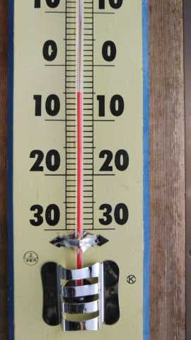
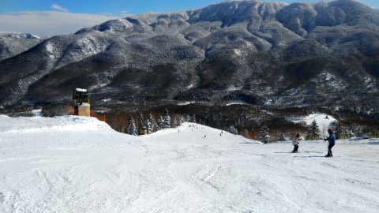
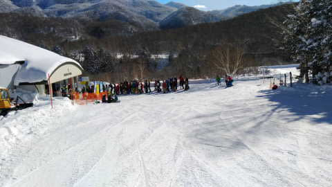
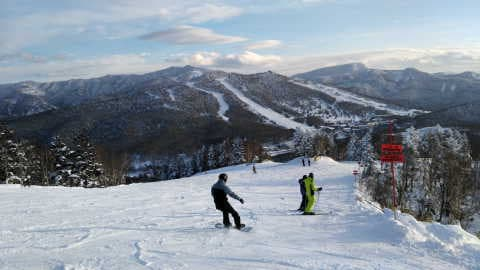
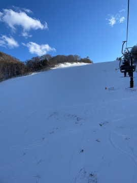
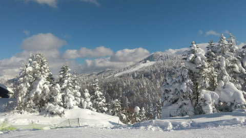
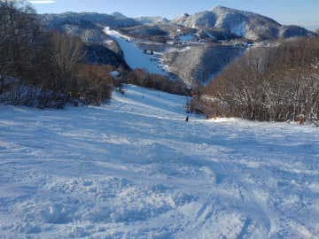
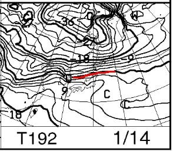
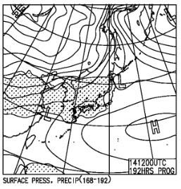

# 明日から志賀高原へ復活するよ！！…そして，3連休初日の1月7日(土)の志賀高原スキー場，特派員情報！

📅 投稿日時: 2023-01-08 00:25:12

🏷️ カテゴリ: [日記](cc4b5682fb7b8b144980957a978653fb0.md)

ということで．

3連休初日の今日は仕事してて，スキーに

行けませんでしたが…

…

で．

まだ仕事が終わってませんが．

月曜の夜にスキーから帰宅してから

残りの仕事をやる

ということに決めて←そんなことできるんか？？

明日，明後日は志賀高原へ復活します！！

…って．

こんな時間にBlog書いてて，明日朝4時

出発で300km運転して

スキーに行けるんだろうか…

とりあえず．

特派員による本日，3連休初日の

志賀高原の状況は…

昨日の予想の，

　朝の気温は-5℃以下までは冷えそう．

という予想通り，5℃までは冷えてくれて…

そして．

　朝の積雪は0cm．

　あさイチはいい感じのシマシマ！

と書いたように，朝の積雪は0cmで．

朝のうちは気持ちいい締まったシマシマ

バーンだったみたいです！！

昼間も締まり気味の良いバーンだった

ようですね…

ただ．

さすが3連休なだけあって，ちょっと

混んだみたいですが…

でも，焼額第1ゴンドラのピークは

この程度．

相乗りレーンだとほぼ待ちなしで乗れた

ようです．

天気は終日晴れ！！

曇り時々晴れの予想は外したけど…

　昼間もマイナスキープ．

というところは当たり．昼間はかなり

気温が上がったけど，ギリギリ

マイナスキープだったみたいです．

…だけど．

概ね全面滑走可能になったとはいえ．

やはりまだ積雪が少なく．

GSコースも，昼ごろからはごく一部に

ちょっと浮石があったみたいだし．

ジャイアントスキー場は…まだ雪着きが

悪く，コース幅の2/3くらいしか

滑れないみたいです(涙)

さらには寺小屋がクローズしていたり…

西舘FISコースが圧雪車1台分の幅しか

圧雪してなかったりと，中央エリアは

残念な感じのところが多いみたいです（泣）

とりあえず．

明日8日の朝は，昨日の予想通り

深夜に5cmほど積もるかな～…

あさイチは柔らかめの圧雪バーン！

でも，昼間は全く積もらなさそう…

というか．

昼間は晴れそうです．

9日は…雪がぱらつくかな．

午後は冷えて雪が強まりそう…

もしかしたら，9日夜から10日にかけて

ちょっと積もるかも！！！！

10日は，久しぶりのパウダーデーになるかも？

10，11日はコンディション良さそうかな？

…でも．

来週末は…

うーーーーん…

…覚悟してください（激涙）

ってなことで．

週末楽しむなら今週がチャンス！

明日，ゲレンデでお会いしましょう～！！

…また，3時間しか寝れない…(涙)

## 💬 コメント一覧

### 💬 コメント by (ももも)
**タイトル**: Unknown
**投稿日**: 2023-01-08 18:12:49

Ｓ様

無事にスキーに行けたようで何よりです！でも無理はしないでくださいね。

我が家は7日が最終日でしたのでお会いできなくて残念でした。

Ｓさんに申し訳ないーって言いながら、４日間は雪降りやパウダーを滑り、最終日はピカピカ晴天の横手を楽しみました。満足です！！日々の行いのお陰だわ(笑)　　Ｓさんにも幸あれ！

### 💬 コメント by (Skier_S)
**タイトル**: ＞もももさま
**投稿日**: 2023-01-08 23:54:42

お久しぶりです～！

そうですか．

ちょうど入れ違いでしたね…

コンディションいいタイミングで滑れて良かったですね…

私はこれからいいコンディションを滑れるはず！！

また志賀高原でお会いしましょう～！！

