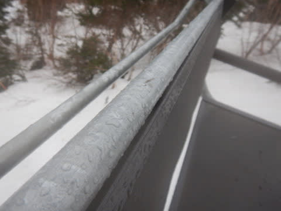

# 2021/4/4(日)の志賀高原スキー場レポート，速報モード！…午前中時折ポツポツ，午後2時過ぎからパラパラ雨．雪がすごい減ったよ(泣)

📅 投稿日時: 2021-04-05 02:14:22

えー．

今日も志賀高原を滑ってきて，

帰宅したわけですが．

それは，数日前の仕事中のこと…

関係者「来週締め切りの件，金曜に間に合わないので

　日曜にWeb会議しましょう！」

私「え…日曜…！？？」

関係者「…来週月曜だと間に合わないので日曜で

　お願いしたいんですが…

　夜8時からでいかが？」

私「夜8時ですか…」（日曜ラスリフまで滑ったら

　帰宅間に合わないよ…）

関係者「…時間，遅すぎますかね？」

私「早い…」

関係者「え？」

私「夜10時スタートじゃダメでしょうか…？？」

　（これなら，ラスリフまで滑ってもなんとか間に合う！）

関係者「え…夜10時…

　…まぁ，いいですけど…」

私「じゃ，夜10時からでお願いします！！」

という私のご無体なお願いで，ラストリフトまで

滑っても間に合う時間にしてもらったWeb会議．

この会議に参加するため．

4時ラスリフ終了後，全力で下山，夕食も

走っている車の中で済ませて．

Web会議開始7分前にギリギリ帰宅した，Skier_Sです．

…いやー．

間に合った…

きわどかった…

（そもそもスキーしてる場合だったのか？そして，ラスリフまで滑ってる場合だったのか？？）

ってなことで．

さっき会議終わったところで．

長いレポートを書くパワーが残ってないので．

今日の志賀高原レポート，

久しぶりの速報モードにて…！

（正月以来の速報モードじゃなかろうか？）

まず．

本日は…

焼額スタートと思っている皆さんの期待を

裏切る（？），熊の湯スタート！

朝はうっすら明るめの曇り空だけど，

あさイチから気温は高く，ゲレンデは

朝から緩み気味…（涙）

そして．

馬の背上部，早くも土が出てきてます！！

…これ，例年なら4月中旬…いや，下旬の

雪の量なのでは？？

昨日の焼額でも思ったけど，

この一週間の雪の減り方，

半端ないです…

でも．

天気が悪い予想だったからか．

ゲレンデはガラガラで…

昼前のクワッドリフト待ち，ピークで

この程度．

第1，第2ペアリフトは終日待ち０で，

経営が大丈夫か心配になるレベル…

で．

天気は，午前11時前から，時折ぽつぽつ

雨が降り始め．

12時ごろには一旦止んだものの．

午後1時半ごろからまたポツポツ来たかな…

と思ったら．

午後2時半からは，雨がパラパラと降り始め，

ウエアがびっしょり濡れるほどの感じに(泣）

だもんで．

午後2時以降はゲレンデは完全に

無人状態でした…！

雪は重かったものの，雨のおかげで

ストップ雪にはならなかったし．

ガラガラで好き放題滑れたので，

やっぱラストリフトまでしっかり

滑ってしまい．

会議ギリギリになってしまったのでした…

ってなことで．

なぜ，本日熊の湯に行ったか．

…皆さん，もうわかりますよね．

そうです．

今日は，熊の湯で開催された試乗会に

参加してきたのでした～！！

…前回参加したエキップさんの試乗会の

試乗レポートもまだ書いていませんが．

ボチボチ試乗レポート書いていきます…

明日，根性があれば日曜の熊の湯，

詳細レポート書きますね！

おやすみなさい…zzz

## 💬 コメント一覧

### 💬 コメント by (ikkun)
**タイトル**: Unknown
**投稿日**: 2021-04-05 07:54:17

おはようございます いやいやすごいや➰仕事さえスキーに合わせるm(__)mしかしそれだけしっかりしたお仕事をされるからそう出来るのですね？試乗会楽しみにしてますなかなか買えないけど楽しいので…(笑)

### 💬 コメント by (ikkun)
**タイトル**: Unknown
**投稿日**: 2021-04-05 07:56:23

追伸 新潟上越高田の夜桜雨の中で傘も指さず一人見てきました❗散り始めたていてやはり早いけどキレイでしたお土産は二色串団子ですか

### 💬 コメント by (さち)
**タイトル**: Unknown
**投稿日**: 2021-04-05 09:29:37

やっぱり日付かわってるじゃないすかw

土曜日は貴重なお時間をありがとうございましたm(__)m

同行の某氏は写真が載ってて小躍りして喜んでおりました！ありがとうございます！

どうか、死なないでくださいね、いやマジです。

### 💬 コメント by (レインボー73)
**タイトル**: Unknown
**投稿日**: 2021-04-05 15:38:30

湯田中は小雨。出発を30分遅らせて８時2ゴン着も一番籠。明日からはスタートをもっと遅らせよう。上林４℃　蓮池２℃。上でも小雨だけど、滑りそうな雪。ワックスは最近はスーパーレインXをひと塗りするだけ。

山頂ー１℃。いいぞ。雨あがりの滑る雪。ややガスってるも、気持ち良すぎ。明日までで帰る気持ちがグラグラッと！

ゴンドラは省エネ運転なので、一回り16分かかる。これでは12時間滑らないと2万は不可能。

２本目、３本目、これだよ。

しかし、幸せはそんなに長くは続かないのが世の常なんです。

大回りで同じように滑っているのに、最高速は、81、71、64km/hと滑るごとに下がっていく。太陽は出ていないし山頂はー１℃のままなのに、人も少ないのに、、、

結局２時間８本滑っただけで終了。タラの芽ご飯を作りたくなりました。

### 💬 コメント by (レインボー73)
**タイトル**: Unknown
**投稿日**: 2021-04-05 15:49:23

世にも奇妙な物語

湯田中の近所にゴールデンリトリバーがいます。ずっと可愛がっているのですが、『名前は?』『ワン』としか答えないので、勝手に『エス』と名付けていました。

『スキーで私を抜き去りゃがって』とか

『可愛がってやるぜ、おらおら』とかでは決してありませんからね。

ところが最近、エスの本名がわかったのです。本名はなんと『エス』

いつかはエス様と親子のご対面！感動場面ですねえ。

### 💬 コメント by (Skier_S)
**タイトル**: コメント回答遅くなりました…
**投稿日**: 2021-04-07 03:31:18

＞ikkunさま

仕事よりスキーが優先ですから！！

試乗レポートはボチボチお待ちください…

しかし，高田城址公園の桜，もう散り始めですか！？？

例年と比べると，今年は早すぎますね…

＞さちさま

土曜はこちらこそありがとうございました～！

日曜会えず残念でした．

写真写ってて喜んでもらえてよかったです(笑)．

これからも死なない程度に頑張ります…

(でも，今日も仕事終わったらこんな時間（涙））

＞レインボー73さま

勝手につけた名前とホントの名前が偶然一致するなんて…！！

かなりの偶然ですね．すごい．

今度親子対面(?)させてください…

