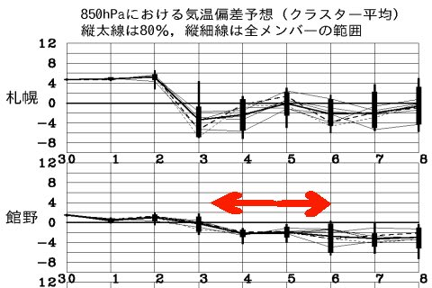
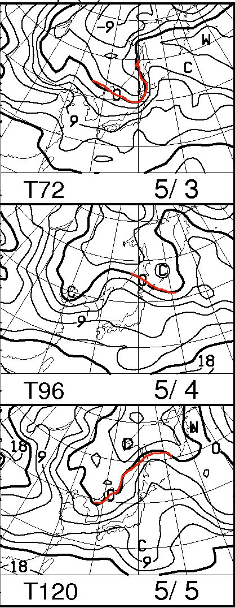
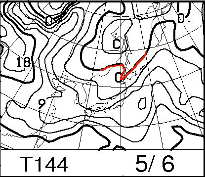
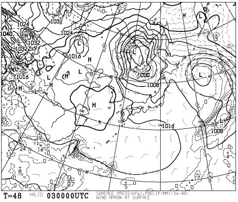
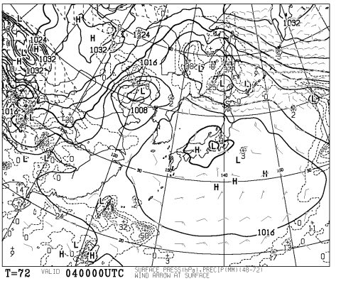
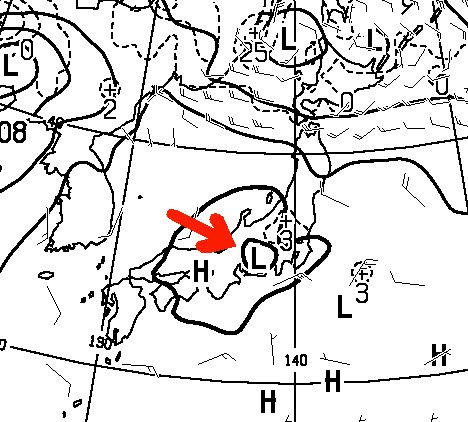
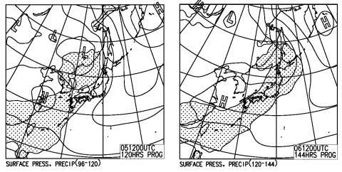
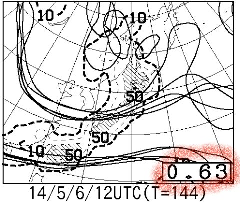

# GW後半，4連休の志賀高原の天気は…奇跡は起きなさそうだなぁ…

📅 投稿日時: 2014-05-02 01:02:45

🏷️ カテゴリ: [スキー天気予想](c6554f5c3c106093b511a8daae23757e8.md)

ってことで．

GW後半の4連休．

初日2日間，結構宿も満室みたいで．

GW前半のようなガラガラ状況とは違って，

ゴンドラ待ちも結構出そうな感じがする

今日この頃．

皆様いかがお過ごしでしょうか．

で．

なんだか．

GW後半の予想天気図．

ここ数日でころころ変わってるんですが…

とりあえず，現時点の天気図をもとに，

皆様お待ちかねの，←待ってた人なんているの？

GW後半の天気予想をしてみましょうか…

まずは，気温ですが．

まー，こんな感じなので．

平年並みよりわずかに低いくらいの気温が続きそうですね．

…ってことは．

昼間は日が射すと結構暑いくらいですかね…

恒例の，850hpa気温図ですが．

こんな感じで，日本よりはるか北に行っちゃって…

…志賀高原は，大体6度線がかかるくらいかな．

まぁ，GW前半と同じくらいで．

深夜は0℃近くまで下がったとしても．

早朝のスタートから気温はプラス．

昼間は10℃前後に上がっちゃう感じですね～．

で．

地上天気図を見ると．

初日の3日，朝9時の天気図はこんな感じで…

まぁ，おおむね晴れそうかな．

だけど．

2日目の4日，朝9時には…

うむ？

ちょっと拡大してみましょう．

…不気味なプチ低気圧が，本州のど真ん中に…

もし．

この予想図通り，微妙なプチ低気圧が発生すれば曇り．

発生しなければ，晴れそうですが…

うーむ．

で．4連休後半2日の地上天気図は．

うむむむ？

3日目の5日は，降雨が予想される網掛け部分が

ぎりぎり志賀高原にはかかっていないので．

なんとか降らないでくれそうな感じなのですが…

最終日の6日は．

…降水域が，志賀高原をすっぽり覆ってるんですけど…（涙）．

うーーーむ．

最終日，雨の可能性が高くなってきました…（泣）．

ただ．

6日の特定高度線の予想ばらつきを見ると．

こんな感じでばらつきが大きく．

スプレッドも0.63と大きめの値．

…つまり．予想のばらつきがまだ大きく．

天気がどうなるかまだ分からない感じです…

ってことで．

まとめると．

3日：基本的に晴れ．時々雲がかかるかも？

　朝から気温はプラス．昼間はかなり暑いくらいに

　暖かくなるでしょう．朝イチは固いけど，すぐ柔らかくなって

　午前中に結構ドボドボの滑らない雪になっちゃうかな…

　午後はゲレンデは荒れ荒れのザブザブでしょう．

4日：曇り～晴れ．プチ低気圧が発生するかどうかで状況は変わる．

　この日も朝から気温はプラス．曇っていると，放射冷却が

　効かずに，早朝からちょっと柔らかめの雪の可能性も．

　昼間はプラス10℃くらいまで上がっちゃうかな．

　昼間は，この日もドボドボの雪で，午後に向かって

　かなり荒れていくでしょう．

5日：曇り．午前中は晴れてるかも．

　この日も早朝がねらい目．午前中比較的早いうちから雪は緩み，

　昼頃には楽しくないコンディションになってそう．

　夕方に向かって雲が増えていき，南風が吹き込むので，

　昼には雪に汚れが浮いて，滑らない雪になりそう…

6日：曇り．ヘタすると雨かも…

　…この日の天気は，数値予想のばらつきがまだ大きく

　未確定．TVなんかの天気予報も，この日の予想は日々

　変わっていくはず．

…って感じでしょうか．

うーむ．

あまり奇跡は起こらなさそうな感じだなぁ…（残念）．

## 💬 コメント一覧

### 💬 コメント by (komu)
**タイトル**: 明日からヤケビ
**投稿日**: 2014-05-02 18:31:15

去年の奇跡が懐かしいですね。

こちらはGW前半、所用と天気で滑りに行けず…

そのストレスで正常な判断が出来なかったのでしょう。物欲大王降臨してしまいました。

こんな時期にアレを買うなんて人として終わってしまいます。気を付けないと…

今夜日付変更位に出発し早朝から滑る予定です。お会いしたらよろしくお願いします。

### 💬 コメント by (Skier_S)
**タイトル**: komuさま
**投稿日**: 2014-05-02 21:51:03

え？

何を買われたんでしょう…

気になりますね～．

私は今回は子連れですので，明日は通常営業

開始以降に滑り初めです．

昼は娘と一の瀬方面を滑っているかと…

明後日以降の早朝はおそらく一人で

かっ飛ばしているかと思います！

