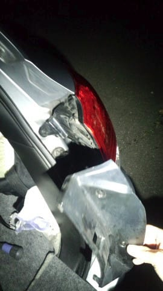

# BRレガシィのブレーキランプを交換してみたよ

📅 投稿日時: 2018-02-07 01:50:34

えー．

なんだか．

北陸は大雪のようですね．

福井県では，困ったくらいの大雪になってるようですね…

そうです．

この8日朝の500hpa気温図なんて．

すごいことになってます．

…普通なら水色の-36℃線が日本にかかるだけで

「強烈な寒気だ，大雪だ～！」と騒ぐところなのに．

それよりさらに6℃も低い，

赤く印した-42℃線が本州にかかるという，

数年に一度レベルの超冷え冷えなんですが．

…だというのに．

強烈な西風で，志賀高原はほぼ積もらなさそう…（泣）．

7日も，ほとんど晴れそうですね．

7日夜から8日にかけては，雪が降って

ちょっと積もるかな…

でも．おそらく10cm，多くても30cmくらいか…．

9日も晴れそうで．

うむ．

志賀高原．

今週は，ほとんど積雪の積み増しがなさそうです（なんだか涙）．

だのに…

3連休初日の10日は．

…

…

oh…なんてこった…（涙）．

この日．地上天気図では．

降水が予想される網掛けが志賀高原にかかっているので…

このままだと．

降れば雨

です（激涙）

…そうです．

神はまだ，満足されていないようです．

10日に冷えて雪になるよう．

情熱的に，激しく，休まず．

みんなで，冷え冷え踊りを踊り続けるのです！！

…みんなが真面目に踊ったか．今週末に明らかになるでしょう…

…てなところで．

本題へ．

先日の日曜のスキーの帰り道．

志賀高原からの下り坂を車で降りている時．

たまたま後ろを，某20000mな方の車が走っていて．

「右のブレーキランプ切れてるよ」

と新雪に親切に教えてくれたのでした…

うはー！ありがとうございます～！

テールランプ，ヘッドランプやウインカーは自分で

確認できるけど．

ブレーキを踏まないと確認できないブレーキランプ．

なかなか自分では確認しにくいもの…

このまま教えてもらってなかったらヤバかった～！

ってことで．

さっそく帰り道の途中でブレーキランプの電球を購入し，

交換することに…

まず．

BRレガシィのブレーキランプですが．

電球は21Wの

「W21W」という種類．

用品店に行って，W21Wの電球を探したけど…

ウインカー用の黄色いWY21Wや，

ブレーキ・尾灯一体型のW21/5Wは売ってるんだけど…

なんと．

W21Wが売ってない（涙）．

しかし．

21Wと5Wの2本のフィラメントが入っている，

W21/5W．

こいつをW21Wのソケットに差せば，

21Wのフィラメントだけ使えるのだ．

ブレーキランプが切れたまま長距離走るのは

気持ち悪いので．

とりあえず，今回はW21/5Wで代用するのだ…

ちなみに．

このW21/5Wは2個入り398円．←2個もいらないんですけど…

まぁ，W21Wとお値段差は無いようです．

…しかし，この両者が同じ値段とすると．

W21/5Wのほうが，フィラメントが2本ある分

お得感が強いな…←なんのこっちゃ

ってことで．

さっそく交換作業開始！

…夜に懐中電灯下で作業したので，

写真が見にくいですがご勘弁を…

まずは，こいつ．

テールランプのカバーを外します．

これは，矢印で示した2か所のファスナーを

軽く引っ張りながらプラスドライバーで左に回すと．

ファスナーがこんな感じで外れるので．

簡単に外せます．

カバーを外した後は．

今度はこの2本のネジを外します．

普通の家庭には無いような巨大プラスドライバー

じゃないと緩められないサイズで．

かつ締め付けトルクがかなり強かったので．

この，普通のドライバーだと，プラス溝を

舐めてしまって緩められず…（ちょっと涙）

私は六角ボルト状になってる頭の部分を，

モンキレンチで緩めました…

この2か所のネジを外すと．

灯体を引っ張れば…

テールランプユニットは簡単に

外れます．

で．

裏を見てみると…

この矢印の上から，

テールランプ，

ストップランプ，

ウインカー

のソケットなので．

真ん中のストップランプのソケットを，

左にひねって外します…

はい．

ブレーキランプとご対面！

で．

このソケットからまっすぐランプを引っ張れば，

ランプはソケットから外れます．

あとは，新しいランプをソケットに差し込んで，

またソケットを元通りの位置にはめ込んで…

また元通りテールランプをはめて．

この2か所の穴をねじ止めしたら，

またカバーをかけて，

ファスナーを止めて，

完成！

…ってことで．

ブレーキランプ交換，部品代398円＋作業時間10分で．

無事直りました～！

交換工賃を払うのももったいないくらいの

お手軽作業で直ります…

ブレーキランプ切れを教えてくれた某20000mな方，

ありがとうございました～！！

## 💬 コメント一覧

### 💬 コメント by (かず)
**タイトル**: Unknown
**投稿日**: 2018-02-07 10:58:22

連休前ほとんど雪降らなそうですね…10日の雨次第ですが　連休後にしようか検討中です　ここも11日のアイスバーン次第ですよね？

### 💬 コメント by (Skier_S)
**タイトル**: かずさま
**投稿日**: 2018-02-07 13:00:03

今晩から明日にかけては降りそうですが…

おそらく30cm程度、スネパフ。

運が良ければもう少し積もるかも。

10日はまだどうなるか読み切れません。

ここは踊り続けるしか無い所です…

### 💬 コメント by (かず)
**タイトル**: Unknown
**投稿日**: 2018-02-07 13:12:21

仕事お忙しいところありがとうございました

### 💬 コメント by (ほっぽ)
**タイトル**: 降ってます！
**投稿日**: 2018-02-07 15:23:12

今日の志賀高原、14時頃から降り始め、本降りです。

積もる感じの雪がボタボタ降ってます。

ヤケビのゴンドラに逃げてきてしまいました。

### 💬 コメント by (しんちゃん)
**タイトル**: 久々の車ネタ
**投稿日**: 2018-02-07 20:55:12

車ネタ、久々ですね。

ランプ交換自分でするなんて、マメですね～!!

ドライバーとモンキーがすぐ手元にあるのもすごいですね。

この週末は欠席ですが、雪になるよう踊り続けておきます(笑)

### 💬 コメント by (ほっぽ)
**タイトル**: Unknown
**投稿日**: 2018-02-07 21:44:18

今日の志賀高原、日記にアップしました。

朝から晴れて、１４時頃から雪が降りましたがラストには止みました。

今回の志賀高原は天候に恵まれました。

私のＢＰレガシィとテールランプの交換手順は、ほぼ同じですね。

私のは社外のＬＥＤに交換したので、当分玉切れは無いはずです。(^^;

http://www2.tokai.or.jp/nana_hoppo/

### 💬 コメント by (Skier_S)
**タイトル**: 10日の天気，まだ微妙です…
**投稿日**: 2018-02-08 00:15:19

＞ほっぽさま

レポート読みました～！

今日も昼間は晴れてたんですね．

午後に降ったものの，止んじゃったんですか…

夜も降り続けるかと思ったのですが．

明日の天気は，雪が降ったりやんだりだと

思います…

このまま10日も冷え続けてくれれば良いのですが．

＞かずさま

8日朝の積雪も，意外とそれほどではなさそうかも…

うーむ．

降ってくれませんね～（涙）

＞しんちゃんさま

冬の間はスキーネタメインなので，

車ネタは確かに久々ですね…

私はスキーウェアのポケットに

ドライバーを仕込んでいるくらいなので，

いろんなところに工具が転がってます（笑）．

しばらく朝礼の欠席が続くようですが，

善良なるスキーヤーの鑑として，

ぜひ踊り続けていてください…

