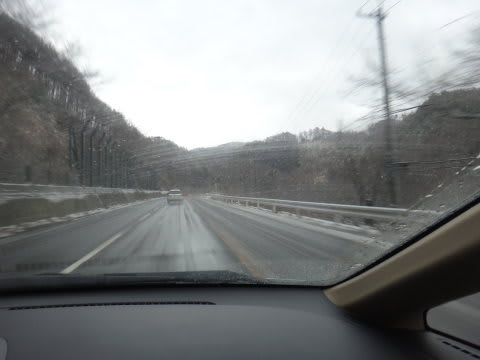
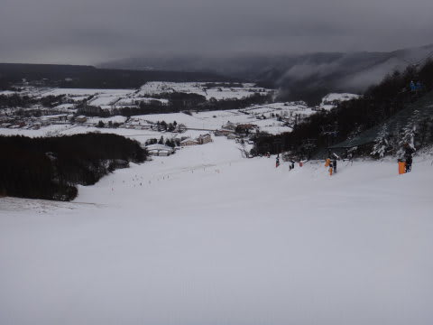
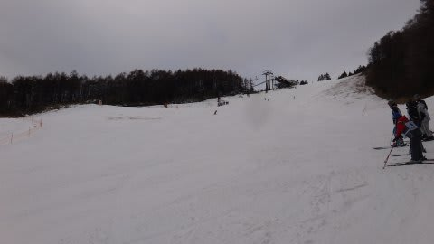
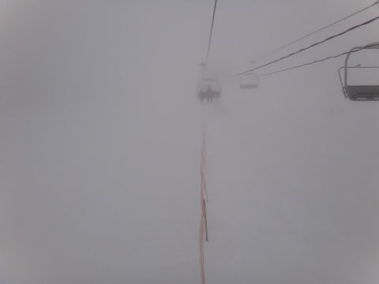
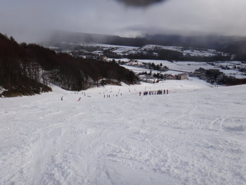
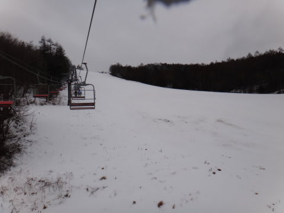
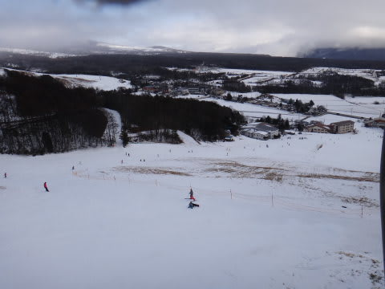

# 12月22日菅平…当初天気予報どおり，時々小雨(涙)．

📅 投稿日時: 2012-12-22 21:30:11

🏷️ カテゴリ: [2013スキー滑走日記](c91dbe557f9a69230b1600e48622fdd61.md)

あー．

昨日の天気予報では．

「標高が高いところでは雪」って感じで書いたように．

志賀高原の一の瀬より上のほうは雪だったみたいですが…

…やっぱり，

それ以下は，大体雨だったみたいですね(涙）．

なぜか本日．

いつもの志賀じゃなく，菅平に行っていたんですが．

朝のうちは，スキー場に登る道は雨．

スキー場直前で雪になったなぁ…

って感じで．

滑り出しの8時くらいには止んだんですけど．

ゲレンデは，当然春の重い雪．

菅平らしからぬ，0度を越える高い気温です…．

んで．

…10時すぎくらいから．

ぽつぽつと．

きました．

…ミゾレか？

と思ったけど…

明確に「雨」

ざんねーーーーん！

菅平まで雨だったか～っ！

12時ごろには止み，それ以降は大体曇り空でしたが．

午後2時ごろには，気温が下がり始め，ガスが出てきました…

が．

雪にはならず．

結局，夕方まで雪は全く降らずじまいでした…

(夕方のガスが晴れた瞬間)

雪のコンディションは，春の雪が蹴散らされた感じで，あんまり

よくなかったなぁ…

で．

太郎山で滑れるのは，

天狗，日の出，ファミリー，白金

で，裏・表太郎はまだ滑れません…

裏太郎はこんな感じです…

天狗でもこんな感じ．

うーん．

菅平は，もう一降り欲しいなっ！

＃明日２３日まで，都連の指導員研修会600人が

＃入っているので，ちょっと込んでた菅平でした…
