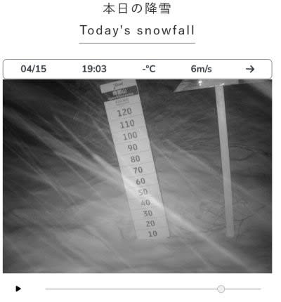

# 2025/4/13(日)の志賀高原スキー場，詳細レポート！…強風で朝は雨，午後はみぞれ～吹雪の修行デー．午後3時過ぎに強風で全リフト終了

📅 投稿日時: 2025-04-16 01:33:58

🏷️ カテゴリ: [2025スキー滑走日記](cacd3fbf84d4a679ee61a5894c3f95e14.md)

美味しいお酒が好き…という人に，

「へぇ～…お酒が好きなんですね！」

と言う人がいますが．

それは違う．

ホントにお酒が好きなら，どんなお酒でも

酒であれば飲むのであって，おいしい

お酒を選んで飲んでいる時点で，ホントの

お酒好きじゃないのだ．

それと同じで．

ホントにスキーが好きな人ならば．

最高の雪質のいいバーンだけじゃなく，

アイスバーンだろうがグサグサの

春の雪だろうが荒れ荒れバーンだろうが，

どんな雪でも雪であれば楽しく滑れて，

滑らないと我慢ができないのが

スキー好きなのではなかろうか…

という説を唱えていたんだけど．

どんな酒でも酒ならば飲むというのは

お酒好きというよりアルコール中毒であり．

それと同じく，どんな雪でもなんでもいい…

というのは，スキー好きじゃなくスキー中毒

と呼ぶのが正しい…

という反論が，あまりにも正論すぎて言い

返せなかったSkier_Sです．

ということで，いまさら感がありますが，

先日の日曜の志賀高原詳細レポート！

…の前に．

本日15日(火)の志賀高原ですが．

昨日の予想通り朝は雨で，これも予想通り

終日風が強く．早朝しばらくは第1ゴンドラ

が強風で運転見合わせで，7時半ごろから

動き出したようです…

そして，昼からは雪になり，午後は晴れたり

雪が降ったりを繰り返したようですが…

夜7時ごろも，ライブカメラを見ると雪が

降ってました！！

明日16日の朝までは，ときおり雪が降る

冷え気味の天気ですが．

その後，17日以降は…めちゃくちゃ高温に

なりますね(泣）

平年比+7℃くらいの超高温が，週末の

20日まで続きそう（涙）

そして，この高温傾向は…

大変残念なことに，GW前の25日ごろまで

続きそうですね（泣）

まぁ，今の積雪量なら，この程度の高温で

GWも余裕で滑れる雪が残ってくれると

思いますが．

…でも，できればGWは冷えてほしいなぁ…

というところで，ようやっと本題へ．

13日の志賀高原のスキー場レポートです！！

…日曜の速報レポートに書いたように．

早朝から高温で，路面の積雪も凍結も

全くない道路を志賀高原まで登ると…

朝6時の早朝開始時から，第1ゴンドラは

強風で運休…！！？？？（激泣）

そして，当然のごとく第2ゴンドラも

強風で運転見合わせ（涙）

今日の早朝営業は第4ロマンスのみ

ということで，営業が始まりましたが…

4ロマだけの営業なのに，早朝から滑ろう

という人がほとんどいないため．

雨は降っていないのに，ガラガラです…

早朝のゲレンデは…

無人ですね．

貸し切りですね．

誰も滑ってませんね…

バーンはシマシマですが．

早朝なのに気温が高めなので，

ユルユルとまではいかないまでも，

ガッツリ固まった感じではなく，

重い雪がしっかり踏まれた圧雪バーン．

まぁ，これはこれで滑りやすい雪だし．

人がいなくて滑りいいんだけど…

うーん．

ゴンドラのロングコースを滑る気マンマン

でいたところ，第4ロマンス1本だけは

かなり残念な感じ…

とりあえず，早朝営業時間中は

ひたすら誰もいないバーンを滑り続け

られましたが…

ただ，営業開始から1時間40分ほど．

朝7時40分ごろに，空からぽつぽつと

降ってきてはいけないものが…！！！

運が良ければ昼から降る予想だったけど．

8時前から降り始めるとはちょっと

早すぎるのでは…！！？？？（泣）

あぁ…

ゴンドラが動いてくれれば雨でも

もう少し快適なんだけど…

雨の中，遅いペアリフトに長い時間

乗っているのは辛い…（泣）

朝9時ごろには，風がやむ気配もなく

ゴンドラの終日運休がアナウンスされたし．

遅いペアリフトで滑っているのも

辛いのと．

一の瀬で開かれる大会に知り合いが参加

しているのもあり…

朝9時過ぎに，一ノ瀬へワーーーープ！！

限りなく無人に近かった焼額に比べると，

大会をやっているのもあり，一の瀬は

人がそこそこいますね～…

でも，リフトはガラガラだし．

人が多いのは大会バーンの周りだけで，

正面バーンはガラガラ！！

ただ，弱い雨が降ったりやんだりだった

ので，バーンは朝から雨に濡れた重い雪で，

急斜面の正面バーンは朝から荒れ気味

でした…

そして．

朝からだんだん風が強くなっている本日．

12時ごろには高天ヶ原クワッドが息絶えた

ようで…

この時点で動いているのは，一ノ瀬ファミリーと

ダイヤモンド，そして焼額の第4ロマンス，

あとは熊の湯くらいか…？？

とりあえず，昼になっても一ノ瀬ファミリーは

クワッドが動いていましたが…

だんだん天気は怪しくなっていき．

昼前には山頂付近は，雨から雪に変わって

いたけど，それがだんだん吹雪っぽく

なってきました…（激泣）

雪といってもかなり湿った雪で，ウェアに

着くとびしょ濡れになる雪でしたが，

搬器もうっすら白くなるほどで，

ときおり結構な勢いで降ってました…

バーンは重い雪の凸凹だし，

暗くて視界があんまりよくなくて凸凹は

良く見えないし．

風は強いしウェアはびしょ濡れになるし

ゴーグルは水滴だらけで前は見えないし…

コースがガラガラなところ以外，

良いところが全くないんですが…（泣）

まぁ，ちゃんと雪があって高速リフトが

滑れるだけで感謝しないと！！

コースの上半分はガスが出ることもあった

けど，下半分は視界も良かったし．

ときおり明るくなって，バーンが見やすく

なるときもあったし…

そして午後2時過ぎには，大会バーンが撤去

されて，クローズされていたフラットバーンが

解放されて滑れるようになって…

うん．

これなら楽しめる！！

修行感はかなり減ってきたな…！！

と思っていたら．

午後2時過ぎには一ノ瀬ダイヤモンドが

強風で止まり．

その後ガスが出たかと思ったら，風も

雪も強まってきて…（泣）

3時前に，

「午後3時半に営業終了時間を切り上げます！」

とアナウンスされたと思ったら…

予想より風が強まってきたため，

3時過ぎにあえなく全リフト営業終了と

なりました…（激涙）

あぁ…

なんだか残念だった…

残念な一日だったよ…（涙）

駐車場でも強風に吹かれ，いろんなものが

飛ばされてスキー板もろくに拭けない

ほどの中，帰り支度をして下山すると…

強風で折れた木の枝やら倒れた木やらが

道路の上に転がっていて，

今日一日の悪天候を物語って

いたのでした…

ということで．

こんな日でもリフトストップまで滑る

人がいるんだなぁ…

と，自分のことを棚に上げていろいろ

感動していたけど．

こんな日に最後までゲレンデを滑っていたのは．

スキー好きというよりは，スキー中毒患者

なんだろうなぁ…
