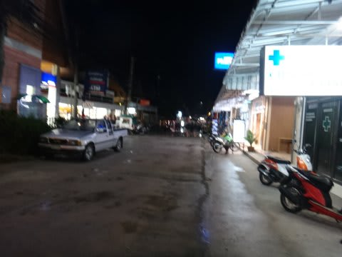

# 2013年9月　子連れタイ・タオ島ダイビング旅行記　その15　2日目の夜

📅 投稿日時: 2013-10-26 00:00:26

🏷️ カテゴリ: [ダイビング日記](ce3a7a8d424d112fce83ee85c81a0e344.md)

えーーー．

土曜日の台風ですが．

昨日の段階では，土曜は終日雨…って書きましたけど．

…なんだか，今の予報では．

Yetiは昼前には雨が止み．

夕方は日も射すかも…

って感じになってきました！

今のところ，Yetiは「26日は10時からの営業を目処」

とアナウンスしているようですが．

10時過ぎには普通に滑れるかな…

うーむ．

土曜日，行っちゃおうかな？？

とりあえず．

本題へ．

---

ってことで．

2日目の午後は，正統派リゾートライフを満喫していた娘ですが．

夕方になってきたので，ちょっとお散歩にでも出てみましょうか…

ホテルビーチの海岸をお散歩して…

その後は，ホテルの外へ．

ホテル前は寂しい道ですけど…

ホテルから10分ほど歩くと，ちょっと栄えた町に出ます．

驚いたことに．数年前までは何もなかったタオ島の，

港から離れたこんなところにまで．

コンビニが進出してますね～

アメリカのセブンイレブンとは違って，

日本のコンビニにかなり近い感じ…

アイスを買っておやつタイム．

…それからホテルへ戻って，ダイビングを終えた妻と合流し，

ショップでログ付けです．

ログ付けを終えると，もう日が暮れる時間…

再び，10分ほど歩いて町へ繰り出し…

夕食はダイビングショップお勧めのタイ料理レストラン「Yin Yang」へ．

＃なぜタイ料理店なのに，中国名？？

で．

3人で食べて，ビール2本飲んで，500バーツほど…

1500円で済むとはっ！

この，カレーヌードルが結構イケましたね～．

…今日はちょっとイマイチだった内湾の1本しか潜れず．

ダイビング的にはちょっと残念な一日だったけど．

コストパフォーマンスの高いタイ料理に満足して．

2日目を終えたのでした…
