# 2020/11/29(日)の志賀高原，熊の湯スキー場詳細レポート！…リフト待ちすごかったけど，雪は良かったよ！

📅 投稿日時: 2020-12-02 00:54:36

🏷️ カテゴリ: [2021スキー滑走日記](c2b0fc073d6357d3b786f6ca655147f7d.md)

なんと…2020年も早くも12月に突入だと！？？

…1年って30ヶ月くらいあったっけか？

まさか，12月が1年で最後の月？？

ええ？こんなに早く1年って終わるん

だっけ…？？

…と，混乱をきたしている今日この頃，

皆様いかがお過ごしでしょうか…

ってなことで．

昨日は記事を書いている途中で意識を失ったように

寝てしまったわけですが．

本日は，この日曜の熊の湯スキー場の詳細レポートです！

って本題の前に．

予告通り，12月1日までの冷え冷え期間が

続いてくれたので．

人工降雪機パワーが高いスキー場が

徐々にオープンし始めました！

まずはかぐらが2日（水）から，

ペアリフトのみですが営業開始！

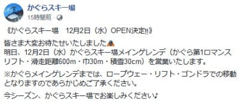

（[かぐらスキー場Facebook](https://www.facebook.com/snowkagura/posts/3324877050972925?__tn__=-R)より）

そして，一の瀬ファミリーペア＆

高天ヶ原トリプルが，4日（金）から

営業します！

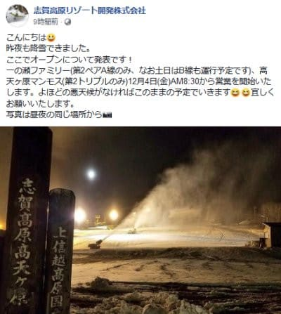

（[志賀高原リゾート開発Facebook](https://www.facebook.com/ShigaKogen.Ski/posts/3478823935567118)より）

ちなみに，12月2日に気温が上がるかも…

と予想されていたのが，意外と気温が

上がらずに済みそうで．

さらに3日夜から4日朝にかけて，多少の

積雪がありそうなので．

…さすがに焼額のゴンドラが動くってことは

なさそうながらも，わがホームゲレンデの

焼額も，12月5日には無事オープン

できるんじゃないかな～…

ってことで．

本題の，日曜の熊の湯レポートです！

えー．

まず．

志賀高原の登りの道路は．

昨日も報告したように，完全な雪道！

…今シーズン初の雪道運転ですね…

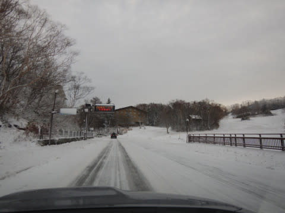

で．

朝7時半ごろに到着したのに，

すでに熊の湯へ近づく前から

かなりの渋滞が始まっており．

今日は混みそう…（涙）

でも．

ゲレンデに向かう道は，いい感じで

冷えた雪が積もり，真っ白になっていて．

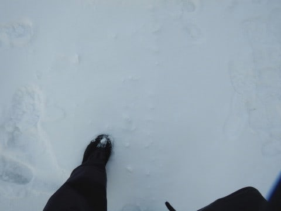

うーむ．

これは，ゲレンデコンディションに

期待っ！！

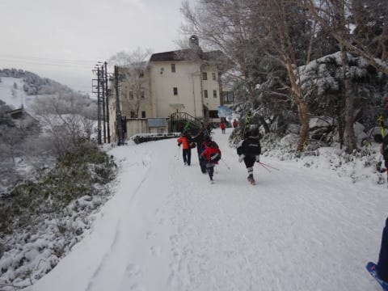

…ただし．

リフト券売り場も．

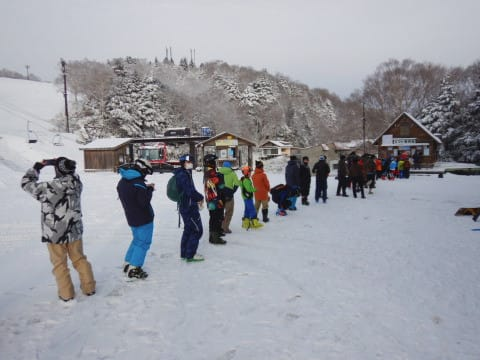

営業前のリフトオープン待ちも，

すごい行列だったので．

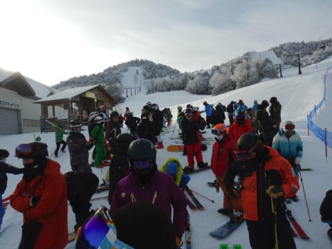

…これは，今日は混雑を覚悟せねば

なるまい…！

ってことで，予定の8:30より10分ほど早く，

8:20にはリフト営業開始！

滑れるのは，第2ペアの下半分の緩斜面

のみですが．

リフトに乗って眺めるゲレンデは…

えええ！？

昨日の特派員レポートでは，まともに滑れるのは

人工降雪がある幅10m弱だけだったのに．

今日はコース全面に圧雪がかかってますよ！？？

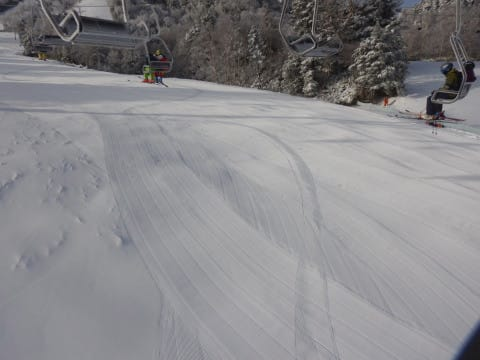

リフト搬器を見ると．

あぁ，昨日は結構冷え込んで，

吹雪いたんだなぁ…

という感じだったので．

どうやら20cmほどの積雪の積み増し

があり，人工降雪がないところも，

圧雪がかけられるギリギリ積もった

ようです…！

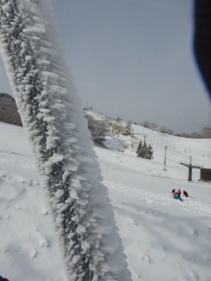

リフトを降りると…

をををををを！！

ちゃんとゲレンデ幅いっぱい，シマシマだっ！！！

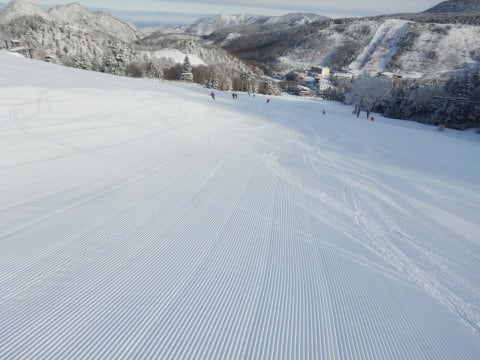

…それも．

人工雪じゃなく，天然雪に圧雪がかかった，

柔らかナチュラル最高シマシマじゃないですか！？？

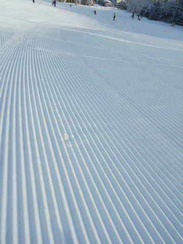

まさか，今日こんな最高柔らかシマシマを

いただけるとは思わなかった…！

いただきまーーーーーす！！！

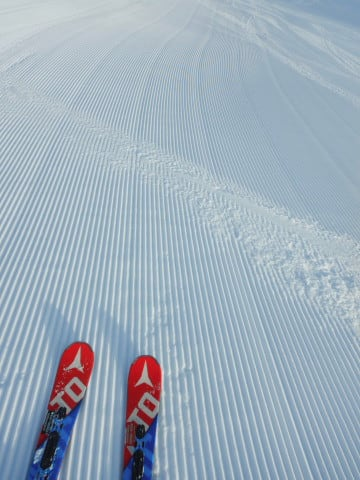

うはーーーー！

シマシマ！

久々のナチュラルシマシマ！

こんなに柔らかくてエッジが食い込むとは！

板が回る！曲がる！素晴らしいっ！！

そうだよ…天然雪って，こんなだったんだ！！！

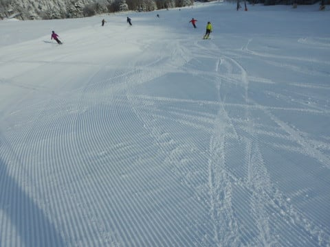

という感じで．

1本目は気持ちよく冷え冷え

天然雪のシマシマを滑った

けれど…

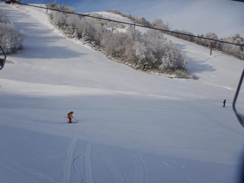

1本目滑り終わった後，

2本目のリフト待ちが，すでに

10分越え（泣）

あさイチからペアリフト2本とも

動いているというのに．

なんということだ…

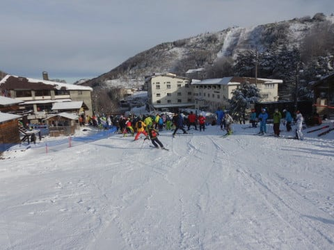

でも，ゲレンデは幅いっぱい滑れて，

Yetiに比べれば，ゲレンデのソーシャルディスタンス(？）

は十分とれる感じ…

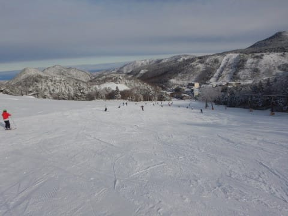

だけど．

3本目には…

うぎゃーーーー！！

何だ，このリフト待ちは…っ！！

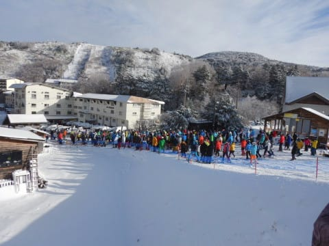

まだ8:40なんですけど…

これからさらにまだ人が増える時間に，

もう待ち時間が10分超えてるって，どうよ！？？

コース上は，コース幅が広いおかげで

それほど人口密度は低くなく，

ゲレンデに出ると結構快適なんですが…

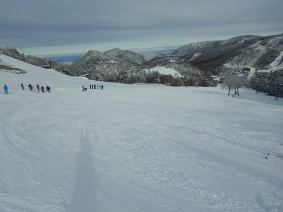

でも，9時半ごろにはリフト待ちが

「熊の湯としてはバブル以来の最高」

と言うレベルにまで達し

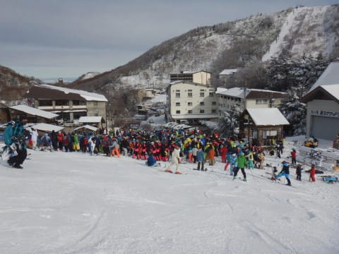

この列が，なかなか短くならず．

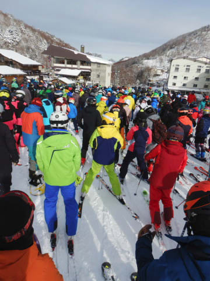

9時半から11時ごろにかけては，

リフト待ち20分以上（涙）．

1時間で2本ちょいしか滑れません（激泣）

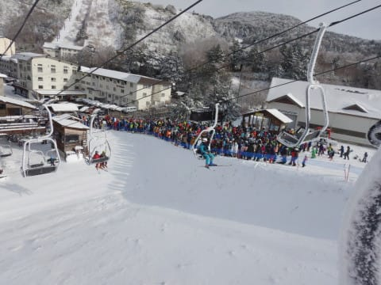

まぁ，それでも．

コースも長くて，幅も広いので．

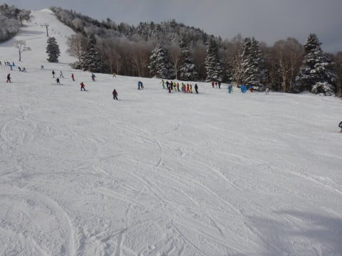

軽井沢よりマシ

と自分に言い聞かせ，滑ってました…

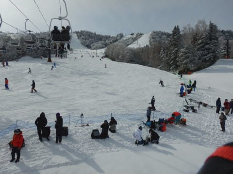

午前中には，雪がちょっと荒れて

細かな凸凹が出てきたものの，

ブッシュも出ておらず，ゲレンデは

いい感じで飛ばせましたね～！

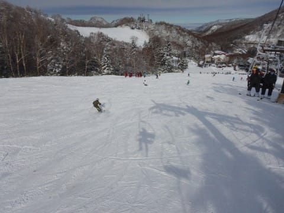

しかし，午後になってもリフト待ちは

多少短くなりはしたものの，相変わらず

10分を超えるような待ち時間で．

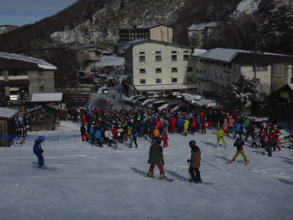

ゲレンデの人は減る気配はありません…

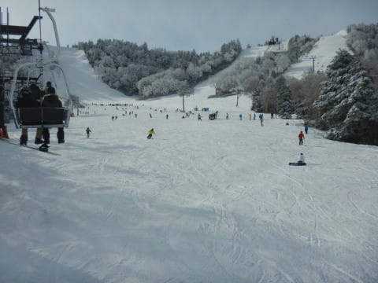

そして．

午後2時を過ぎてくると，

気温がそれほど上がらなかったので，

雪質は悪くないものの．

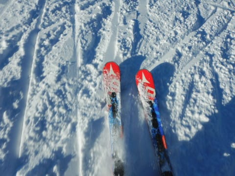

雪が柔らかかったぶん，

ちょっとゲレンデが荒れて来て…

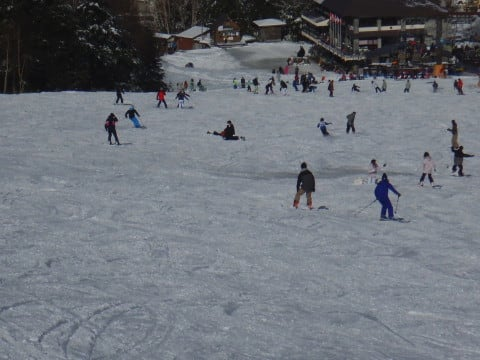

そして．

人工雪が無いところ，ところどころ

雪がはがれかけて来ました（涙）

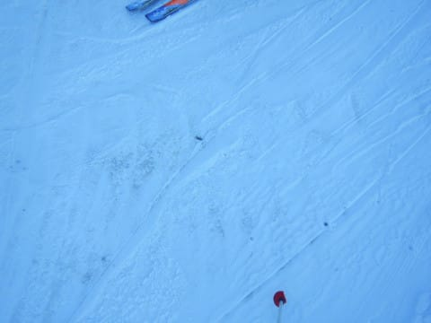

さらに同時に，さっきまで晴れていた

コース上に，いきなりガスが！

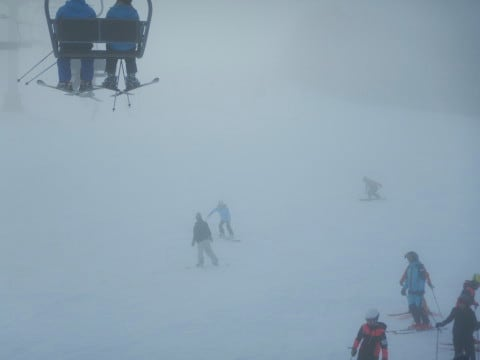

ガスで見えない中…

いきなり現れる，デンジャラスブッシュエリア！

…これは怖い！

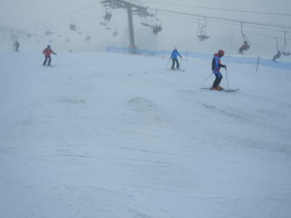

…ガスが出て，ブッシュが増えたので，

帰った人が多いのか．

午後3時ごろになって，やっとリフト待ちが

2-3分にまで短くなってきました…

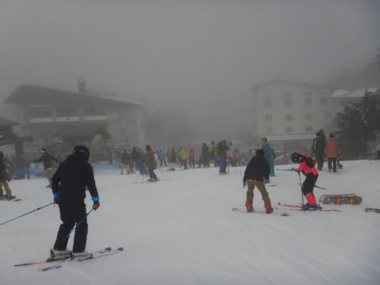

とはいえ．

いつもなら人が全くいなくなるような

午後4時15分の営業終了まで

リフト待ちが0になることは無く．

ゲレンデの人も，結構多く残っていた

熊の湯でした…

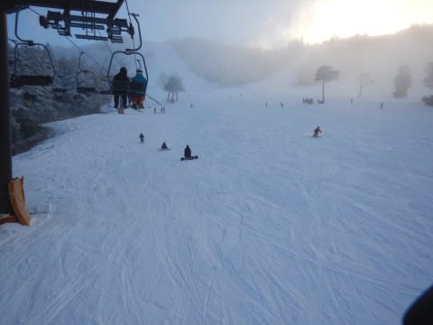

ってなことで．

バブル以降最高の入場数というのが

よく分かる混雑具合の熊の湯でしたが．

100%人工雪を覚悟していたところ，

予想以上にいい感じの天然雪で滑れて．

今シーズン，やっとホントのスキーをした

感じになれて，満足の一日を

終えたのでした…

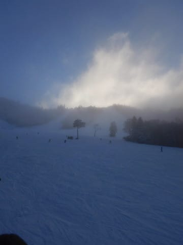

今週末はかぐらも鹿沢も丸沼も

アサマ2000もオープンして．

志賀高原も一の瀬ファミリー，

高天ヶ原，焼額とオープンするから，

さすがにここまで混まないはず…！
