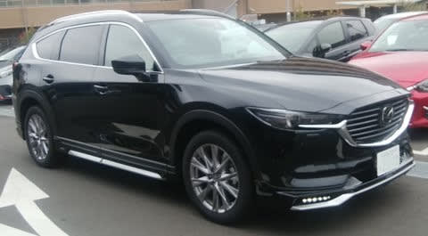

# 2.5Lガソリンターボが出た，MAZDA CX-8に乗ってみた

📅 投稿日時: 2019-06-22 00:14:50

ということで．

本日は，MAZDA車の試乗レポート，2車種目．

今度は，CX-8に乗ってみました～！

いや．

以前，2.2Lディーゼルには乗っているんですが．

今回，新たに2.5Lガソリンターボが追加されたので．

乗ってみたかったんですよ…

この，新しい2.5Lターボエンジン．

馬力が230馬力なのはいいとして．

なんと，トルク42.8kg-m！！！！

2.2Lディーゼルの，45.9kg-mには

負けますが．

スバルWRX S4や，我が愛車のLEVORG2.0の

40.8kg-mを超えてますね…（涙）

ってなことで．

ガソリンエンジンでは，国内最高クラスの

トルクを誇る，この2.5Lターボエンジン．

お値段もディーゼルよりは20万円近く安いし．

一体どんなものなのか，気になったので，

試乗してきました～！

内装は前回乗った時から変わってませんが．

さすがに400万円クラスの車…

と，納得できるレベルの仕上がり．

運転席のアイポイントも高めで，

見下ろし感があって，運転はしやすそうです．

で．

車を発進させると…

…

うおーーーー！

何だ，これは！！

すげートルク．

トルク42kg-mは伊達じゃない！

軽いタービン音とともに，

1.9t近い車を，あっという間に

加速させていくバケモノトルクです．

ディーゼルより，数字上のトルクは低いけど．

エンジンのピックアップがディーゼルより

いい分，ディーゼルよりトルク感が

感じられます…

ターボラグもそれほど感じず，どの回転数，

どの速度からでもアクセルを踏んだ分

ぐっと加速します．

ディーゼルエンジンよりも

エンジン回転の上昇速度も早く，

かつ，ディーゼルエンジンより

高い回転数までトルクが出続けるので．

パワー感と伸び感は，ガソリンターボ

の方が上です…

そして．

ターボラグはスバルのFA20より少ない感じ．

FA20では，アクセルを踏み込んだ後に，

ブーストが上がりながらトルク上昇がおくれて

ついてくる…

という感じがありますが．

MAZDAのターボエンジン，後から

ブーストが追いかけて上がってくる

感じが少なく．

アクセルを踏んだ時から，ぐっと

トルクが出てくる感じ．

で，そのトルクが

「こんなにもいらんわ」

ってほど，悪逆なトルクです．

恐ろしいほど軽やかに車を

加速していきます．

回転数が上がってもトルクが

伸び続けるので，ディーゼルより

パワー感を感じる．

すごい．これは，すごい…

…で．

パワーはすごいんだけど．

燃費はJC08モードで12km/L．

街乗り実燃費は，リッター10km/Lを

切ってくる感じ．

うーん．

ハイオク指定じゃなく，レギュラーガソリンなだけ

まだマシですが．

パワーと引き換えに，燃費は覚悟しておいた方が

良さそう…

そして．

つぎは足回りですが．

剛性が十分で，サスからの入力を

しっかり支えるボディーの

がっちり感があって．

ばたつき感や妙なブルブル感もない，

いい感じで引き締まった足です．

一昔前なら，高級なスポーティータイプの

車にあったような味付け．

ロールも小さく，大柄な車にしては

反応が早く，気持ちよく走れます．

…結構よくできた車なんですが．

いや，日本車でもかなりいいレベルで

仕上がったボディ＆足回りだと

思うんですが．

いかんせん，MAZDA3のあとに乗ったのが

悪かった…

わずかな段差を乗り越えた時の振動の伝わり方が，

例えばCX-8では「結構しっかりした足なのに，角をすごく上手く丸めている」

という表現になりますが．

MAZDA3だと，「段差があることはわかるけど，角があったことを感じない」

って表現になるし．

CX-8が「ロールなどでサスが動いた後の収まりが速い」

という表現になるところが，

MAZDA3だと「ロールなどでサスが動くとき，目標値でぴったり止まる」

といった表現になる…

とでもいえばいいのか．

いや，CX-8もすごくいい足なんです．

よくできてるんですが．

MAZDA3のあとに乗ったのが，ちょっと

惜しかった…

でも．逆に言うと．

MAZDA3のあとにCX-8に乗るまで，

MAZDA3のすごさがよく理解できて

無かったんですが…

かなりいい出来のCX-8に乗って，

MAZDA3がそれを超えている，

驚きの車だったことが

良く分かりました．

ってなことで．

まぁ，MAZDA3は別格とすると．

反応が早いのに，衝撃の角は上手く丸め

られているサスは結構よくできているし．

エンジンのどトルクとピックアップの速さ，

ディーゼルよりスムースに伸びていく感じは

文句のつけようがないし．

これでディーゼルより安いんだから…

燃費の悪ささえ我慢できるなら，

2.5Lターボ，よくできた車でした．

## 💬 コメント一覧

### 💬 コメント by (ほっぽ)
**タイトル**: マツダ
**投稿日**: 2019-06-19 06:51:07

Ｓさん

マツダ、最近エンジン車の開発とモデルチェンジに熱心ですよね。

ディーゼルもガソリンターボも、魅力的なエンジンラインナップだと思います。

かつてはスバルの十八番だったＭＴ車の設定も今ではマツダの方が多い。

でも、４年後と予想しているレヴォーグ買い替えが早まるようだと、

私の計画も早まるので心の準備はしておいた方がよさそうですね。(^^;

スキーシーズン終了後からレガシィのノーマル化を少しずつ進めてます。

何時Ｘデーが発動されても良いように

### 💬 コメント by (Skier_S)
**タイトル**: ＞ほっぽさま
**投稿日**: 2019-06-22 00:29:04

ということで，ワンテンポ遅れたコメント回答になりますが．

最近のMAZDA車，すごくよくできてます．

うーむ．

最近では，4WDもすごくよくなってきてるらしいし．

スバルにも頑張ってほしいところ．

ただ，MAZDA車，ちょっと高いですね（涙）

最近は下取りも良いようなので，CX-5なんかは

新車が高くても，下取りの良さで十分カバーできます…

ってことらしいけど．

15万～20万km走って乗りつぶしてしまう私には，下取り価格があんまり関係ないので，車両本体の高さは

もろに効きます．

### 💬 コメント by (ほっぽ)
**タイトル**: マツダ
**投稿日**: 2019-06-22 10:06:56

Ｓさん

新車に縁がないというか中古車しか頭にないので

新車ディーラーに行くのは部品を買う時の

スバルくらいになってしまっています。(^^;

先日やっとＦ型レヴォーグとＳ４のカタログ貰ってきました。

マツダ、内燃機関に活路を見出す戦略なので、エンジン車の開発に熱心ですよね。

この2.5Lターボがレギュラーガソリンとは知りませんでした。

燃費の悪さはレギュラーガソリンで多少はカバーできますね。

このエンジンがレヴォーグくらいの車体に載れば、

燃費もまだ改善できるのかと思いますが、

手ごろなワゴン車はマツダには無いですね。

攻める４ＷＤはスバルと三菱のオハコでしたが、

最近ではマツダやトヨタもかなり頑張っているようです。

トヨタのＲＡＶ４の４ＷＤも

攻めたセッティングになっていると聞いています。

尤も、トヨタはＷＲＣに参戦していたし、復活もしたので

攻める４ＷＤのノウハウは知っているのだと思いますが。

私はＳさんが乗り潰したレヴォーグを更に延命させる計画です。(^^;

### 💬 コメント by (yumi)
**タイトル**: Unknown
**投稿日**: 2019-06-22 19:31:29

Ｓさぁ～ん🚀🚀🚀

Ｓさんのレヴォくん🚗💖✨

もう、ほっぽさんに 狙われているのですね☺️

・・・・・

10万 超えちゃぁ～ ダメ😢🆖⤵️って、日本ぐらいですよね☺️

### 💬 コメント by (naoちゃんねる)
**タイトル**: Unknown
**投稿日**: 2019-06-22 21:52:06

CX-８のガソリンターボ…そんなに良かったのですね。

私はこの前のシーズン(Sさんには今シーズンw)には間に合わせたかったので、ディーゼル買ってしまいましたが…

ガソリンが出てたら相当迷ったと思います。

しかし…下手な自動車ジャーナリストより分かりやすい記事はさすが「徒然ドライバー日記」ですねっ(笑)

### 💬 コメント by (ほっぽ)
**タイトル**: 下取り
**投稿日**: 2019-06-22 22:34:28

yumiさん

はい、Ｓさんが買い替えた際の下取りを狙っています。(^^♪

前回のＢＲ９レガシィはノンターボだったので食指が動きませんでしたが、

今回は２Ｌターボ、３００ｐｓ、

しかもビルシュタイン付きの2.0GT-Sとあれば、

Ｓさんの魂を受け継ぐのは私しか居ない！と

勝手に思っています。(^^;

そして、かつて車庫証明取得や陸自持ち込みナンバー登録も

自前でやっていた人間としては、個人売買も全く問題ありません。

というわけで4年後？のＸデーを今から楽しみに待っています。

### 💬 コメント by (Skier_S)
**タイトル**: 最近のマツダ車はいい
**投稿日**: 2019-06-23 08:02:45

＞ほっぽさま

CX-8の2.5Lターボ，カタログの馬力数字を追わず

実際のドライバビリティを良くするようにチューニング

されていると思いました…

馬力の数字は230馬力とかなり控えめな数字ですが，

トルクピークをかなり低い回転数にもってきており，

実際使う2000回転前後の領域のトルクをたっぷり

太らせている感じ．

最近のマツダは，いろいろ割り切った設計をしますね…

そして，私の次のプロジェクトX3ですが．

いつ実行されるかはまだ未定です（笑）．

＞yumiさま

そうなんですよ．

我がレヴォーグ君，次の嫁ぎ先が決まってます（笑）．

で，海外では10万km超えてまだまだ乗ってるイメージですよね…

アメリカだと，10万マイルがひとつの目途みたい

なので，日本の1.6倍でしょうか…

＞naoちゃんねるさま

CX-8，良かったですよ…

今，5人以上乗れる車が必要なら，私は迷わず

CX-8のガソリンターボを買うと思います…

燃費がもう少し良ければ文句なしなんですが．

### 💬 コメント by (ほっぽ)
**タイトル**: CX-8
**投稿日**: 2019-06-23 10:03:00

Ｓさん

CX-8は排気量に余裕があるので、レギュラーガソリンで

ピークパワーを狙わずともトルク重視で街乗りで使いやすいセッティング、

そんな感じでしょうか。

レヴォーグ1.6はレギュラーガソリンに拘ったが故に、

かなりムリしたECUセッティングになっているようで

知り合いのSHOPでは1.6をハイオク仕様にすることで、

ビュンビュン走るいいデータになったとblogに上げてました。　

私もレガシィのセンターパイプとマフラーを、ほぼノーマルに交換して、

ヌケの悪い状況にはなりましたが、逆に適度に背圧が掛かって

街乗りのトルク感が増えて乗り易くなりました。(^^;

もしも本当にＳさんの魂を譲り受けることが出来たら、

まずエンジンマウントや足回りブッシュ類の確認&交換で、

都築のSHOPか群馬のSHOPに

ドック入りさせようと思っています。

難点はPCDが変わってしまうので、

今使っているタイヤ＆ホイールが夏冬ともに使えないことです。

### 💬 コメント by (Skier_S)
**タイトル**: ＞ほっぽさま
**投稿日**: 2019-06-24 05:05:22

いや…LEVORG1.6，レギュラーはかなり無理があると

思います．

しかし，普通の走りをする人は，おそらく4000回転も

回すことはそうそうないと思うので，

低速トルクをガッツリ太らせればいいんだよな…

というのが，CX-8を乗ると分かる気がします．

レガシィからLEVORGは，確かにホイールのPCDが

かわるので流用が効きませんが，

私のBRは16インチだったので，どっちにしろ17インチ以上しか

履けないLEVORGにするためにはホイールごと全とっかえ

でした（笑）

