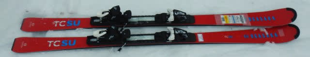
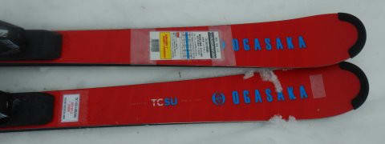
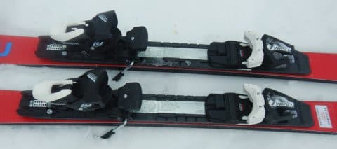
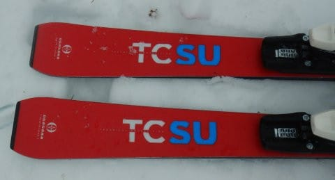
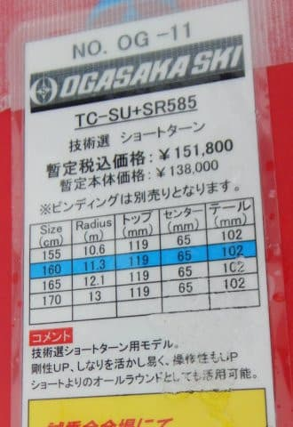

# 2023シーズンモデルのスキー板，試乗レポートその13…OGASAKA TC-SU SR585プレート

📅 投稿日時: 2022-06-17 01:46:59

🏷️ カテゴリ: [スキー板試乗](c0bd8048615710cee890e403a36cc9a2b.md)

えー．

今日も2023シーズンモデルのスキー板の

試乗インプレッションなんですが…

前回までは，

3月上旬の雪がいい時の焼額スキー場

で実施した試乗レポートでしたが．

今回からは，雨が降ったり強烈に

気温が上がったりで，

ベトベト春雪になった3月下旬の一の瀬ファミリー

で行われた試乗会でのレポートになります…

ちなみに，3月上旬の試乗の時は

ブーツはHEAD RAPTORのフレックス140の

強めのブーツでしたが．

3月下旬の試乗会は，雪が柔らかかったので

ブーツも柔らかめのREXXAM R-evo130M

で試乗しました…

だもんで，そこそこ柔らかめの板でも，

評価はそこまで辛くならないはず…

ってなことで，

後半戦の先頭バッターはオガサカのTC-SUです．

では，どうぞ～！

○OGASAKA TC-SU SR585 160cm

基礎小回り

技術選選手を狙って作ったTCシリーズ．

今年の小回りモデルは，TC-SUという

名前のようです…

この板は，

強いSR585 プレート付き，

弱めのFM585プレート付き，

プレート無し

の3種類が選べますが．

この板は一番強いSR585プレートが着いた

モデルになります．

ただ，長さが160cmだったので，ちょっと私には

短めのチョイスかな？と思いながらも，

ちょうど空いていたので乗ってみました…

滑ってみたところ．

いや…意外といい！

去年のTC-STは，かなりコアの張りが強く，

トーションもガチガチに強くて，

さらに重量も重め…

という，かなり手ごわい板．

脚力とかなりのスキルのある選手が，

本気で攻めるためのもので，

自分にはとても履きこなせない

と思ったものですが…

今年のTC-SUは，手ごわくなくて気持ちいい板です！

長さが160cmと短めながらも，

かなり張りが強めの板．

でも，昨年のSTみたいにコア材が突っ張って

硬いというより，メタルの強いばね感がある

張りの強さ．

踏むとたわみ，たわんだだけメタルのバネに

圧が溜まっていく感じ．

板がすごくきれいにたわんでくれて，

板のトップとテールのエッジがしっかり効いて，

たわみに沿って板が鋭く回っていきます．

ただ，そのしっかりしたグリップで旋回

していく途中でも，板を動かす自由度が高い！

板を強くたわませてカービングの弧を作って

いる中でも，さらにそこから板を動かして

弧を深めて回っていくとか，板を動かすことで

弧を自由に作っていく操作性の高さがあります．

かなりスピードを出してガッツリ傾いた

すごい横Gが強いところで，キレ・ズレの

出し入れが思う通りにできます！

かなりのハイスピード域でも，サイドカーブに

乗っただけじゃなく，板を動かして弧を

作っていくことができます．

動かせる板ではあるけど，決してルーズな

わけではなく．谷回りも早い捉えから

すっと板がたわんでターンに入って行って

くれるし，ターンの仕上げの返りも速めの

いい感じの返りがやってくるし．

かなり攻めた中で，板なりに滑らさせ

られるんじゃなく，いろんな小技が使える

感じの板です．

カービングじゃなくて，板をずらして滑って

みても，いい感じの旋回性でまわって行って

くれますね～…．

…これ，FMプレートかプレート無しなら，

かなり低速でゆっくり板を動かしていく

ところから結構な高速まで，幅広く使える

板じゃなかろうか？？

SRプレートだと，カービング小回りで滑ろうと

思うと，結構しっかりスピードを出して

圧をかけて行かないといけないけど…

逆に言えば，圧をかけなければそこそこ

縦目に落としていくこともできます．

うん．

160cmにしては安定度もあったし．

この板は良さそう！！

…しかし．

この赤地に青文字ってデザイン，

好き嫌いが分かれそうだな…

## 💬 コメント一覧

### 💬 コメント by (northfox)
**タイトル**: Unknown
**投稿日**: 2022-06-17 13:08:18

TC-SUよりTC-STのインプレに反応しました。

やはりSTは手強い板ですよね❗️

去年試乗したときは "ごめんなさい🙇‍♀️私には無理です💦" と速攻で返却しました。

そのトラウマで今年の試乗会ではTC-SUには触れもしませんでした😅

### 💬 コメント by (Skier_S)
**タイトル**: ＞northfoxさま
**投稿日**: 2022-06-17 21:10:03

そうなんですよ…TC-STとTC-SU，全然変わりました！

乗りやすくなりましたよ～！！

