# 新しいスマートウォッチ，Garmin Fenix7Xを買ったよ！その16…PC版Garmin Connectで作った登山用ルートを登山で使ってみる

📅 投稿日時: 2022-09-13 00:42:12

🏷️ カテゴリ: [PC,カメラ&小物](c0d8caed13e597efe97b661a8ae56bed0.md)

えー．

このBlog．木曜夜に更新したけど，

金曜夜には更新できず．

土曜夜にまた更新したけど，

昨日は出張続きで疲れているうえに，

日曜なのに，なぜか夜に懇親会があり…

宿に戻って倒れたように寝てしまったので

更新できませんでした…

いや．

海外出張に行こうが，旅行に行こうが，

週で2日も更新しなかったことはそうそう

なかったと思うけど．

Blog更新を楽しみにしていた方，←そんな人いるんだっけ…？

すみませんでした～！！

ってなことで，本題へ．

長々と続いたGarmin Fenix7Xの紹介記事，

今回が最終回です！

（やっと終わるよ…）

（Garmin Fenix7Xのレポート全16回のもくじ

機能説明，登山用地図の作り方，登山で使ってみた…など

は[ここをクリック](e516b23a4874189de2e9208be87fa5184.md)）

[前回](ecef5e9aa9991815cb00b0c3cc5817d98.md)は，PC版Garmin Connectで作ったルートを，

ウォッチに送ったわけですが…

今回は，登山の時にこのルートを読み込む

やり方を簡単に説明しますね．

まずは，ウォッチの右上のボタンを押して，

アクティビティメニューを呼び出しますが…

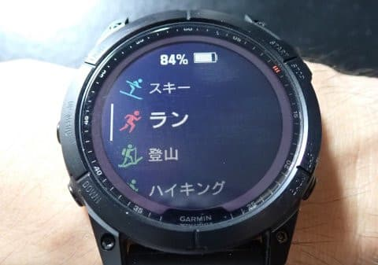

ここから登山を選べば，登山の画面に

切り替わります．

そこで，画面の上の白い部分をタップするか，

左側矢印で示す，UPボタンを押すと…

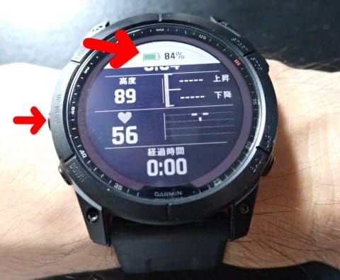

こんな画面に切り替わります．

ここで，コースを選んであげると…

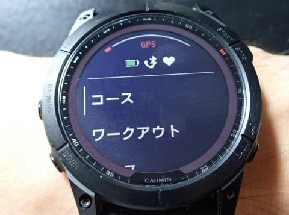

このように，これまでにウォッチに

転送されたルート一覧が表示されます！

だもんで．

今回登山で使うルートを選んでやれば…

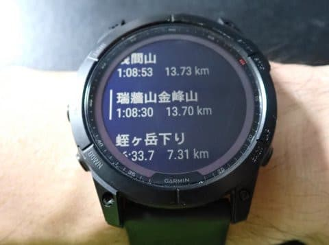

「開始」と「地図」が選べるので．

地図を見るだけなら，「地図」を．

実際に登山するなら，「開始」を

押してあげましょう．

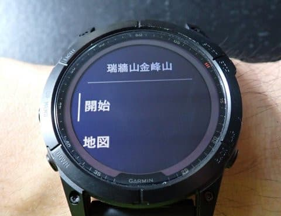

そうすると，地図が読み込まれて…

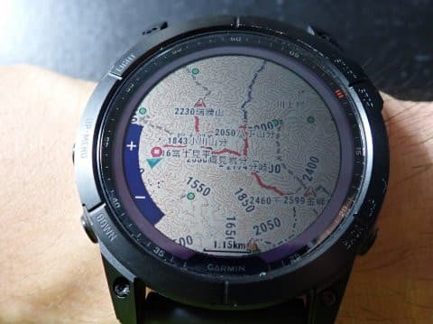

ちゃんと前回入力した，中継ポイントも

読み込まれているのが分かります！

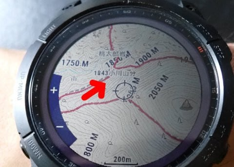

ルートが読み込まれたら．

右上のSTARTボタンを押せば，

アクティビティスタート！

ナビが開始されて，

私の設定の場合は，数秒ごとに

情報画面と…

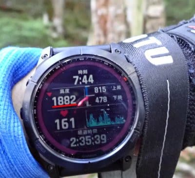

地図画面．

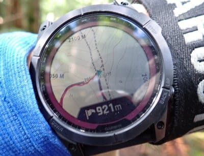

ナビゲーション画面（現在地から

各中継ポイントまでの距離が出る）

が切り替わって表示されます！

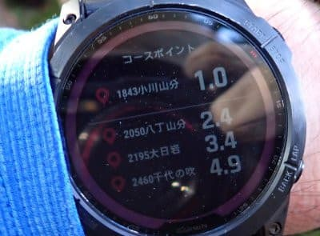

曲がる場所なども，地図を見れば

すぐにわかるし…

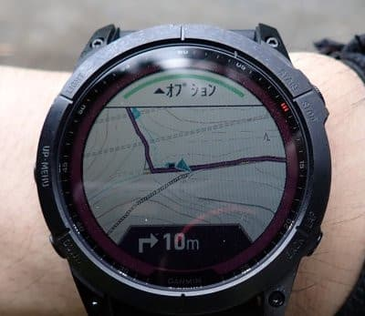

コースから外れると，オフコース表示が

出ると同時に，ブザー＆バイブで通知されるので

すぐ分かります！

（オフコース表示を写真に

撮ったのが無かった（涙））

コースから5m～10m位離れると

警告が出るので，道を間違えることは

ないです…

そして．コースに戻ると

「オンコース」の表示と確認音が出るので，

コースに戻ったこともすぐ分かります！

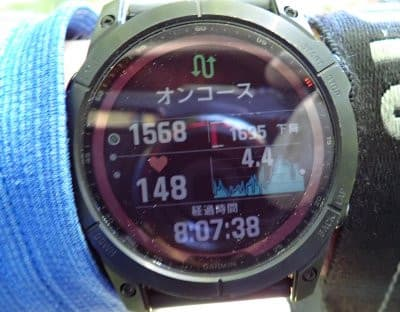

前回，これで目的地の駐車場じゃない，

違う下山ルートに降りそうになったところ，

すぐに間違いが分かって助かりました…

（ルートを間違えると，経由地までの

距離も表示されなくなる）

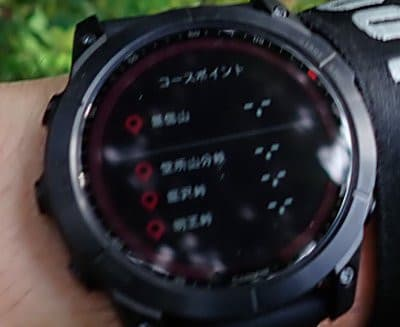

ってなことで．

中継地点までの距離も分かれば…

（ポイント名に標高も入れれば，

ポイントの標高も分かるし）

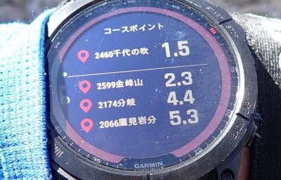

地図も，スマホを出さなくてもすぐ

手元で見ながら歩けるし．

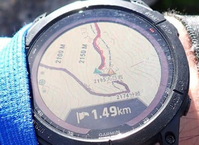

自分で選んだ，好きなデータを表示

させられるし．

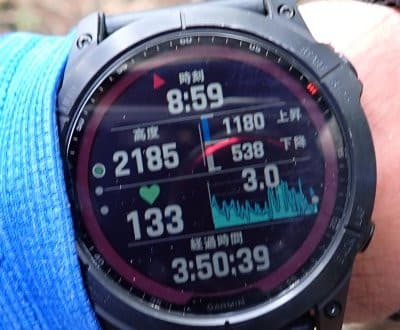

これまで山登りの際は，

かなり頻繫にスマホを取り出して，

地図やら次のポイントまでの距離やらを

確認してましたが…

Garminを使うようになってから，歩いている

途中にスマホを見る必要は，全く無くなり

ました…

無茶苦茶便利で，今では，もうGarminなしでの

登山は考えられないですね…！！

GPS精度は高いし．

GPS入れっぱなしでも，一日山登りして

電池は10～20％くらいしか減らないし…

いや～．

Garmin Fenix7X．

無敵の登山ウォッチだわ…

（とりあえずこれでGarminのレポートは

　一旦一区切り…長かった…）

## 💬 コメント一覧

### 💬 コメント by (megalith)
**タイトル**: Unknown
**投稿日**: 2022-09-13 12:36:12

>>log更新を楽しみにしていた方，←そんな人いるんだっけ…？

呼んだ？（笑）

ご無沙汰しております。

もちろん楽しみにしていますよ。（笑）

最近はApple Watch等でも山歩き用やスキー用のアプリ等出ているようですね。

欲しい機能があるかはわかりませんが。（笑）

### 💬 コメント by (Skier_S)
**タイトル**: ＞megalithさま
**投稿日**: 2022-09-14 01:18:31

このBlogを楽しみにしているような，奇特な方がいらっしゃるとは思っておらず…（笑）

Apple Watchはヤマレコアプリと連携できて地図が見れるので，Apple Watchも

悪くないんですが…

電池もちがあんまりよくないですし，私はAndroid派なので，Apple Watchは

購入対象になりませんでした…

