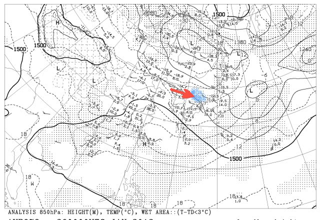
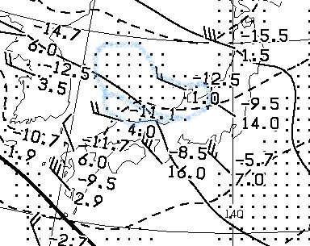
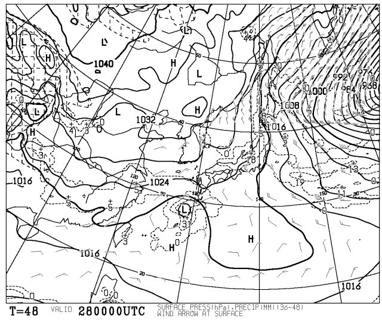
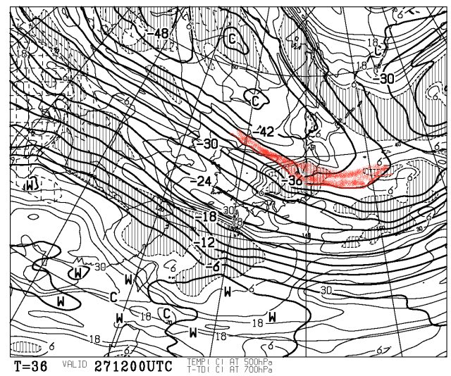
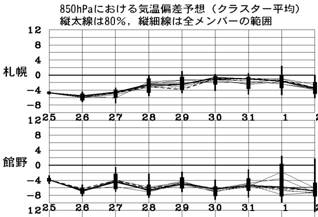
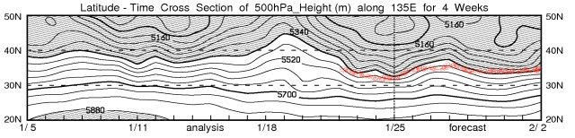

# 今週末のスキー場の天気は？？

📅 投稿日時: 2012-01-27 01:06:37

あー．

あれですね．

[ここ](e5f8daa2f91362cb7cf6e5ac9980a4548.md)での予想通り，新潟ではかなりの大雪みたいですね．

…でも．信州は降らないと思っていたところ．

25日の夜から26日朝にかけては，信州でも結構積もったみたいですな～．

うーむ．

おかしいな？

信州の内陸まで，雪雲が入らないパターンに見えたんだけどなぁ…

まぁ，昼ごろには止んじゃったみたいですが，

嬉しい方向に外れたので，よしとしておきましょう．

（自分の予想が外れたことに対する苦しい言い訳)

さてさて．

いつもどおり，この週末のスキー場の天気を，[専門天気図](http://n-kishou.com/ee/exp/exp.html)から読み解いてみましょうか…

…の前に．

ちょっと言い訳してみましょうか．

26日朝9時のAXFE578を見てみると…

青く色付けした，湿数の低いエリア(空気が湿っているエリア)が

日本海にあります…

これは，大陸で冷やされた冷たい空気がきれいに日本海に

流れ込んでいないパターン．

ここに湿数が低いエリアがあると，日本海の吹き出しの雲が，信州まで流れ込まないことが多いんですが…．

この図の日本部分を拡大すると…

輪島上空1500mの風向きは，見事に西から吹き込んでます．

このあたりの風が西向きの場合，西から信州へ向かった雪雲は，

北アルプスにぶつかってしまい，信州までとどかないんですが．

という感じで，26日朝は信州は積もらない天気図だったんですが．

…何で積もったんでしょうね～．

と，言い訳はこれまでにしておき．

ざっとこの週末の天気を予測してみましょう．

FXFE504を見てみると…

あー．

29日の朝は，見事な縦じまの等圧線になってますね．

きれいな冬型ですね．

日本の東にある低気圧，960hpaと台風並みに発達してます．

さらに．FXFE5874を見ると…

赤い線で書いた，上空5000mの-36度という寒気が

信州まで降りてきてますね～

-36度の寒気って，大雪になる目安です．

…ということで，

27日夜から28日朝にかけては．

信州も積もりますっ！！！

かなり積もりそうです．

それも，よく冷えた，軽い雪質の雪がいっぱい積もります！

最高のパウダーデーとなりそうっ！

土曜はおそらく最高でしょう…

28日は雪が降り続きそうです．

29日の日曜は，ちょっと降りが弱くなりそうですが…

この土日，ものすごく冷えて雪が降り続けそうです．

で．

この寒さがいつまで続くかというと…

FZCX50を見ると…

少なくとも，2月2日までは，平年比4-6度低く推移しそう．

2月2日までは，かなり寒い日々が続きますね～

で，FXXN519は…

今後，2月2日まで，5400mの線(赤く記した部分)が35Nくらいまで

下りてます．

5400m線が35Nより南まで下がるってのは，大雪の目安です．

という感じで．

これからしばらく，かなりの雪になりそうですなー．
