# 2016年8月　子連れ座間味ダイビング旅行記　その12…3日目の2本目は，地形ダイブでのんびりと

📅 投稿日時: 2017-07-22 03:34:47

🏷️ カテゴリ: [ダイビング日記](ce3a7a8d424d112fce83ee85c81a0e344.md)

なんだか．

来シーズンで，

焼額第1ゴンドラが8人乗りに架けかわってから

15年目になる

ということに気づいて，驚いている今日この頃．

皆さまいかがお過ごしでしょうか…

第1ゴンドラが4人乗りのタマゴゴンドラから，

8人乗りになった時はかなり衝撃でしたが．

あれから早くも15年ですか…

架けかわったのは，10年くらい前だったかな～，

と，思ってたんですが．

もう15年経っていたとは…！！

…まぁ，冷静に考えると．

娘が生まれる数年前にゴンドラが架けかわっていて，

もうその娘が10歳になろうとしているので．

15年くらいたっていても，不思議じゃない

わけなんですけどね～．

という，スキーネタをやったあとは．

本題のダイビング日記へ，Go!

--

ということで．

きれいなサンゴと魚がいっぱいの，

のんびりヒーリングダイブだった1本目を終えて．

…ボートは2本目のポイントへやってきました．

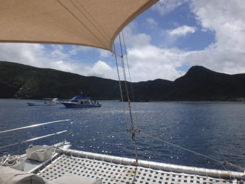

ダイビング最終日の午前2本目のダイビングとなる，

次のダイブですが．

今日は半日しかダイビングできないので．

なんと．

早くももう，これがラストダイブとなります…（涙）．

フルで1日潜れたのは，昨日1日だけか…

なんと短いことよ…（泣）．

ってことで．

2本目のダイビングポイントに到着すると．

子供たちは待ちかねたとばかりに，

シュノーケリングの準備に取り掛かります…

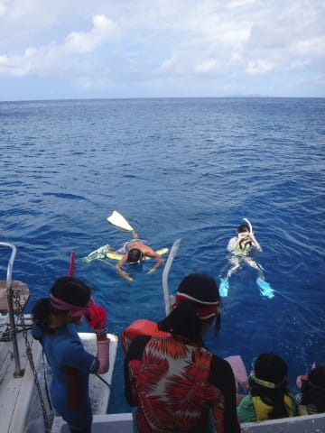

ガイドに連れられて，

みんなシュノーケリングへお出かけタイム！

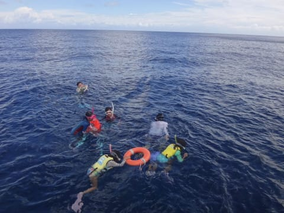

ガイド2名ついてますし，

ライフベスト＆浮き輪＆フロートも

準備されていて，安心して子供を

任せられますね～．

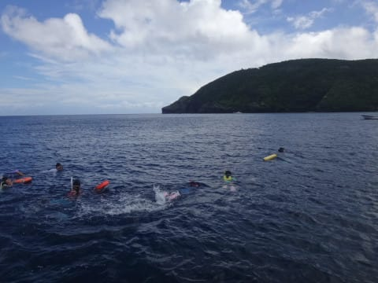

ってことで．

子供たちがシュノーケリングで遊んで

くれている間．

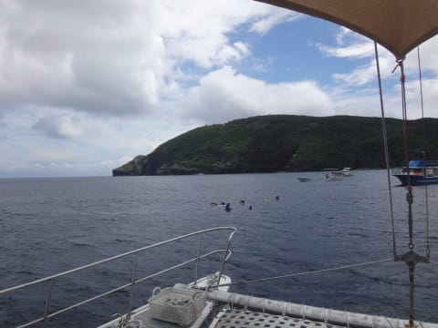

（どこまで遠くへ行くんだ…）

わが夫婦は，ダイビングへ！

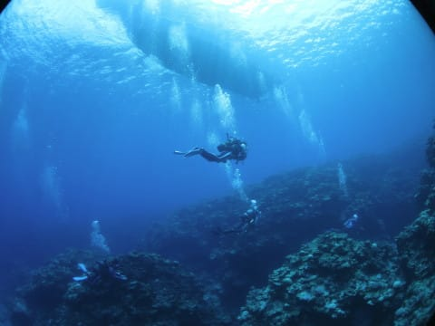

子供を安心して預けられるので，

何の心配もなく，夫婦そろって潜れるのが

有りがたいところ…

で．

今回のポイントは地形ポイントのようで．

こういう岩の割れ目を進んでいくと…

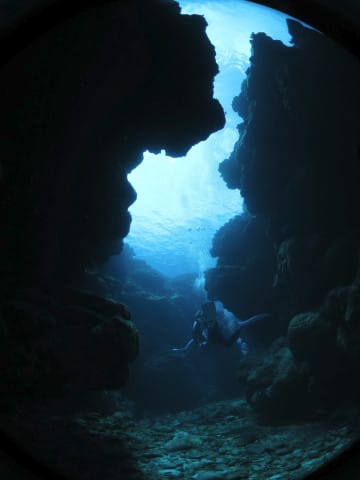

洞窟状のところへ出ましたね～…

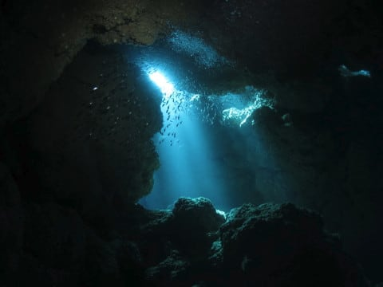

光のシャワーに照らされながら，

ハタンポか何か，小魚が群れてるのが

キラキラと光ってます．

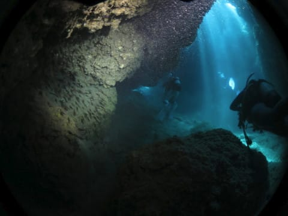

いや．

光のシャワーがきれい…！

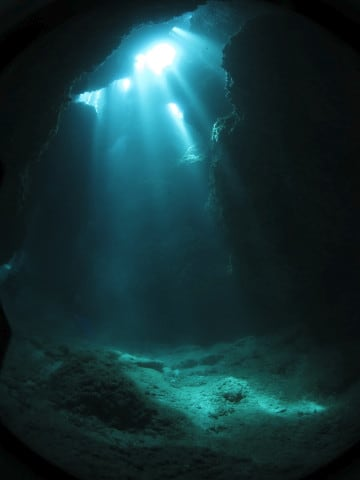

洞窟の中には，かなり巨大なイセエビ君が

鎮座してました．

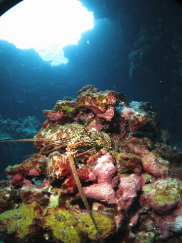

そして，洞窟の出口にやってきて…

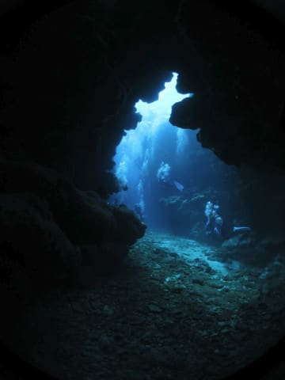

外に出ると．

そこはまたサンゴに覆われた海ですね～．

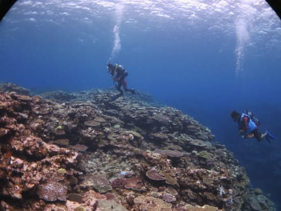

ってことで．

ボート下に戻ってきて，

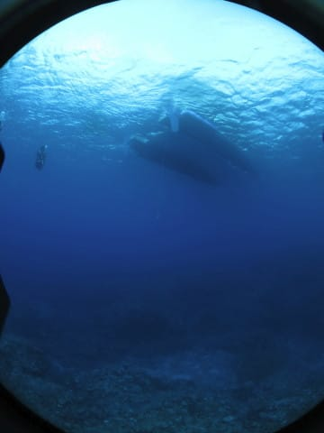

エグジットです．

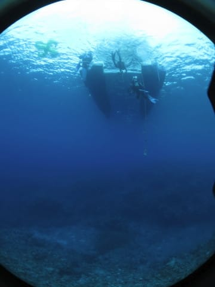

…

ちょっとアッサリ気味のダイビングでしたが…

あぁ．

しかし．

なんということだ．

これで，この旅行のダイビング，すべて終わりとは…っ！！

ってか．

この旅行で，たった5本しか潜ってないんですが…っ！！

なんと短いダイビングツアーだったことよ…（涙）．

でも．

たまには，味わいの違う地形ダイブもいいけど．

やっぱり私が慶良間の海に求めるのは，

こーゆーポイントでは無くて．

魚がごっちゃり群れるサンゴのきれいなところか，

面白いハゼのいる砂地なので←このあたり一部偏っている嗜好あり

できれば最後はそういうところが良かったかな…

と，ゼイタクにも思ってしまった，Skier_Sなのでした…
