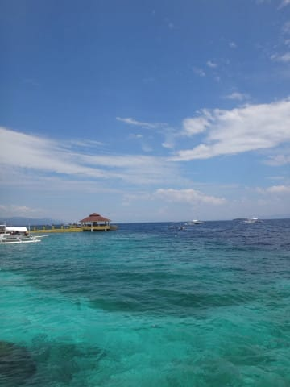
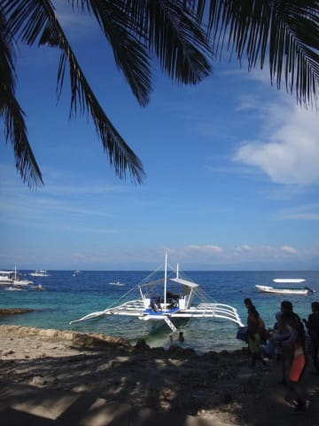

# 2020年の夏はどこに潜りに行くのか…って，娘の夏休みこれだけしかないの！？？

📅 投稿日時: 2020-06-27 00:53:37

ということで．

夏モードに突入したわけで．

このBlogの話題も，ダイビングの話題に

なるわけですが…

で．

いつもならGWごろには．

スキーシーズンど真ん中にもかかわらず←いや，普通の人はもうスキーシーズン終わってる頃だから

頭を何とか夏に切り替えて，

どこに行くのか決めて，

旅行の手配をしてしまうところ．

しかし．

今年はこんな状況で，

一体いつ遠出ができるのか

ってことが，全く読めず．

…かつ．

海外に潜りに行くことは不可能

という，悲しい状態だったので．

夏のダイビング遠征の予約ができず，

しばらく様子見をしていたのですが．

で．

6月に入って，娘の学校も無事始まり．

私も月山まで遠征できるようになり．

そろそろ通常モードに戻ってきた感じも

あるから，娘の夏休みに合わせて，

沖縄くらいには行けるかな…？

と，娘の学校の夏休み日程を確認したところ…

…

…な，なにぃ～っ！！？？？

娘の学校の夏休み，お盆前後の

わずか2週間だけしかないの！？？

…それも．8月10日は祭日だから…

実質，夏休みで授業が無くなる平日は

わずか9日間のみ！？？

…暴れる．

自分が学校の生徒だったら，

絶対暴れる…

あまりにも可哀想じゃないか…！

子供の親が！！←そっちか

まぁ，世間一般の親にとっては．

ただでさえ，3月～5月の3か月間，

夏休みみたいにずっと家に居たんだから

また夏休みもずっと家に居られたら

たまらん…

って人が多いでしょうが．

自分にとっては，

人生，あと何回娘と一緒に潜りに行けるのかを

考えると．

娘と潜りに行きたかったのだ…っ！！

やっと娘にCカードを取らせて，

一緒に潜りに行けるようになったと思ったら，

この仕打ちとは…（涙）

とはいえ．

約2週間弱の夏休みがあるようなので．

なんとかその時期に潜りに行こう…

と．

とりあえず，いつもの座間味は抑えて

おきました．

ってなわけで．

また，この夏も．

ザマミセーリングさんで，

ペンション星砂泊り

という，我が家の黄金パターンでの

ダイビングです．

うーむ．

娘も12歳になって，最大深度12m制限が

取れたので．

今年はちょっと違うところにも潜りに

行ってみたかったんだけどなぁ…

そして．

ジュニアアドバンスも取らせたかったのに．

どちらも実行できず，ちと残念…

まぁ，学校に3か月も通学できなかったので．

最悪完全に夏休み無しという

パターンもあり得たので．

休みがあって，潜りに行けそうなだけ

良かったということにしておきましょう…

ってなことで．

この夏も，また2次感染拡大が無ければ．

座間味へ潜りに行ってきます～！！

　

　

　

　

## 💬 コメント一覧

### 💬 コメント by (西館)
**タイトル**: 沖縄本島にええ温泉あるのご存知ですか？
**投稿日**: 2020-06-27 21:49:51

お嬢様、進学校に通っていらっしゃるのですね。

相棒くんは気楽な大学生なので授業は全て在宅で、ネット講習とレポート提出なので夏休みはしっかりある。

ばかりか、別に家で受けなくても良い。（ネット講習も聴講期間に猶予が有るそうです。）

なのでオリンピック休暇の前にさっさとアドバンス取りに沖縄本島に行ってきます！本日テキスト届きました。ライセンス取得は本島が安いから！そして慶良間に初ダイブ、ナイトも初体験です！更に、温泉に入ります♪

スキー板買ってアドバンス取って、更にスキーメンテ道具（ええアイロンと工具のブラシとバイス）更新を目論んでいて、日本経済に貢献します！

私たちには時間が無いのよお金よりも楽しい人生、子どもと過ごす時間よ（やけくそ）

･･･お嬢様、部活とかに支障があったでしょう、それがとにかく可哀想だと思います。

### 💬 コメント by (Skier_S)
**タイトル**: ＞西館さま
**投稿日**: 2020-06-28 04:07:46

いや…ぜんぜん進学校じゃないんですが，うちの周りの中学はみんな夏休み短いみたいです．

で，アドバンス取られるんですね…

講習頑張ってください．

慶良間はのんびりダイブが好きな人にはいいですよ…

しかし，沖縄本島に温泉があるとは知りませんでした．

沖縄は，温泉不毛地帯だと思っていたので…

（西表以外に温泉があると思っていなかった…）

ちなみに，娘の部活はまだ始まってません．

7月1日まで，部活動禁止です…

### 💬 コメント by (ももも)
**タイトル**: Unknown
**投稿日**: 2020-06-29 10:24:05

S様

中学校ネタでしたので…お嬢様、初めての中学校で大変ですね。ももも娘も夏休みは2週間、今も毎日半日授業です(T_T)

夏の旅行は「宿題がいつもの夏休みの量＋休んでたときのツケ分あったら行けるはずないでしょ！」と断られました。ステイホーム決定です。

西館様

板、購入しましたか!?　私も探し中てす。レディースで軽量でスピード出しても安定してるのを探してます。昨年は型落ちのサロモンS/MAXを買いましたが…重すぎる!　オススメがあったら教えてください。Sさんもレディース板の試乗レポートはしてくれない…。西館さんしか頼れる方はいません！待ってます！熱望!!

### 💬 コメント by (西館)
**タイトル**: Gokuさま、Sさま、ありがとうございました。
**投稿日**: 2020-06-29 23:04:58

昨夜から先ほどまで掛けて、2020モデル FISCHER RC4 SC RACETRACKでL155/R12、DTX L164/R14、息子が DTX L171/R16、

更には私の太板 LINE BACON SHORTY L165、息子が奥志賀フリーラインパークで平均台などのアイテムに乗る用に LINE BLEND だったかな、の5本を5%還元に間に合って購入できました。

7月中旬に、5本届きます。ほんまもんの板を買ったのは初めてで、凄く緊張してしまい、お腹を壊しました。シーズン落ちでも5本購入で30万超え！ひぃぃぃぃ大丈夫か我が家。でもシーズン落ちだったので5本買えました。日本経済と、スキー業界に少しは貢献できましたでしょうか。

Sさま、GOKUさま、勝手にアドレス貼らせて頂き申し訳ありません、まずかったらSさま、削除してくださいませ。

(各メーカーの口コミを探すと、結局はSさんの記事に戻ってきます。もしかしたら、私たち同様、板選びに困った女性が辿り着いた際のヒントになるかもと思い、貼らせていただいたものです。)

### 💬 コメント by (西館)
**タイトル**: もももさま
**投稿日**: 2020-06-29 23:11:12

うひょひょひょひょ～とんでもない！！一の瀬日中のみで20000m達成のもももさまは間違いなく私よりもスキー上級者ですよ、そんなもももさまに私が助言などできる筈が無いんですけど、何かのヒント程度にはなるかも知れないので恐る恐る書いてみます。

各メーカーの口コミを探すと、結局はSさんの記事に戻ってきますよね。つまり、もももさんもおっしゃるとおり、女性の書いた試乗レポートは無いんだと思います。

メーカー毎、板毎の特性は、男性利用でも女性利用でも、大きくは違わないと思うんです。

なので、まずはSさんのインデックス記事のページを3年分開き、ざっと読んでみました。全文読むのは大変なので、文末から読みまして、高評価のもののみ残すと相当数が減ります。

Sさんは、扱い易いだけの板は好みませんで、若干くせの残る板が気に入る傾向にある点は割引ました。

VOLKL、FISCHER、ROSSIGNOKL、OGASAKA　など8社の小回り用板を比較紹介しているサイトを参考に貼らせていただきます。

ここに出てくる板は、Sさんの試乗レポートにも出てくるので、比較してみると更に参考になると思います。

<https://www.youtube.com/c/MsSkiSalon/videos>

私は幸いなことに、焼額オールスターズのGOKUさまにもご助言いただきました。その際のやりとりが下記です。

<https://red.ap.teacup.com/gokurakuskier/1230.html#comment>

GOKU妻さまの愛用機種は共にL165cm/R13だそうですが、動画を拝見すると、身長が高い方ですし相当な足前！私にはNORDICA DOBERMANN は無理でございます｡｡｡

GOKU妻さまの動画は下記からご覧になれます。

<https://www.youtube.com/c/GokurakuSkier/videos>

で、試乗していない私の勝手な結論ですが、レディースで軽量でスピード出しても安定してる板となると、 FISCHER RC4 SC RACETRACK なのではないかと思います。「女性用」を謳った板ではありませんが、「女子選手にもお勧め」の板ではあるようです。

そして同じ板でも長さによって、かなりの違いが生じますが、ももも様の求める長さ、Rはお幾つでしょうか。私はL155/R12にしましたけど、オールラウンド的に使うのであれば、L165/R13も良いのではないでしょうか。10cmで300g重くなるようですけど。

FISCHER DTX も相当操作性が良くて快適そうで、長さが同程度なら重量も同じみたいですが、2020モデルは L164/R14 か L171/R16 しか在庫が無いかも。神田にならあるのかな？我が家は愛知県なのでごめんなさい。RC4 SC RACETRACK L155 は手稲のパドルクラブには在庫があるそうです。これまた神田には在庫あるのかも。

以上、だらだらと書いて申し訳ありません。ほんの少しでも参考になったら幸甚です。相性の合う板と巡り会えますよう祈っております。

P.S.素晴らしいお嬢様ですね。お嬢様から悪の誘惑？を断ち切るとは。「努力できる」のも才能の1つです。

20000m達成も驚きでしたけど、根性も備わっていて、凄いと思いました。

### 💬 コメント by (Northfox)
**タイトル**: 物欲万歳！！
**投稿日**: 2020-06-29 23:54:24

西舘さん、板の購入おめでとうございます！

しかし御自身用だけでも一気に3本購入って凄いです。板の買い物としてはS様に匹敵するのでは？

という私も何故か今持っているのと同じ板（年式違い）を購入してしまいました。

まさか自分が一郎君、二郎君を所有することになるとは。

いつの間に物欲にまみれてしまったのか、それとも元からまみれていたのか．．．

このままでは自分も終わった人になりそうで心配です。

でもスキー業界に貢献できたということで良いかな？

それと M'sスキーサロン、私も見ています。吉田プロ、良いですね

### 💬 コメント by (Skier_S)
**タイトル**: 皆さん，物欲がすごい…
**投稿日**: 2020-06-30 00:25:34

＞もももさま

…わが娘も6月からやっと学校が始まりましたが…

果たして，夏休みの宿題，どうなることやら…

とりあえず，宿題があろうが何があろうが，

潜りに行く予定です…！

…そして．

さすがにレディスの板は試乗できませんが…

軽めの板をお望みなら，最近はVolklが全体的に軽めかも？？

＞西館さま

すごい…

5セット購入はすごすぎる！！！

日本経済に見事に貢献されてますね！！

…どうでもいいのですが，詳細に書かれているスキー板の

試乗レポートを探すと，やはり私のBlogに行きあたる確率が高いようですね(笑)．

あ，Goku妻さんのスキーテクニックは私よりずっと上で，

数多くの伝説（？）を残しているスキーヤーなので，

一般人の参考にはならないかもです(笑)．

https://www.youtube.com/watch?v=LLkZkSfFlmU

これを見ると，その一端が分かるかと…

＞Northfoxさま

二郎君行ったからには，三郎君，四朗君まで揃えてあげないと！

もう，物欲にまみれましょう(笑)．

大丈夫です．

このBlogの読者は，大体が終わった人ですから．

スキー業界に貢献してください！

### 💬 コメント by (西館)
**タイトル**: 昨夜は燃え尽きておりました
**投稿日**: 2020-07-01 20:31:32

こんな高額なお買い物はしたことが無いので相当なストレスだったらしく、疲労困憊、真っ白になってしまったのでした。

>Northfoxさま、ありがとうございます！

今までが全く持ってなくて、2018-19シーズンに14シーズン履き続けて流石に危険水域に達していた靴をやっと更新し、2019-20シーズンに10年使ったウェアをやっと更新し、これまた2010シーズンに量販店で買った中級用板をやっと更新したのが今回でしたので。

### 💬 コメント by (ももも)
**タイトル**: Unknown
**投稿日**: 2020-07-01 22:27:06

S 様

ありがとうございます。Volklですね。近所ではあまり見ない板なので、神田に行かねばなりませんね…　でも、東京に行くのはちょっと怖いかな。コロナの人数が増えてきましたね…　冬までに収束してほしいですね！

西舘様

ありがとうございます。

板5本ですか!?素晴らしいですね!!コメント参考にさせていただきながら、各社カタログをチェックしました。やはり…いい板はお値段高いなぁ。最近は大物買い過ぎだし。昨年購入したサロモンの板、私の力不足で履きこなせない感あるんです。今まで初心者用の板しか履いたことないし。ここ数年、年のせいか体力激減だし。冬までランニングと筋トレ続けてみてようかな…　まだ時間もあるし、今は買いに行くの怖いのでゆっくり考えてみますね。

あっ、西館さんは誤解してるようなので。私、スキー上手くないんですよ。得意な滑りはボーゲンだし…かなりの頻度で足開いて滑ってます!　20000はテクニックよりも根性と持久力でカバーしました(笑)

冬になったら、新しい板の感想、待ってますよ〜(^o^)

### 💬 コメント by (ももも)
**タイトル**: Unknown
**投稿日**: 2020-07-01 22:37:49

書き忘れた(｡ŏ﹏ŏ)

西館さんの相棒さんは大学生の息子さんなんですね!!　私も上の子が大学2年生です。もしや、西館さんと私って同じ年代なの！？と親近感増しちゃいました❤

私の息子はかなりのスキー○カです。20000も、彼がやりたいって言い出し家族でやることになったし…　今はスキーの為に教習所に通ってますよ！

### 💬 コメント by (Skier_S)
**タイトル**: コロナ対策給付金を，皆さん経済発展に活用してるようですね…
**投稿日**: 2020-07-02 01:10:54

＞西館さま

VOLKLのSL（旧SL DEMO）は，かなり小回りに特化していて，結構切れ込んで深く回ってきます．

なので，小回り機としての評価するには，VOLKLのSLがいいのですが，

オールラウンド性でいえば，FISCHERのDTXの方が上だと思います…

FISCHERもRC SC Proだと，結構高い小回り性を持っているんですが．

VOLKLでオールラウンド性を求めると，VOLKL SXになるかと．

VOLKLのSXも，結構いい板ですよ！

…そして．

NordicaのDobermann SLはさらに過激な小回り板で．

私も「この板を履いて一日滑ってたら疲れるな…」

という板なんですが．

これを気に入って履いているGoku妻さんのレベルがそれだけでもうかがい知れるかと(笑)．

＞もももさま

Volklだと，RACETIGER SXがオールラウンドに履くにはおススメです．

レディスというわけではないのですが…

あとは，HEADのSupershape Magnumあたりも軽快で滑りいいです．

