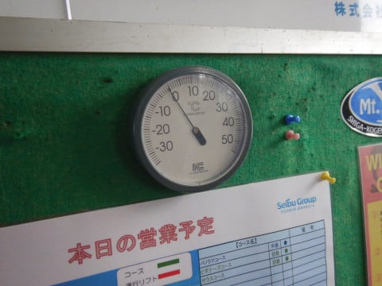
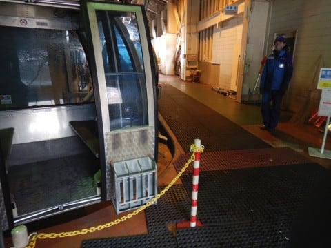

# 2021/4/18(日)の志賀高原スキー場レポート，速報モード！…朝は晴れ間も，気温は低め．昼間は緩んだけど，想定外の午後吹雪！

📅 投稿日時: 2021-04-19 01:18:39

🏷️ カテゴリ: [2021スキー滑走日記](c2b0fc073d6357d3b786f6ca655147f7d.md)

ということで．

本日も志賀高原で滑ってたわけですが．

いや…今日もかなり激しい天気の

一日でした…

とりあえず．

帰宅後，板のワクシング＆エッジ手入れ等

いろいろしてたので，いつも通り

安定の深夜更新で，本日の志賀高原

レポートです！

ってなことで．

土曜の朝から降り続けた雨は．

ひたすら日曜の朝5時頃まで

降り続いたものの…

早朝営業開始時には止んでいたので．

今日は早朝へ出動です！

早朝朝6時半の早朝開始時の

山頂気温は，0℃をちょい下回る

程度でスタート．

そして，山頂はちょっと雪が降ったようで…

うっすら白くなってますが，積雪は

1mmもない感じですね(涙)

雨があれだけ降ったんだから，

その穴埋め分は，積もってほしかった…

…けど．

早朝は，予想外に日も射す天気！

そして．

早朝のバーンは…

…

うはーーー！

シマシマっ！！

硬く締まっていい感じのシマシマっ！！

すばらしい！

早朝に来た甲斐があった…っ！！

…と，喜んで滑っていたのも1時間ほど．

早朝は日が射していたので，8時前には

早くも緩み始めてきました…(ちょい涙）

でも，今日の焼額はガラガラで．

通常営業が始まってもゴンドラは飛び乗り！

そして，通常営業開始時には曇り空に

なり，日差しも無くなったので…

雪はちょいと緩んだものの，日差しで

緩んだザブザブ雪ってほどにはならず．

写真にも人が写ってないほどのガラガラ

だったので．

雪は荒れたものの，大回り板で

滑ることができるレベルで．

午前中はそこそこ楽しめました…！

…でも．

昼ごろになると．

バーンはかなり荒れてきてしまい．

うーん．

ちょいと残念…

と，思っていたら．

何と．

全く予想外のことに．

12時過ぎに，かなりの雪が降ってきました！

ちょっと雪がぱらつくかな…とは

予想していたけど．

まさか，こんな激しい雪になるとは…！！

わずかの時間で，表面を薄っすら覆うほど

雪が積もりましたが…

雪が降ったのは1時間もないくらいの

短い時間．

あぁ…どうせ降るなら1mほど積もって

欲しかった…

残念ながら積もったのは1cmほど．

中途半端に積もった雪は，

下地の緩んだ雪と混ざっていき…

しばらく経つと．

うーん．

微妙な雪質に…(ちょい涙)

その後，気温が冷えていくに伴い，

ところどころ固くなっていき，

表面が凸凹したまま固まった，

微妙な雪質になっちゃいました…

うーん．

これなら，雨の日の昨日の方が

雪がフラットで滑りやすかった

かも…？？（泣）

…と，思っていたら．

なんということか！！！

さらに追い打ち（涙）

午後2時ごろから風が強くなっていき…

午後2時半に．

なんと．

強風のため，ゴンドラ営業中止に！！！

がーーん．

一体私が何をしたというのだ．

なんでこんな仕打ちに…

…もう，15:30の営業終了が近いので．

代行の第4ロマンスの営業もなく，

焼額は営業終了しちゃったので…

まだ営業している高天ヶ原へ移動っ！！

しかし．

ぐんぐん気温が冷えていった，午後3時．

高天ヶ原も，荒れ荒れ斜面がそのまま

凍った，ガリガリで滑りにくい，

微妙な斜面になってました…（泣）

そして．

さらになんと．

高天ヶ原について2本目を滑ろうと

する頃には．

なんだか，また激しい雪が降り始めたんですが…

というより，風が強い中に

横殴りに降りつけるこの雪は…

吹雪ってやつですね（涙）

この吹雪のおかげで，全く前が

見えなくなり…

荒れ荒れガリガリ斜面を，

斜面状況が見えないまま滑るという，

修行のようなスキーに…←それでも滑るのね

バーンは，こんな感じでかたまった

殺人コロコロ…

というより．殺人氷のカタマリがゲレンデ

全面にまき散らされた殺人バーンで．

吹雪の見えない状態でこの斜面を滑る

というのは…

人間の野生のカンを鍛える訓練か！？？

吹雪は午後4時を過ぎても続き．

ゲレンデに2-3cmほど雪が積もってきたけど…

このきれいな雪の写真に騙されては

いけない．

この下には，殺人コロコロが大量に

隠されていて．

これは，むしろ．

雪で覆われて下の氷のカタマリが

見えなくなり滑りにくくなる

という罠か…！！

…こういう辛い状況の中．

「まったく楽しくない…（激涙）」

と思いながらも．

なぜか午後4時過ぎまでしっかり滑ってしまった，

Skier_Sだったのでした…

いやー．

早朝から午前中は良かったものの．

それ以降は微妙な天気の一日でした…

夕方の雪はその後しばらく降った

みたいで．

深夜1時現在，蓮池のライブカメラでも

ちょっと雪が積もっているようですが…

この雪が，明日まで降り続けて，積もってくれると

嬉しいんですが…

でも．

残念なことに，もう雪は止んでおり．

これ以上積もらなさそうです…

そして．

明日以降，またしばらく気温が

上がりそう．

うーん．

今年のGW．

後半まで雪がもつかどうか，微妙になって

来た感じ…（涙）

## 💬 コメント一覧

### 💬 コメント by (ほっぽ)
**タイトル**: 4/18　志賀高原
**投稿日**: 2021-04-19 07:06:26

Ｓさん

昨日は午後から悪天候の中、ラストまでお疲れ様でした。

昼前にニゴン前駐車場に車が無かったので、てっきり移動したのかと思ったら、車だけ移動したようですね。

そう、ＳＸが乗り場にあったので変だなとは思ったんですよね。

午後イチの高天はアイシーでフラットで滑りやすかったですが、夕方は厳しかったようですね。

私もラストは奥ゴン回しのダウンヒル、

最後は第四のコブ道場からエキスパのコブ道場でしたが、

コブの方が滑りやすいという状況でした。

滑走記録はblogにアップしました。

http://hoppo.officialblog.jp/

### 💬 コメント by (うえいと)
**タイトル**: Unknown
**投稿日**: 2021-04-19 09:02:32

翌朝イチの雪は粘っこい新雪でした。

増えたのも結局数センチ。

周りは白くきれいですが。。

ここから数日温かい予報ですので先はまさに心配ですね。

### 💬 コメント by (Skier_S)
**タイトル**: 今日は特派員不在
**投稿日**: 2021-04-20 02:01:34

＞ほっぽさま

週末はお疲れ様でした～！

夕方の高天は辛かったです…

もう，修行のゲレンデでした．

今週は土日とも修行をやらされた感じです（笑）．

＞うえいとさま

月曜は，結局そんなに積もらなかったのですね…

まぁ，解けていく一方に比べれば，積もってくれただけ

ありがたいです．

とりあえず，GWまでもってくれるよう祈るばかりです…

