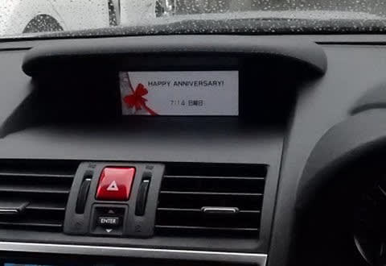
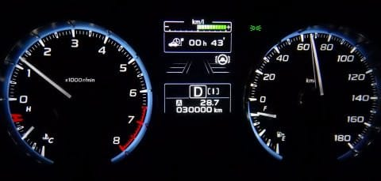
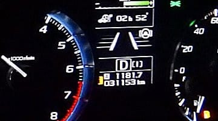
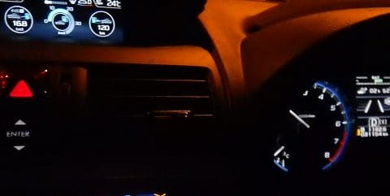
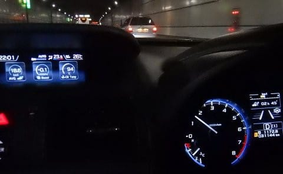

# 祝・VMGレヴォーグ君，購入1周年！…そして，一年で走行距離30000km突破．いつもの過走行状態です（笑）．

📅 投稿日時: 2019-07-16 01:51:24

🏷️ カテゴリ: [車](cba0e8330b3f2ded7c1addfacc75d4547.md)

そうなんです．

[あの日々](ecdca7ac058e50b9e3a2a3ae04e18b623.md)から，もう1年…

早くも，[昨年の7/14にLEVORGが納車](e5058a80cde19261b4716c15323cfcabc.md)されてから

1年が経ってしまいました！

早いものよ…（しみじみ）

いや．

この間，車の1年点検を済ませたので．

「そろそろ，買ってから1年だよなぁ…」

とは思っていたけど．

正確な日付はすっかり忘れていた私．

私が忘れていても，

車が覚えていたようで．

うむ？

なんだこれ？？

インフォメーションディスプレイに

現れたのは…！？？

…なんと．

自らの誕生日を主張するとは．

なかなか自己主張の強いやつだな…

ってなことで．

1年を過ぎる前に，30000kmも突破したし．

1年突破時の走行距離，

31000kmちょい．

…まぁ，我が家の車は．

1年でだいたい3万～3万5千km走るので．

ノルマ（？）の3万kmは超えてますね…

いつも通り，1回目の車検までに，

10万km近く走っちゃうという過走行

ペースで酷使しています（笑）．

そして．

LEVORG君，これまで3万kmの生涯燃費は，

リッター約13kmと．

カタログ値13.2km/Lとほぼ同じ数字に

なってます！

まぁ，私の使い方としては，

スキー往復の高速走行がかなり多いので．

高速燃費が割といいこの車，

結構いい数字になってます．

しかし，毎日の通勤にも使っている

ことも考えると…

LEVORG 2.0としては，かなりいい数字かな．

なんとなく，エンジン＆リニアトロニックの

制御プログラムが見えてきたので．

燃費がいいポイントを突く運転が

できるようになってきました…

で．

この3連休もちょいと（かなり？）

遠出してきたのですが．

約1200kmの往復燃費．

16.8km/Lを指してます！

…分かりにくいですが．

右側のトリップメーターが，

1182kmを指していて．

左のインフォメーションディスプレイに，

トリップメーターリセットからの燃費を

表示させているのですが．

この燃費が16.8となってます…

帰り道の高速だけの燃費を見ると．

18.6km/L!

これは，左のインフォメーションディスプレイに，

エンジンをかけてからの平均燃費を表示させて

いるのですが．

右側のエンジン始動からのタイマーが，

2時間45分を指してます．

帰り道の2時間45分間の平均燃費が

18.6kmということで．

カタログ値よりリッター5kmほど

多く走れてます．

…この車の使い方としては間違っている

気がしますが．

高速道路で燃費を重視した走行をすれば．

このくらいは走れる車です…

ということで．

1年間，ともに過ごしてきましたが．

燃費走行すれば，意外と高速での燃費もいいし．

[雪道も強い](e2abed604f2e4f1dccb1bb27fc362dfec.md)し．

山道を走っても楽しいし．

かなりパワーもあるし．

長距離運転はむちゃくちゃ楽だし．

はい．

個人的には，気に入ってます…

## 💬 コメント一覧

### 💬 コメント by (ほっぽ)
**タイトル**: レヴォーグ
**投稿日**: 2019-07-16 22:45:35

Ｓさん

順調に距離を伸ばされているようですね。

４年後は１５万ｋｍオーバー確実で、乗り換えの見極め時でしょうか。

でも、かなり気に入っていらっしゃるようですし、

もう１回車検を通して７年２０万ｋｍを目指すのも

良いかもしれませんね。

尤も、私的には４年後に出番が回ってくることを予定していますが。(^^;

### 💬 コメント by (Skier_S)
**タイトル**: ＞ほっぽさま
**投稿日**: 2019-07-17 01:03:02

順調に3万km突破しました…

しかし．

3年で買い替えるのか，5年で買い替えるのか，まだ

自分でも分かっていません（笑）．

そのころに，私の物欲を刺激する車があるかどうかが

運命の分かれ道です…

### 💬 コメント by (Hide)
**タイトル**: さすがの走行距離です・・・
**投稿日**: 2019-07-18 09:17:23

S 様

おひさしぶりです。

あいかわらず1年で3.1万Kmとはさすがです。

私は先月初回車検でしたが、3年でまだ1.8万kmです・・・

冬の志賀高原と夏のゴルフ以外は、基本動かないのでこんな感じです（涙）

休日もついつい電車・バスで動いちゃうので、もはや駐車場代払って車持ってる意味が・・・（汗）

ゴルフの予定が入らないと2か月間位動きませんから（爆）

### 💬 コメント by (Skier_S)
**タイトル**: ＞Hideさま
**投稿日**: 2019-07-19 02:24:43

車検過ぎて1.8万kmですか．

中古でちゃんとお値段がつきそうでうらやましいです…

私は車を売るときは，必ず二束三文で買いたたかれてしまうので（涙）．

でも，夏でもせめて月いちくらいのペースで乗ってあげてください（笑）．

