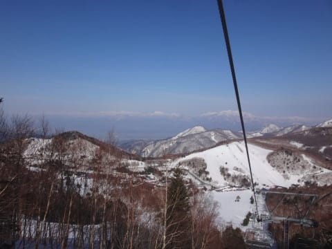
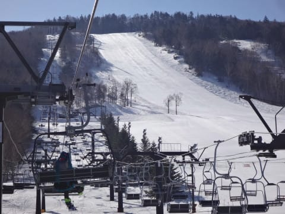
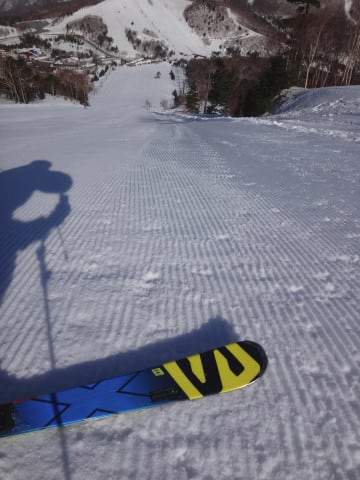
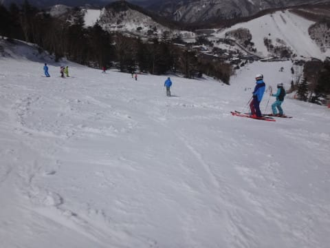
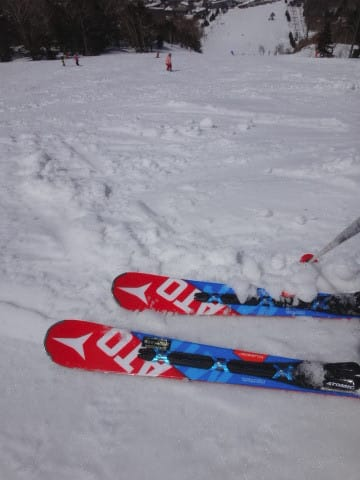
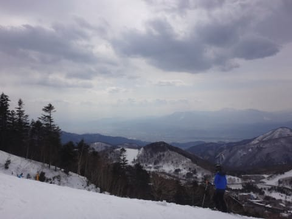
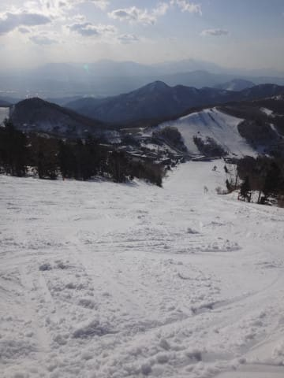

# 4月16日（日）の志賀高原スキー場，速報モード…晴れ，午後しばらく曇り．気温は高かったけど，楽しめた一日

📅 投稿日時: 2017-04-17 00:38:09

うむ．

このBlog．

なんと，累計500万PVを超えたようで…

最近では，月間15万PVですか…．

まさか，こんなに多くの人に読んでもらえる

ようになるとは…

このBlogを応援してくれている読者の皆様に，感謝！

＃そもそも，こんなに長く続けるとは思わなかった…

＃コメントやらゲレンデでの「読んでますよ」の一言で，ついつい…

ってことで．

本題の，スキー場レポート．

今日も帰宅が遅かったので，速報モードにて

お送りします…

えー．

今日は一日，一の瀬はりつきで

過ごしましたが．

今日は，朝から晴天っ！！

朝イチのゲレンデは…

放射冷却で冷え込んだ，しっかり硬いバーン！

ってか，ホントに硬いよ…！

ピカピカ晴天で，気温も結構高かったわりに，

9時半まで硬いままで．

さらに11時近くまで，比較的締まった

フラットバーンをキープ！

さすがに昼ごろは，強い日差しで

ちょっとネットリとしたクリーミーな雪に

なっていきましたが…

でも，板が潜ってしまうようなドボドボ雪にはならず．

午後になるとちょっと日が陰ったおかげで，

雪質はそれほど悪くならず，結構板が滑る雪

でしたね～！

さすがに午後3時を過ぎると荒れ始めてきたけど．

でも，夕方は人も少なく，リフトストップのときでも

コブコブになってしまうことはなく．

気合を入れれば大回りできるレベルのバーン状況だった，

今日の一の瀬スキー場でした…

いやーー．

今日も，意外と楽しめましたよ…！

また明日，詳細レポートやりますので，

お楽しみに～！

## 💬 コメント一覧

### 💬 コメント by (さち)
**タイトル**: Unknown
**投稿日**: 2017-04-17 12:18:47

読んでますよ！

昨日はお疲れ様でした！

私は無事に松本で友人と飲めました(笑)

また今週(^^)/

### 💬 コメント by (Goku)
**タイトル**: 大爆走
**投稿日**: 2017-04-17 21:00:26

週末はお世話になりました～♪

私達はカミさんの足が売り切れとなり、３時過ぎに上がりました。

それにしても、恒例のパーフェクター集団暴走！楽しかったです！

また週末お会いしましょう。

### 💬 コメント by (Skier_S)
**タイトル**: 今週末も晴れそうかな…
**投稿日**: 2017-04-18 02:12:35

＞さちさま

いつもありがとうございます～！

土曜の夜はお疲れ様でした（笑）

今回も楽しめました．

また今週もよろしくお願いしま～す！

＞Gokuさま

昨日の雪は，かなり太ももに来る雪でしたね…

あのパーフェクター暴走が効きましたか（笑）

でも，午後も日が陰って，暑くなりすぎず

雪は結構いい感じでしたよね～．

恵まれてます．

今シーズンは…

また今週もよろしくお願いします～！

