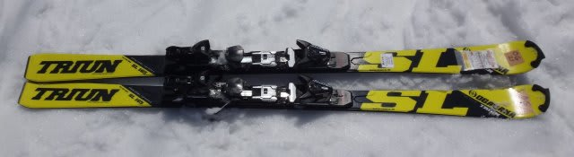
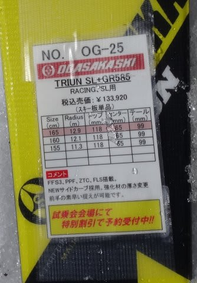
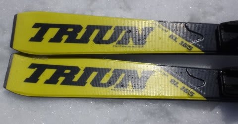
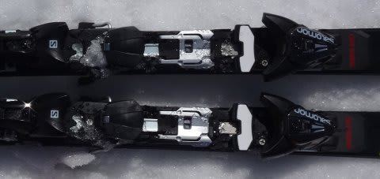
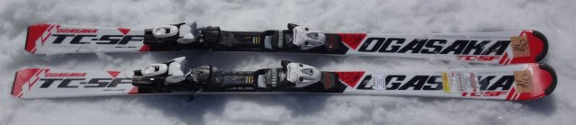
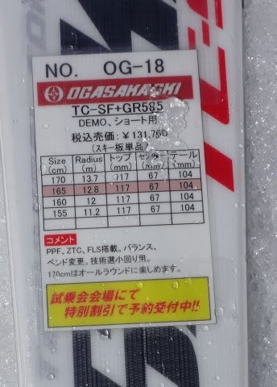
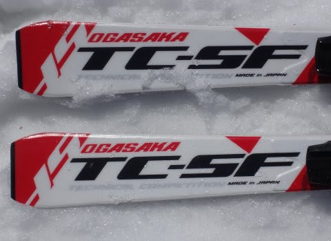
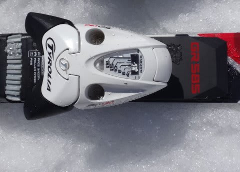

# 2016シーズンモデル，スキー試乗レポート第18回…OGASAKA編その３

📅 投稿日時: 2015-05-26 01:43:20

🏷️ カテゴリ: [スキー板試乗](c0bd8048615710cee890e403a36cc9a2b.md)

という感じで．

忘れたころに復活する，2016シーズンモデルの

スキー板試乗インプレッション．

今度は，オガサカ編です．

今回は，TRIUN SLと，前回乗ったTC-SFの再インプレッション．

では，どうぞ～！

○OGASAKA TRIUN SL + GR585 165cm

SL競技用．

試乗したモデルは，GRプレート付きになります…

ビンディングは，OGASAKAの試乗には珍しいSALOMONビンディング

付きでした．

で．履いてみた感じですが．

エッジグリップがかなり強いですね～．

さらにGRプレートが結構強く，フレックスも硬め．

さらに，しっかり重いってのもあって．

安定感は抜群！

春の荒れた斜面でも，荒れに飛ばされることなく，

どっしりとした感じで進んでいきます．

ただ，スイングウエイトが重く，エッジグリップが強いので，

ズラシを使ったり，板を谷回りで動かして

いくという小技は使いにくい感じ．

かなりカービングマシーン的な感じで，

これまでのオガサカとは異なる印象を受けました…．

荷重ポイントは，センター．母指球側を押す必要もなく，

ひたすらセンターに乗り続ければいい感じ．

しっかり板のセンターに乗って行かないと回らないですが，

センターにのれば，しっかり切れていきます．

この板とGRプレートの組み合わせは，ちょいと気楽に

乗れる感じのゲレンデ板じゃないかな．

私には，コブとかだともてあましそうな感じ…．

ただ，固い雪でかなりハイスピードだと，

おそらくこの重量感としっかりしたエッジグリップで，

いい感じのカービングマシーンになってくれそう．

低速や柔らかい雪，荒れた雪でお気楽に乗れる板ではなさそうですが．

締まったバーンをハイスピードで飛ばしてみたい感じの板です．

○OGASAKA TC-SF + GR585 165cm

基礎小回り用．

プレートもGRプレート，長さも165cmと，[前回試乗した](e69e5a80b7d7928b20726d2d9233de743.md)のと

全く同じ板です．

ただ…

前回は下地が固く，その上に柔らかい荒れた雪が乗った状態で

試乗したのですが．

今回は，完全にザブザブの春雪状態で試乗したからか．

ちょっと印象が変わっちゃいました…

まず．

履いた感じ．ちょいと重く，前回より動かしにくい感じが…．

そして…あれ？ちょっと硬く感じる…．

この板，比較的フレックスが強めなので．

完全にザブザブな雪だと，板に仕掛けにいっても

足場が崩れて，たわむほどの外力を受けられず，

この板のおいしい領域に入れられない感じ…

また，板+プレートの重さで，ざぶざぶ雪にちょっと潜って

しまって，ずらしも使いにくくなってきます…

春の雪とは相性が良くないのかな…

板自体はかなりのポテンシャルがある板ですし．

この重さ，フレックスの強さは，かなりの部分が

GRプレートによるものだと思うので．

春の柔らかい雪に対応するなら，プレートを一つ弱めて

FLプレートにすると，いい感じになるのかも？？
