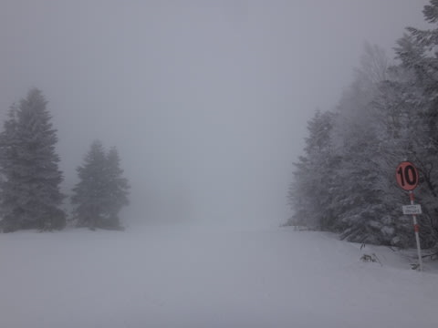
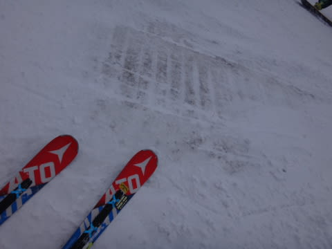

# まだ続くよ！1月3日の志賀高原は…雪が降ったけど，ほとんど積もらず．ガスで見えない，人が多めの一日

📅 投稿日時: 2017-01-03 23:07:11

🏷️ カテゴリ: [2017スキー滑走日記](c7d777cecfc91bdf0fa464ad62c6d49ab.md)

そろそろ読者の皆さんも飽きてきたころと思うのですが．

一体いつまでSkier_Sは志賀高原にいるんだろう…

と不思議に思うことでしょうが．

まだ続きます（笑）．

ってことで．

年末年始休の最終日の本日ですが…

本日は，ちょっと大人の事情で，

朝はかなり出遅れてのスタート．

で．

朝10時過ぎの志賀高原の登り坂．

積雪凍結路面で，事故やスタックする

車が続出…（涙）

おかげで，上りも下りもかなり渋滞で．

上林のチェーンチェックから焼額まで，

1時間半近くかかりました…（泣）

なので．

昼ごろスタートとなってしまった本日．

ゲレンデは結構雪が降りしきっており…

そして，昼でも気温がマイナス6℃と，

比較的低めだったので．

これはいい雪がたっぷり積もっているに違いないっ！！！！

…と，期待したところ．

あり？？

コース脇で，せいぜいこの程度．

10cm積もっているか…

もっと積もっていると思っていたのに…（涙）．

ちょっと，積雪が足りない…

で．

コース上の人も多めだった本日．

あうーーん．

昼にはもう，コース上の大体の雪は

スキーヤーに蹴散らされて…

危険エリア，また土が出てきてました…（涙）．

ゴンドラ山頂に，まだこんな看板が出てるので．

うーむ．

やっぱりまだ，積雪が足りないっ！！

でも．

今日，新たに積もった雪は比較的雪質がよくて．

緩斜面では結構気持ちいいんだけど．

中・急斜面は…

上の雪が大勢のスキーヤーに削られて，

またアイスバーンがコンニチハしてきてます…（泣）．

それも．

本日は，山頂付近．

かなりガスが濃い目の天気だったので．

…見えない…

ゲレンデ状況が，見えない…っ！！

これでいきなりアイスバーンで「ズルっ」といく

という，ちょっと恐怖感を誘うゲレンデ（ちょっと涙）．

…麓付近は視界が良かったんですけどね～

で．

本日も，ゴンドラ待ちはせいぜい1分程度の

短い待ち時間でしたが．

でも，ゲレンデの人は午後でも多めで…

驚くことに，いつもならゴーストタウン化する

年始休み最終日の夕方になっても．

人が多かったです…

でも．

夕方になってくると，ガスも上がって，

日も射すようになり．

時々現れるアイスバーンに気を付ければ，

最後はちょっと楽しめたかな～！

ってことで．

本日も焼額ゴンドラ営業終了の16時まで，

しっかり滑りました～！

…ってことで．

今は，大人の事情でK奈川県の自宅に

帰ってますが．

明日も仕事は休みなので．

…おそらく，明日も志賀高原を

滑ってます…

## 💬 コメント一覧

### 💬 コメント by (Unknown)
**タイトル**: Unknown
**投稿日**: 2017-01-04 06:27:37

志賀高原気象協会会長様へ

そろそろ、三連休の気温・降雪が気になるこの頃…

どんな感じでしょうか？

1/3 は風向きが変だったためか、高天が原のほうが

積雪は多めだったようです。

### 💬 コメント by (Skier_S（志賀高原気象協会会長）)
**タイトル**: Unknownさま
**投稿日**: 2017-01-05 02:01:04

3日の志賀の積雪傾向，不思議でしたね…

横手も結構積もったみたいでしたね．

ヤケビはイマイチでした…

とりあえず．

眠い目をこすりながら天気予想しましたので，

許してください…←何を？

