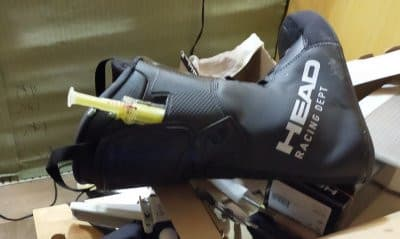
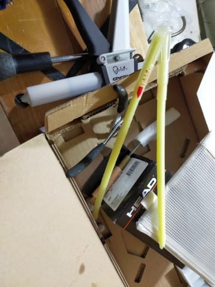
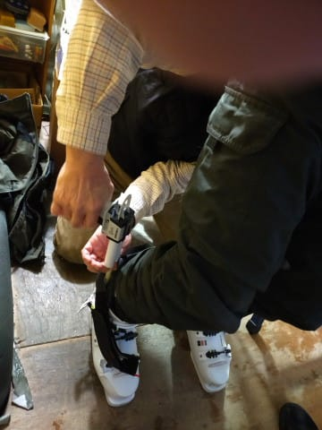
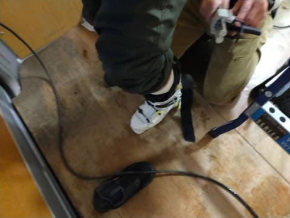
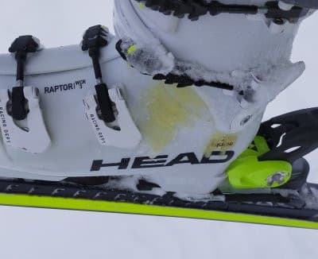

# スキーシーズン終盤，HEAD RAPTOR WCR3のブーツにLIQUIDを足してみた

📅 投稿日時: 2022-06-23 01:37:27

🏷️ カテゴリ: [スキー雑談](c1f9d2cb7478308da16419928ea3945e9.md)

今から1年とちょっと前…

[2021シーズンのラストに購入](e236e665405cc4eef9821c1d9111c69da.md)し，

今シーズンのメインブーツとして

使ったHEAD RAPTOR WCR3．

このブーツ，インナーブーツの足首の

ホールド感を増すために，

「LIQUID FIT」とかいう，

グリス状の液体をインナーブーツに

入れて，足首周りのボリューム調整が

できるようになっていて．

購入時にLIQUIDフォームを注入して

もらっていたのですが…

（この，インナーブーツに刺さったホースから注入する）

このLIQUIDフォーム．

なんと．

使っている途中に何度でも入れ増したり，

逆に抜いたりできるのですね～．

（LIQUIDを入れるホースや工具類）

で．ほぼ1シーズン使った結果，

インナーブーツがつぶれてきて，

インナーのボリューム感が減ってきた，

我がブーツ．

ちょうどシーズン終盤に，[エキップさんで
小指部分を拡げてもらった](e9c80a3bfa9f9ad2b66be10e7371a331b.md)ついでに．

「LIQUIDフォームを足してみようか…」

と，足してもらいました～！

インナーブーツにLIQUIDを入れる

ホースを刺してからブーツを履いて，

ブーツを履いた状態でLIQUIDフォームを

注入してもらいます…

足した後は，またインナーのボリュームが増して，

インナーがつぶれる前の新品のように

全体のフィット感が増した感じ！

足首周辺にしかLIQUIDは入らないのに，なぜか

全体のホールドが増した感じがするのは

不思議…！！

…でも．

どうやらLIQUIDをちょっと入れすぎたのか．

翌日滑ったら，LIQUIDがちょっと

逆流して漏れてきちゃいました…（涙）

とはいえ，[最初の不具合](e942c9654b97bb4bba2b56c8e81c885b5.md)の時みたいに，

LIQUIDが全部漏れちゃうことは無く．

入れすぎた分がちょっとだけ漏れた

だけみたいで．

入れた直後よりは緩まっちゃったものの，

入れる前よりはホールド感が

上がってくれました～！

…シーズンで50日以上履く私のブーツ．

普通だと，1シーズンでかなりインナーが

つぶれてしまって，2シーズン目になると

ペタペタ感が出てくるんだけど…

LIQUIDを足すことでまたインナーの

ボリュームを増すことができる，

このHEADブーツ．

これなら2シーズン目も，新品インナー

みたいな感じで履けそう！！

すばらしい！！

とりあえず，シーズンにかなりの日数を

滑って，ブーツのインナーがすぐに

ペラペラになってしまう人には，

いいかも…！！

あ，ちなみに．

HEAD RAPTORのブーツを取り扱ってても，

LIQUIDを入れる特殊工具をもっていて，

注入や追加をしてくれるお店はあんまり

ないようですので，ご注意を．

HEADのLIQUID対応ブーツを買う時，

お店でLIQUIDの注入をやってくれるか

どうか，確認してくださいね！！
