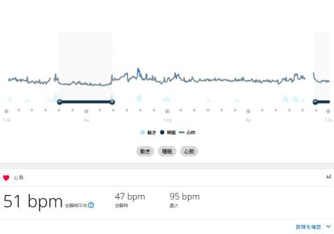

# 新しいスマートウォッチ，Garmin Fenix7Xを買ったよ！その13…PC版Garmin Connect

📅 投稿日時: 2022-09-06 04:42:12

🏷️ カテゴリ: [PC,カメラ&小物](c0d8caed13e597efe97b661a8ae56bed0.md)

えー．

昨日の記事は，やはりほとんどの読者を

振り落としてしまったようですね…（涙）

次回はもう少し分かりやすくなるよう

がんばります…

で．今日は，

「一体これは何回続くんだ…？？」

って感じのGarminの紹介記事です！！

（Garmin Fenix7Xのレポート全16回のもくじ

機能説明，登山用地図の作り方，登山で使ってみた…など

は[ここをクリック](e516b23a4874189de2e9208be87fa5184.md)）

前回までは，長きにわたって，

スマホ版 Garmin Connectの説明をしてきましたが．

今回はPC版Garmin Connectの紹介をば…

…っていても．

PC版の機能は特にスマホ版と変わらないので，

今日はちょっと短めで，ざっくり簡単に説明します！

まずは，こいつがPC版のGarmin Connect.

アプリではなく，ブラウザで

https://connect.garmin.com

にアクセスすると見れるWebページです…

Garmin Connectのトップ画面がこいつ．

このトップ画面に何を表示させるかは

好き勝手に編集できますが，こんな感じで

いろんなデータがタイルで並んで一覧で見る

ことができるトップ画面になってます…

さらに，左のメニューから，

「一日の概要」を選ぶと．

スマホでも見ることができる，

心拍数グラフやら…

睡眠時間やら，

睡眠スコアに，

ストレスレベルやらボディーバッテリーやらを

見ることができます！！

そして，左のメニューから「アクティビティ」を選んで，

「すべてのアクティビティ」を選べば…

過去のアクティビティ一覧が表示されて．

それぞれのアクティビティの詳細を

見ることができます…

この，標高や心拍，ペースなどのグラフは，

スマホより見やすいですね！

カーソルでグラフのある場所を選べば，

地図のポイントもそれと連動して，

「どこにいた時この心拍数だったか」

とかも確認できます…！

地図をクリックすれば，地図だけが拡大

されるし．

画面が大きいので，これもスマホより

見やすいですね…！

まぁ，このほかにもいろいろ機能は

ありますが…

基本的には，スマホのGarmin Connectアプリに

ある機能ほぼそのままなので，

ここではあまり詳しく説明しなくていいかな．

ただ．

このPC版でしかできないことがあって…

それは，

「GPXデータを基に，ルートを作ること」

山登りをする際に，事前にウォッチに入れておく

ナビゲーション用のマップを作るのは，

このGarmin Connectからやります…

次回は，

Garmin Connectを使っての

山登り用のルートマップの作り方

を紹介しますね～！
