# 2012年　子連れモルジブ　ダイビング旅行記　その18

📅 投稿日時: 2012-11-15 00:46:39

えー．

この週末の天気予想ですが．

土曜は昼から天気が崩れそうですね～．

標高の高いところでは，雨→雪と変化しますね．

降り始めは標高の高いところでも雨です．

風が強くなって，山沿いでは荒れるかも．

そのあと，18日の午前にかけて，日本海側～長野の山間部は

雪かな．

…明日，週末の詳細天気予想レポートします…

では，モルジブレポート，続きます～

----

で．

ゴキゲンの娘を乗せたボートはモルジブの海を走り．

1本目のポイントへ向かいます．

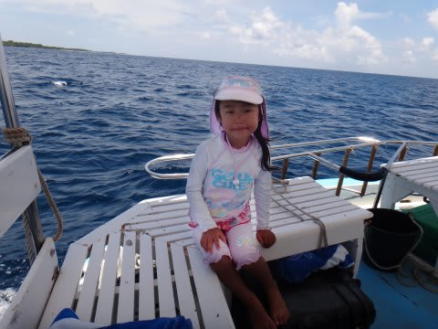

妻と，潜行…ならぬ，先行を決める相談を．

私「どーやら2本目はマンタポイントらしいよ」

妻「あなたは2日目にマンタポイントを潜ってるよね」

私「そうだけど」

妻「2日目にマンタポイント潜ってるよね」

私「…」

妻「マンタポイント，潜ってるよね」

私「…分かりました．マンタポイントはお譲りします…」

ということで．1本目は私が潜って，2本目は妻が潜ることに．

で，1本目のポイント名は…

「ドンファヌ・ティラ」

ボトム30mくらいから立ち上がっている，比較的大きな根．

この回りにいろいろ大物が回ってくるポイントのようで．

「娘ー，いってきまーす」

ってことでエントリー．

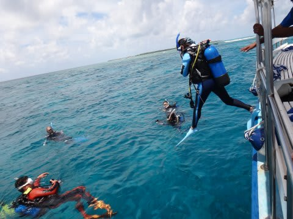

をををっ！

これまでで一番いい透明度っ！

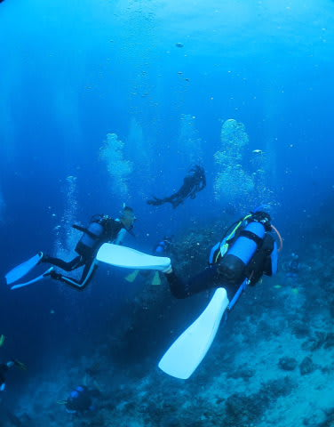

20m以上抜けてるかな～

透明度がいい，根の周りを回っていくと…

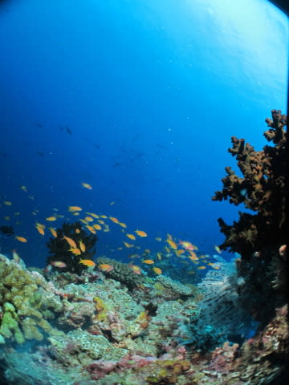

いつものモルジブらしいこんな景色や．

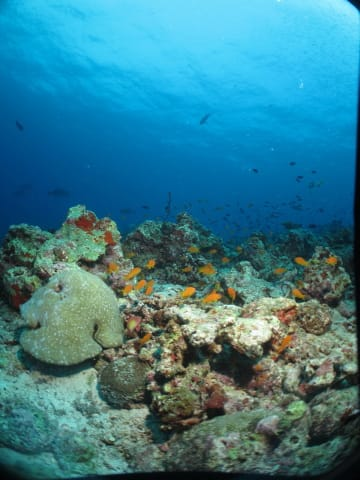

腹黒クマノミやら．

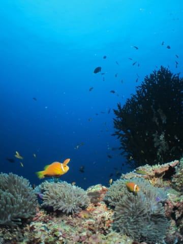

こんなやつもいます．

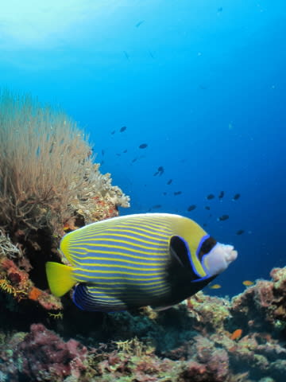

…そして．

根の先端に行くと．

カスミアジやら，

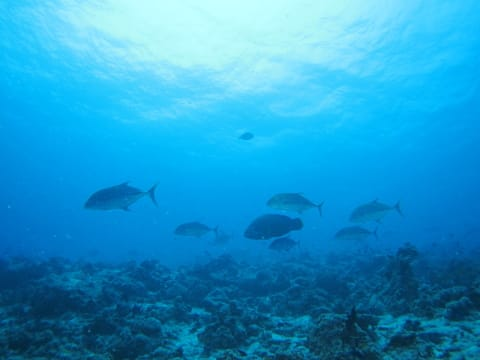

イソマグロやらが何度もやってきます．

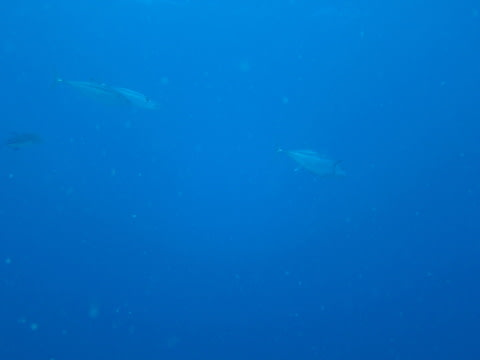

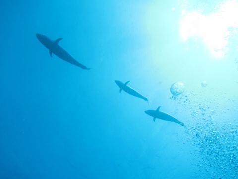

そして，ナポレオンが3匹．

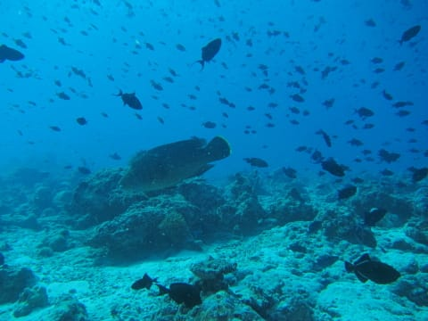

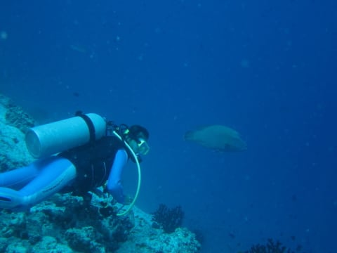

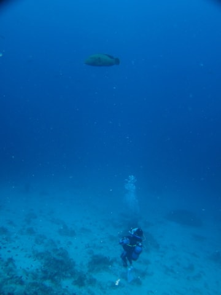

こいつら，結構フレンドリーですねー．

そうこうしていると．

おおっと．

マンタさん通過．

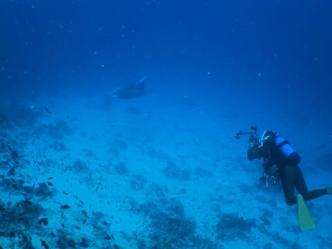

…マンタポイントじゃないのに．

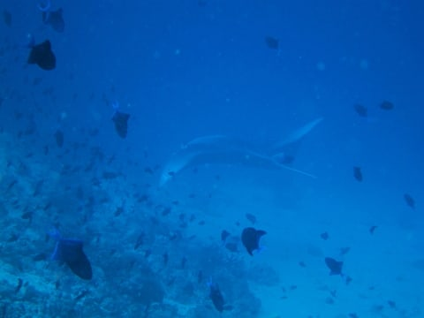

ってことで．

比較的透明度もよく．

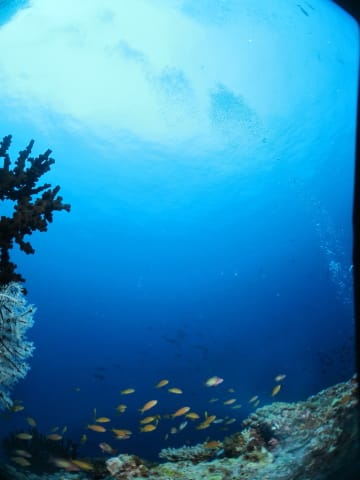

大物もかなり出てくる満足ポイントを堪能してエグジット．

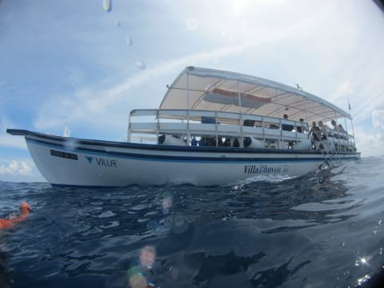

で．

ボートに上がると．

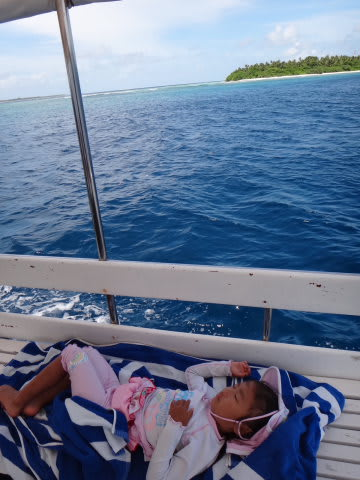

…娘．

ぐっすりと寝てました…
