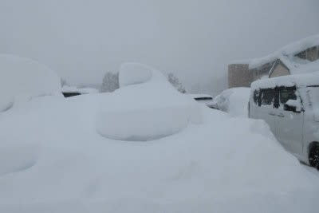
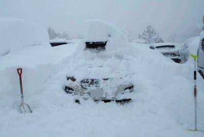
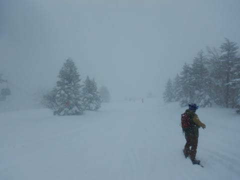
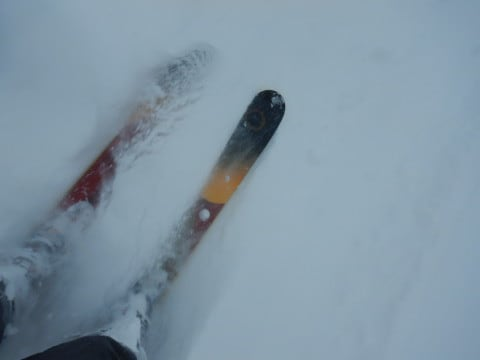
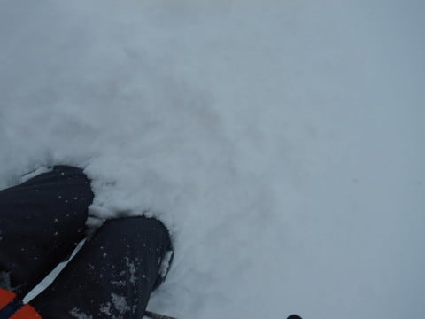
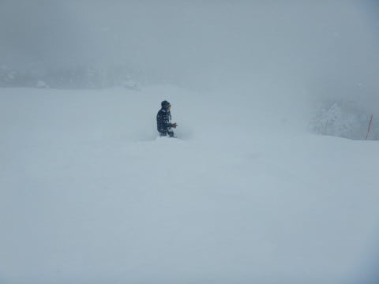
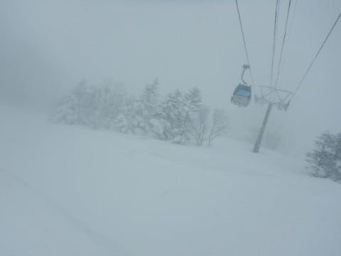
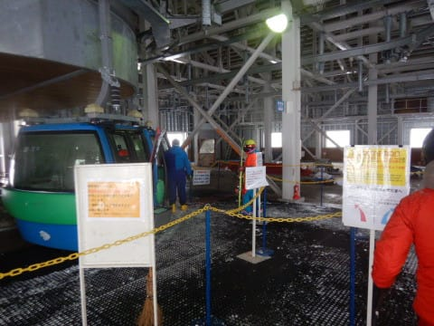
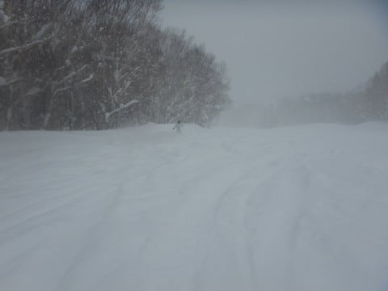
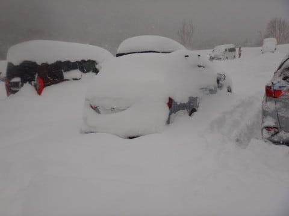

# 2022/2/6(日)の志賀高原焼額山スキー場，速報レポート！…朝の積雪は太ももパウダー！終日雪降りのエンドレスパウダーデー

📅 投稿日時: 2022-02-07 01:42:00

積もりました…

いやー．

積もりましたね．

この土日の志賀高原…

土日2日間動かさなかった車は，

車がこんなことになってたみたいで…

土日2日間の積雪，1mくらい積もったの

かな…？？

しかし，これはまさに発掘作業．

「をを！こんなところに車が！！」

って感じですね…

ってなことで．

今日もお約束通り，ラストまで滑ってきたわけで．

帰宅もいつもの深夜パターン…

だもんで．

本日の志賀高原レポート，

定番の速報モードにて！

えー．

まず．

昨晩からひたすら雪が降り続けており．

今日の朝も激しい雪降りでスタート．

圧雪コースも，圧雪バーンの上に10cm

ほどのパウダーが乗ってます…！

当然，こういう日は新雪を楽しみに，

オリンピックコースへ行ってみますが…

ををを！！

太ももパフ！！

コース全面，見事な太ももパフです！！

…が．

気温が低いにもかかわらず，ちょっと雪が

重め(涙)

緩斜面だとスタックする重さでした(泣)

そして．

今日もマイナス10℃以下の激しい雪降りの

天気が一日中続き…

そのせいで，ゴンドラはガラガラ！！

コースの人が少ないうえに激しい雪降り

だったので，圧雪バーンでも新雪が

踏まれる前に積もっていき，

終日深さ5~10cm程度の，エンドレス

パウダー状態でした…

そして．

ラストまで滑って車に戻ると．

今日もまた車が雪に埋もれてる…(涙)

昼間だけで，これだけ積もったのか…

ってなことで．

泣きながら車を発掘して，帰路に

向かったのでした…

しかし，良く降る…！！

志賀高原は明日7日(月)まで雪が

降ります…

そのあとは8，9日は雪は積もらなさそう．

というより，志賀は晴れるかも？？

ちなみに，10日は関東でも雪が降りそう

だけど…志賀はそれほど積もらなさそうかな．

とりあえず，また明日，日曜の志賀高原

詳細レポートやりますので，お待ちください…

今日はもう寝ます…おやすみなさい…

## 💬 コメント一覧

### 💬 コメント by (みこみん)
**タイトル**: Unknown
**投稿日**: 2022-02-07 08:19:04

おはようございます☀

無事に帰宅されましたかー？

土日は、本当に凄い積雪だったんですね！(◎_◎;)

私は根性ナシなので、その状況だと途中でリタイヤしちゃってますね😰💦

今週金曜日から行く予定ですので、今後の予報も楽しみにしています( ´∀｀)

### 💬 コメント by (Kiteholic)
**タイトル**: Unknown
**投稿日**: 2022-02-07 13:37:00

こんにちは。

今年は雪が多くて幸せです(*^o^*)

さて、話は変わるのですがvmでこれだけの積雪だと腹擦りませんか？新雪なら構わず行けるのかもしれないですが、どうなんだろう？と思いました。

というのも、現状VM4→SK9に乗換、BS9は最終型のBS9に乗換ているのですが、SK9に飽きてしまって…乗換を考えています。

BTアウトバックは駐車場の幅がオーバーなので、VNにしようか悩んでいるのですが、最低地上高が気になります。

以前のVM4に乗っていた際は、豪雪地帯にはなるべく行かず、BSでいく様にしていたので、実際どうなのだろうと思い質問させて頂きました。

率直な感想を教えてください。

よろしくお願いします。

### 💬 コメント by (副院長)
**タイトル**: Unknown
**投稿日**: 2022-02-07 20:26:10

月曜日は朝は勢いよく降ってましたが、徐々にはれてきました。新たな積雪は30センチぐらいでしょうか。ヤケビウォールは10時頃オープンするのですね。パトロール点検前に、私設点検部隊が、何人も点検されていました。

ところで、焼額、体調不良者発生で、営業リフト縮小のようで　心配ですね。

### 💬 コメント by (Skier_S)
**タイトル**: 13日はちょっと気温が上がりそう…
**投稿日**: 2022-02-08 00:56:04

＞みこみんさま

いやーー．この土日，すごかったですよ…

根性の無いスキーヤーは完全にふるい落とされる天気でした．

今週金・土は晴れそうです！

＞Kiteholicさま

他の車が数多く走っている道では腹をすることは無いですね…

VM程度の車高の車はいっぱい走ってるので．

除雪が行き届いてない駐車場とかがヤバいですが，腹というよりフロントバンパー下がヤバいです．

志賀高原は雪が軽いので何とかなります．

雪が重いところだと，バンパー下が除雪車状態にならないか注意した方が良いかも．

でも，VMGで3シーズン志賀にやってきましたが，少なくとも最低地上高が低いせいで

亀さんになっちゃった…ってことは私は無いです．

でも，安心したいならSKがいいかも…

SK9，いい車だと思いますよ．

＞副院長様

月曜は天気も良くて良かったみたいですね！

リフト営業縮小は心配です…今のところ木曜までで，金曜からは通常営業に戻すと言ってますが，

果たしてどうなることやら．

