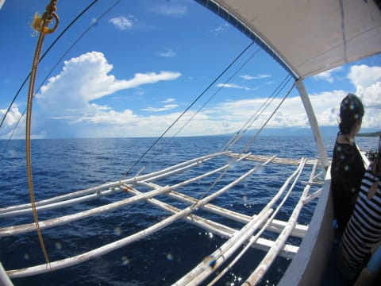
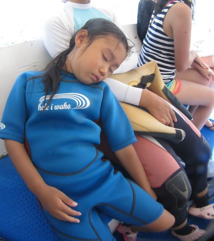
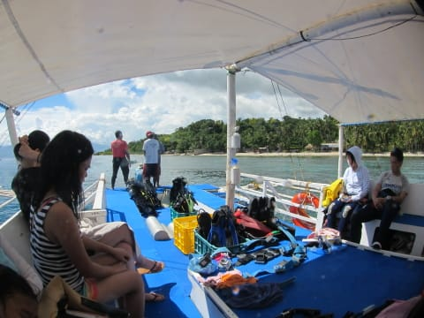
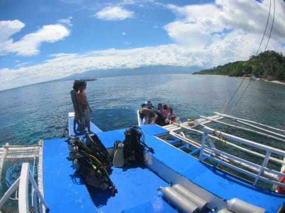
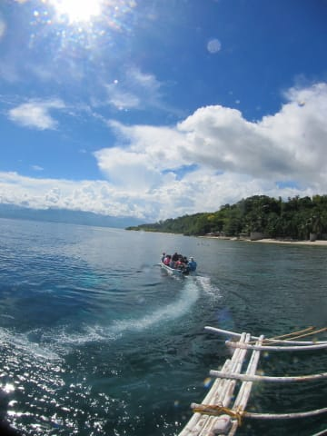
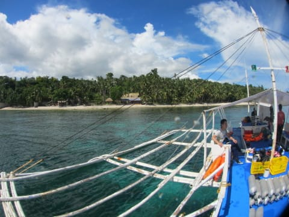
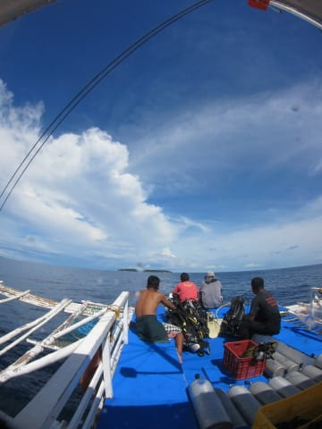

# 2013年11月　フィリピン・オスロブ　子連れでジンベエを見るぞっ！　その14

📅 投稿日時: 2014-07-23 01:11:22

🏷️ カテゴリ: [ダイビング日記](ce3a7a8d424d112fce83ee85c81a0e344.md)

ってことで．

お昼ごはんが終わったら，ホテルへ向かって移動です…

しかし．やっぱり．

予想通り…

泳ぎまくっていた娘は．

疲れたらしく，船の揺れでぐっすり…

泳いで食って寝て，

まー，シアワセな娘だこと…

スミロンから，泊まっているルビ・リゾートは

ボートでわずか20分ほどの距離なので，

あっという間にホテル前に到着！

ここで，ほとんどのメンバーはボートに乗り移り…

ホテルへ戻っていきます．

ジンベエも見たし，たっぷり泳いで満足の

娘と妻もここで降りていきました…

でも．

…オプションの，午後のダイビングに行く人は，

船に残ります．

当然，午前中に潜っていない私は，

午後のオプションは潜りに行くのだ．

船に残るのだ．

ということで，わずか3人だけのゲストを乗せた船は，

午後のダイビングへ向かいます…

向かうは，目の前に見える島．

そう，またスミロンへ戻るのだ！
