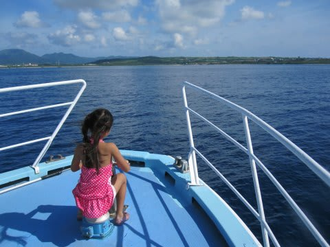

# 2014年9月　3連休，子連れ石垣ダイビング　エピローグ

📅 投稿日時: 2015-07-07 01:26:35

🏷️ カテゴリ: [ダイビング日記](ce3a7a8d424d112fce83ee85c81a0e344.md)

というわけで．

あまりもの思い付きで，[発作的に予約してしまった](edd2368d3cf52b5cc7bbb2568f8eace7a.md)

石垣島だったんだけれども．

あとで，冷静に旅費を計算すると．

「実質2泊3日の石垣島が，[5日間のフィリピン旅行](eba00449a8604d46409c23a754543fd68.md)より高くついてるんですが…っ！！」

という事実に気づいてしまい．

…

…

…やはり．

国内旅行は，高い…（涙）．

飛行機代は，石垣とフィリピンだとそれほど変わらず．

ダイビングフィーやら宿代は，フィリピンやタイの数倍…（激烈涙）．

…ものすごく財布に痛かった，石垣旅行だったのでした．

でもまぁ．

娘にも水族館で

「これがマンタだよ～．ダイビングで時々見るよ～」

とか言っていたけど．

わが娘．

そのマンタを，シュノーケリングで2日とも

特等席から眺められるというゼイタクな

体験ができたわけで．

私「娘～．今回の旅行，楽しかった？」

娘「うん，すっごい楽しかった～！！」

と，言ってくれたので．

お金はかかったけど．

かなりお財布に痛かったけど．

とりあえず，良しとしておこう…

だが．

しかし．

私「で，何が一番楽しかったの？」

娘「お友達と泳いだことっ！！！！！」

私「…

　　…えっ！？？

　　……そ，それ？？？

　　そこなの？？

　（マンタ見たことじゃなかったのか…っ！？？）」

娘にとって．

今回の旅行の一番の思い出は．

マンタを見たことではなく．

お友達と一緒に，ダイビングボートに乗って遊んだこと，

だったらしい…

（Fin)

## 💬 コメント一覧

### 💬 コメント by (マルハバ)
**タイトル**: ＞国内旅行は，高い…
**投稿日**: 2015-07-07 14:57:55

ですよね～（汗）

私もダイブ歴の95％以上は海外でしたね。

ダイビングの世界では

「貧乏人は外国で潜れ！」が常識？です（笑）

### 💬 コメント by (KENKEN)
**タイトル**: うちの娘も
**投稿日**: 2015-07-07 21:27:01

いつもショップのお子さん達と遊ぶのを一番の楽しみにしています。。

まあ親も楽ちんで助かるのですが・・・・・

うちの娘も今年から飛行機代以外にも交通費がいる年になったので沖縄行きも少々値上がりしそうです。

大作？の石垣旅行記お疲れ様でした。

### 💬 コメント by (Skier_S)
**タイトル**: 長編終了しました
**投稿日**: 2015-07-08 00:07:21

＞マルハバさま

いやーーー．

今回改めて思いましたが．

国内ダイビングは，高い…

…でも．

海外ダイビングも，タヒチやクルーズ，

モルジブの高級リゾートとか，高いところは

いっぱいあるんですけど．

やっぱり，タイやフィリピンのお値段感覚に

慣れちゃうと，他の場所は「うわ！高っ！！」

ってなりますよね…

＞KENKENさま

そうなんですよね～

子供はやっぱり子供同士で遊ぶのが

面白いみたいですね．

しかし，シュノーケリングでマンタ見たって，

一生の思い出に残るレベルの

超ゼイタクだと思うんだけどなぁ…

