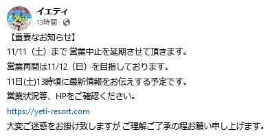
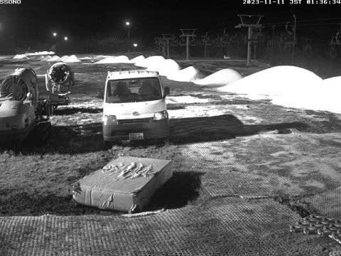
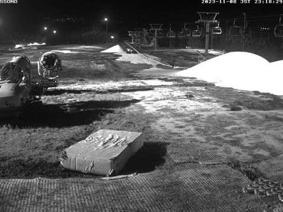

# やはり今年も開催，物欲選手権！…今回はスキー場で開催？？その2

📅 投稿日時: 2023-11-11 03:12:28

えー．

やはり．

悪いほうの予想通り．

イエティは，11日の営業をあきらめた

ようです（涙）

（[スノーパークイエティFacebook](https://www.facebook.com/YetiSnowtown/posts/pfbid02M9UKE4zbFexaMnUTe1RrTvTEmukHcc6xRCKiK6comHEqw3FbxtvLLxPU5F4rs1F7l)より）

ただ，金曜深夜のライブカメラを見ると．

完全ではないけど，そろそろ雪山がコース上に

そろい始めてきていて…

あと，明日1日あればコースはつながりそうに

見えますね！

（金曜深夜現在のライブカメラ画像）

（[WNIスノーパークイエティライブカメラ](http://webcam.wni.co.jp/KAC24326/loop.html)より）

なんてったって．

水曜深夜の段階でこんな感じだったのに，

これから2日間で上の写真のレベルまで

造雪が進むって…

やっぱりイエティの造雪能力は半端ない…！

（水曜深夜のライブカメラ画像）

ってなことで．

残念ながら土曜はイエティがオープン

しないので．今週末は土曜はまた泣きながら

仕事して，日曜にイエティが開けば滑りに

行く予定です…！

というところで，本題へ．

[前回の物欲選手権](e05737a8e31c770fa09305653a9f0b66c.md)，「続く」の状態で

長らくお預け状態でしたが…

ようやっと前回の続きです．

果たして，まだどんな勝負が続いていたのか？

ーーー

アナウンサー　「ということで．

　『第1回 スキーヤーの物欲を刺激する

　のがうますぎる危険なスキーショップ

　社長と対決して，物欲にまみれた

　スキーヤーが買い物をせずに我慢できるか

　選手権』

　ですが．

　どうやらまだ勝負は終わっていない

　ようです！！」

解説　「まだ終わってなかったんですか…？」

アナウンサー　「鈴木社長，

　まだ次の手を打っています…！

　勝負が終わったかと思ったところ，

　まだ攻撃の手を緩めません！

　まだ勝負が続くようです…！」

解説　「…さすがは鈴木社長．

　Skier_S選手の物欲がこの程度で

　済むものじゃないと見事に

　見切っている感じで，さらに

　勝負をかけてきてますね～！」

アナウンサー　「さすが手練れの

　鈴木社長！！

　さらにSkier_S選手の物欲を刺激

　するべく，なんと今回，Volklの板

　だけじゃなく，Fischerの板をさらに

　2セットSkier_S選手に貸している

　ようです…！」

解説　「もうすぐ型落ちになって

　安くなる，2023シーズンモデルの

　FischerのRC4 SC PROと

　The CURVの2セット，追加で

　貸し出しているみたいですね」

アナウンサー　「それも1週間，

　次の週まで借りっぱなし

　でいいという条件です…

　これはすごい勝負に

　なりそうですね…！！」

解説　「だから，これまでSkier_S選手の

　勝負で，一度でもすごい勝負ってありまし

　たっけ…？」

アナウンサー　「とりあえず．

　すでにスキー板，VolklのDeacon84

　という大物購入が終わっていると

　いうのに，果たして，まだこれからも

　Skier_S選手の物欲が発揮される

　というのか！？」

解説　「しかし今回，鈴木社長のチョイスが

　絶妙すぎますね…

　Skier_S選手の物欲をさらにピン

　ポイントで突いてきていますよ…」

アナウンサー　「といいますと？」

解説　「実は，Skier_S選手．

　[前回の物欲選手権で板を2セット購入した](e2f7f076faaf353202e84952b50279be7.md)

　ことになってるんですけどね」

アナウンサー　「そうでしたね．

　Fischerのロング用，RC4 RCの

　型落ちでプレートを最新の

　M/Oプレートに魔改造した板と，

　2023モデルのFISCHERのRC4 

　SC PROを購入していたことに

　なっていたはずですが…？」

解説　「でも，2023 RC4 SC PROは，

　試乗したオーストリア製が気に入って

　購入を決めたものの．

　[実はその後一般販売用に市場に流れた
　板はウクライナ製になった](ebb49c0255a644671dbd9627e88322875.md)んですよ」

アナウンサー　「そういえば，

　そういう話がありましたね」

解説　「エキップさんもオーストリア

　製を入手できず，オーストリア製と

　ウクライナ製の乗り味が同レベルか

　わからないということをSkier_S選手に

　お知らせしてて，いったん2023シーズン

　モデルのRC4 SC PROの購入を

　キャンセルしているんですよ…」

　

アナウンサー　「同じ板なのに，

　オーストリア製が入らなかったという

　ことだけで一旦キャンセルを

　勧めるというのも，なかなか

　すごいショップですね…」

解説　「ということで，2023シーズン

　モデルのウクライナ製がどんな

　乗り味か確認してみたかったと，

　Skier_S選手は常々思っていたみたい

　なんですよね…」

アナウンサー　「Skier_S選手．

　ウクライナ製の2023シーズンモデルを

　今回，初めて履くみたいですね…」

　

解説　「そうなんですよ．

　エキップさん試乗会もあったけど，

　そのときはもう2024シーズンモデルが

　出ていて，試乗板は2024シーズンモデル

　だったので…

　2023シーズンのウクライナ製はこれまで

　履くチャンスがなく，今回初めて履く

　みたいです」

アナウンサー　「なるほど…

　でも，いまさら古い2023シーズン　

　モデルより，2024シーズンモデルの

　ほうがいいんじゃないですか？」

解説　「いや，それがですね．

　2024シーズンモデルはウクライナ製の

　まま，無茶苦茶値上がりするんですよ…」

アナウンサー　「となると…

　もとから2024シーズンモデルより安く，

　そのうえ2023シーズンモデルは型落ちに

　なってさらに安くなるはずだし…

　最新モデルを買うよりかなりの格安に

　なるということだと，これは結構

　危険ですね…！」

解説　「そうなんです．

　来シーズンモデルは定価20万を

　超えてきますし．

　もうすぐ昨シーズンモデルになっちゃう

　2023モデルがその半額近くで買えると

　なると…

　これはヤバいですね…」

アナウンサー　「あ，さらに．

　鈴木社長から，2023シーズンモデルは

　全部売れちゃって，これが最後の

　1台だという話が出てますよ！！」

解説　「これはヤバいパターンですね…

　鈴木社長の物欲の刺激が巧みすぎます！」

アナウンサー　「そしてさらに追い打ち．

　新品じゃなく，試乗で出した板だから

　さらに特別価格が出てますよ…！！」

解説　「…これはもう，

　鈴木社長の物欲の刺激の仕方が

　上手すぎる…あまりにも巧みに

　Skier_S選手の物欲の秘孔を

　ピンポイントで突いてます…」

アナウンサー　「これはもう，ダメな

　パターンですね…」

解説　「Skier_S選手．半額という言葉に

　弱いですからね…

　そして最後の1台とくれば…

　ダメなパターンですね…」

アナウンサー　「ダメっぽいですね…」

解説　「秘孔を見事に突かれちゃったので，

　これはもうダメですね…」

アナウンサー　「あぁ…

　やはり予想通り，ダメだった

　ようです…！！

　行ってしまいました…！

　Skier_S選手．行ってしまいましたっ！

　ウクライナ製のFISCHER RC4 RCも

　お買い上げです！！！」

解説　「ダメでしたね…

　でも，本来昨シーズン買うはず

　だった板をキャンセルしてお金が

　浮いているから，

　今シーズン買ってもいいよね…

　来シーズンはもっと値上がりするから

　買うなら安いものがある今のうちだよね…

　と，自分に言い訳しているようです」

アナウンサー　「さすが物欲大魔王！！

　もう，自分を騙すための言い訳も

　見事です！

　物欲に敗れ続けているだけあって，

　敗れた理由を正当化する言い訳も

　滑らかに出てきます！

　さすがだてに負けてない！！」

解説　「そこ，ほめるところじゃない

　ですから」

アナウンサー　「しかし，今回も

　銀河系を飲み込むほどの物欲を

　見せたSkier_S選手でしたが．

　さすがにもう1セット借りていた

　The CURVは買わなかったようですね…」

解説　「そうですね…

　The CURVも結構気に入っていた

　みたいですが．

　まだかすかに，バクテリアの

　涙ほどに理性が残っていたという

　ことでしょうか」

アナウンサー　「せっかくの物欲大魔王，

　ここは3セット板を買ってほしかった

　ところですが」

解説　「確かにそっちの方がネタ的には

　面白いですけど…

　さすがに板を3本借りて，3本とも

　買うようだと，

　鈴木社長は次から板を10セット

　持ってくるでしょうね」

アナウンサー　「ということで，

　『第1回 スキーヤーの物欲を刺激する

　のがうますぎる危険なスキーショップ

　社長と対決して，物欲にまみれた

　スキーヤーが買い物をせずに我慢できるか

　選手権』

　ですが．

　スキー板を3セット持ってきて，

　2セット購入するという結果で．

　今回も鈴木社長の見事なピンポイント

　攻撃に，なすすべもなく敗れました…！」

解説　「今回も，鈴木社長が見事

　すぎましたね」

アナウンサー　「もう，Skier_S選手の

　物欲の秘孔の突き方が素晴らしいですね…

　やる気スイッチみたいに，

　『物欲スイッチ』を見事に

　見つけて押してる感じでしたね…」

解説「Skier_S選手の物欲スイッチは，

　わざわざ見つけなくてもそこら中に

　ありそうですが」

アナウンサー　「では，また次回…！」

（え？まだ[続く](e86184c188b21f43fe0f4d568138c1e77.md)の？）
