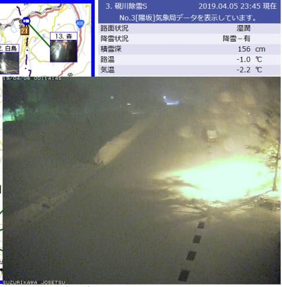
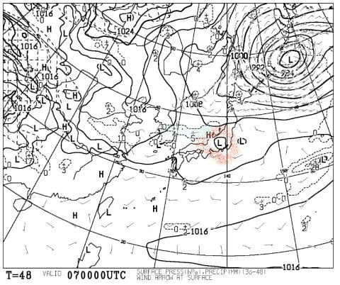
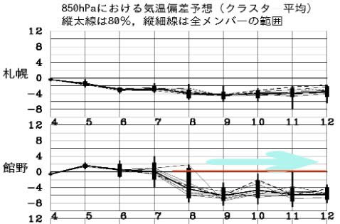

# 今週末も当然志賀高原で滑ってます～！…

📅 投稿日時: 2019-04-06 00:13:56

🏷️ カテゴリ: [日記](cc4b5682fb7b8b144980957a978653fb0.md)

本日の志賀高原．

朝は硬めだったものの．

日差しが強く，昼前には

強烈なストップ雪

になったようで．

…シアワセな奇跡の冷え込みだった

昨日までとは，打って変わった

春らしいコンディションになって

しまったようです…（残念）

とりあえず．

現在の志賀高原ですが．

　夜中～早朝にかけて，雪が降り積りそうですが．

　昼間は止んで，いい天気になるんじゃないかな…

という，水曜段階の予想通り．

雪が積もり始めているようです…！

熊の湯そば，硯川のライブカメラだと

こんな感じです！

（[北信建設事務所HP](http://hokushin-camera.org/)より）

ただ，この雪も明日の早朝営業開始前には

止んでしまいそうなので．

それほどの積雪はなさそうですが．

明日の朝はガチガチアイスバーンではなく，

硬い下地の上に，うっすらながらも新雪が

乗ったものが圧雪されるので．

あさイチはそこそこのいいコンディション

じゃないかな～．

でも．土曜は昼間晴れそうなので．

午前中から雪が緩み始めそう…（涙）．

昼間の気温は3℃程度と，それほど

高温にはならなさそうですが．

日差しが強いので，東斜面の焼額は

雪はちょっと残念な感じになるかな…

西斜面の一の瀬方面は，昼くらいまでは

いい感じでもちそうな予感．

まぁ，この土曜はピカピカ晴天の

春スキーっぽい日になるでしょう．

で，明けて日曜なんですが．

うーーーーむ．

天気図が微妙な感じになってきました…

赤丸で記したところにプチ低気圧が

発生する予想になってますが．

ホントに低気圧が発生するのか．

発生したとしても，この場所なのか，

わずかに南北にずれるのか…

で，予想は全く変わっちゃいます．

とりあえず，この天気図通りになるとすると．

日曜は朝から曇り空，朝のうちは

固めのバーンでスタート．

朝早くに緩むけど，曇り空なので

それほど雪が貼りつくほどには緩まず．

ただ，低気圧の場所によっては…

昼過ぎくらいに，ぽつ，ぽつと空から

液体がぱらつくかも．

じきに雪に変わり，

それほどひどい降りにはならずに

止みそうですけど…

ってな感じで．

木曜までの奇跡の冷え込みとは比べ物に

ならない，春っぽい雪になっちゃいそうな

この週末ですが．

まぁ，雪はまだたっぷりあって．

GWまでは問題なくもちそうな感じに

なってきたし．

さらに…

来週，また冷えそうですね．

水色矢印の9日火曜から12日水曜まで．

平年比4～6℃くらい冷えそうです！！

…冷えてくれるのはいいけど．

なぜ，今週末だけ狙ったように

気温が上がるのか…（涙）

ってなわけで．

この週末も志賀高原を滑ってます～！

あと1時間45分後に出発です．

1時間半寝られない…（涙）

## 💬 コメント一覧

### 💬 コメント by (Rikoriko)
**タイトル**: Unknown
**投稿日**: 2019-04-06 21:27:42

こんばんは〜。

今日の熊の湯は最悪の雪でした〜。

黄砂が積もったからか朝8時15分のリフト運行開始1本目から全く滑らない雪で、いつもは急斜面に感じるイベントコースや正面バーンもラクラク滑れる感じ。第二の緩斜面はクローチングを組んでも前に進まず参りました。

その上、東京都連研修会200人＋長野県連ボードの研修会＋BSA＋アルペンボードのポールトレーニング＋スキーのポールトレーニングと大繁盛でした。

大人数が滑ったおかげで11時頃からは一皮むけて何とか滑りやすくなりましたが・・・。

おそらく明日も同じ団体さん達で埋め尽くされると思われます（涙）

焼額や一ノ瀬・奥志賀の混み具合や雪の状況を教えてください。

もし空いているなら明日はそちら方面に行こうかなあ。

### 💬 コメント by (yama)
**タイトル**: Unknown
**投稿日**: 2019-04-07 07:56:00

奥志賀高原はゴンドラ半分でも待ちなし、焼額山も待ちなしですが、午前のうちからザブザブです。一の瀬は昼までアイスバーンも午後からは良い感じでした。パーフェクタも昼から開いて良かったです。

### 💬 コメント by (Skier_S)
**タイトル**: コメント回答遅れてすみません
**投稿日**: 2019-04-08 01:48:49

＞Rikorikoさま

コメント回答遅くなりました～！

すみません．

熊の湯はダメだったんですね…

焼額は，土曜はまだ板が滑ったのですが，

日曜は完全アウトでした（涙）

日曜は，どこに行ってもダメだったかと思います…

＞yamaさま

パーフェクターに午後2時ごろに行きましたが，

滑りが微妙な感じでしたね…

一の瀬正面バーンが一番板が滑ったかも！？？

