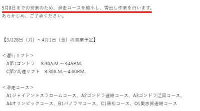
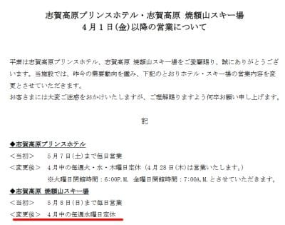
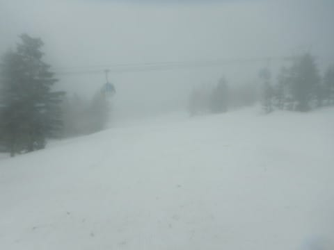
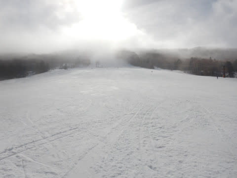
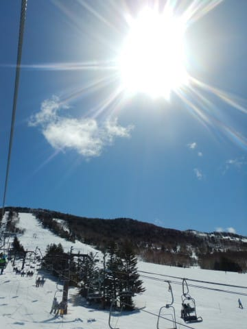
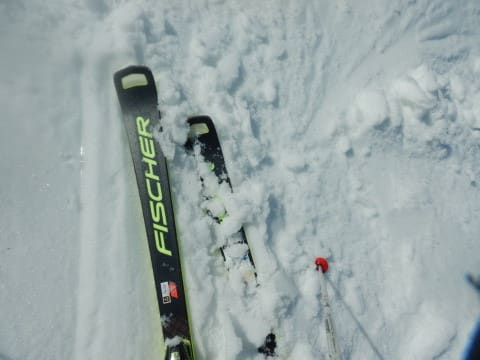
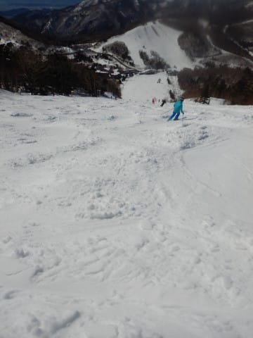
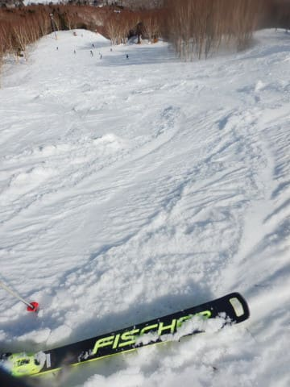

# 2022/3/27(日)の志賀高原スキー場速報レポート…朝はガスったけど10時ごろから晴れ！でも日差しで雪はザブザブ(涙)

📅 投稿日時: 2022-03-28 03:20:15

🏷️ カテゴリ: [2022スキー滑走日記](cc9cb73e4320f6a97af6fccc37587a61a.md)

ここしばらくのご無体で疲れているし．

まだ仕事も残っているので，今日は早く帰ろう…

と思ったにもかかわらず．

やはりラストリフトまで滑ってしまったSkier_Sです．

行く前は，睡眠不足でスキーに行ったら

死ぬんじゃないか…と思っていたけど．

スキー場に行くと元気になるようで．

2時間睡眠でスキーに行って，

土曜夜もラストまで滑った後仕事してたのに．

日曜もしっかり最後まで滑ってしまう

自分がいたのでした…

そしてさっき志賀高原から帰宅して．

今，泣きながら仕事しています…

明日の朝までに仕上げないと…(泣)←スキーから帰って来た日に

こんな時間まで仕事しなきゃならないなら，普通は早く帰るよね…？

ってなことで．

今日はクイックレポート！

でも，その前に情報を…←そんな記事を書いてる時間があったら仕事しなさい

明日からの焼額の営業案内が出ていますが．

明日も1ゴン，2高が動くけど．

雪出しのためにコース縮小ということで．

白樺コース，パノラマインコース，

SGSコース，イーストコースが

終わっちゃったみたいです…（泣）

([焼額山スキー場ホームページ](https://www.princehotels.co.jp/ski/shiga/winter/)より)

まさか白樺コースが終わっちゃうとは…

ラストの今日，ちゃんと滑ってくれば

良かった…(涙)

そして，

4月1日以降，焼額山スキー場は

水曜を定休日とするようです…

昔は4月以降は週末しか営業しなかった

という時期が長かったので，

まだ水曜以外の平日に営業してくれるだけ

ありがたいのかも．

…まぁ，平日に滑れない私には影響は

ないのですが…

（[焼額山スキー場ホームページ](https://www.princehotels.co.jp/file.jsp?id=372785)より)

ってなことで．

実は全コースが滑走可能な最終日だった

らしい，本日の焼額ですが．

営業開始前の早朝は霧雨が降っており．

営業開始時はかなりのガスでスタート(泣)

でも，営業開始30分後にはガスも

切れてきて…

10時ごろには，なんとすっかり晴天に

なっちゃいました！！

午後は晴れると思ったけど．

こんな早くに晴れるとは…！！

でも．

この時期は晴れても嬉しくない．

強い日差しで，午前中のうちにもう

雪はザブザブとなり…

午後にはコースが荒れ荒れコブコブに

なっちゃいました(泣)

まぁ，雪の滑走性が良かっただけマシですが．

コブコブになったせいか，午後は人が

一気に減り，ゴンドラ待ちもほぼ無し

でした…

ってなことで．

明日また詳細レポートやります～！

PS.

これからの志賀高原．

28日(月)，29日(火)ともに晴れるけど

気温は低め！

午前中はガチガチ，日差しの良い焼額は

午前からちょっと緩みそう．

一の瀬方面は28日は硬いまま．

29日は昼ごろには緩むくらいの感じかな？

## 💬 コメント一覧

### 💬 コメント by (レインボー74)
**タイトル**: Unknown
**投稿日**: 2022-03-28 06:07:43

日曜日の志賀高原情報

土曜日は強風なので、竜王に逃げました。ゴンドラはさすがに停止してましたが、まあ楽しめました。そこで驚いたことが一つ。

若いボーダーが多く、ほぼマスクをしていない。従業員すら！

遅ればせながら日曜の志賀高原は、朝は気持ちよく滑れたものの、10時頃からずっしりと重い雪がぼこぼこになって、横滑りがやりにくい状況に。私レベルでは快感は得られないので、3時間で終了。こんな日にもラストまでとは！つくづく私は中毒患者ではないと、自信を深めました。エス様ありがとう。

### 💬 コメント by (レインボー74)
**タイトル**: Unknown
**投稿日**: 2022-03-28 18:47:57

月曜日の志賀高原情報

朝の上林+1℃　蓮池-4℃。冷えて滑りそう。

オリンピック、GSはガスってるので、ほぼパノラマ→カラマツ→イチゴンを繰り返しました。

とても硬めで、ずーっとしましまは残ったままでしたよ。

今日からしらかば閉鎖がとーっても残念でした。

時間がたつにつれて雪も良くなっていったのですが、諸事情により今日も11時30分終了で、湯田中の仲良し食堂ラーメンをいただきました。

昨日の横滑りがやりにくい雪と比べると、アイスバーンなんて大歓迎かなと気づいた今日でした。

### 💬 コメント by (Skier_S)
**タイトル**: ＞レインボー74さま
**投稿日**: 2022-03-29 05:27:53

今日は日が射さなかったのでずっとガリガリバーンだった

みたいですね…

白樺クローズ，残念です．

これからバーンが硬いことが増えそうなので，転んでけがしないようにご注意を！

