# 12月19日，土曜日の志賀高原は…終日雪．激混み（涙）

📅 投稿日時: 2015-12-19 19:59:50

🏷️ カテゴリ: [2016スキー滑走日記](c70c67ed5248e9432b899dcd5747048bb.md)

ということで．

いつも通り，志賀高原にやってきた本日ですが．

…先週から，滑れるゲレンデが全く増えてないんですが…っ！！？（激涙）．

横手山・熊の湯を除くと．

動いているのは，一の瀬ファミリー下半分，高天ヶ原下半分，

ヤケビの第2高速，第4ロマンスくらいです…（こぼれ落ちる涙）

奥志賀は全くオープンできる状況じゃないですし．

寺子屋，一の瀬山の神・ダイヤモンド，タンネの森，

西舘山，東舘山，ブナ平，ジャイアント，蓮池，丸池と

全滅です．

12月20日にもなろうというのに，これは…

私の知る限りでは，最もひどい記録のような気が…（あふれ出る涙）

とりあえず．

昨日からの積雪で．

今週も志賀の上り路は完全雪道になっており．

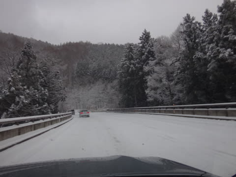

…これは，ゲレンデの積雪が期待できるかもっ！？？

と，大期待してゲレンデに出てみたけど…

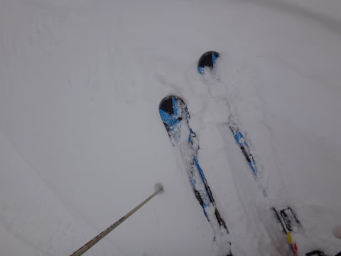

はう？

なに？

昨日からの積雪，これだけ？？

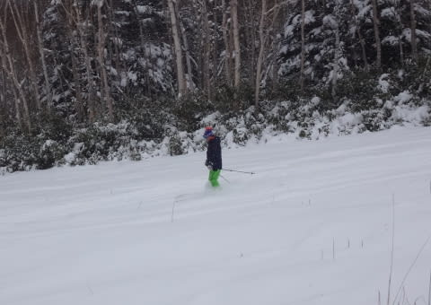

一見，コースわきにはいっぱい雪があるように見えるけど．

10cmあるかないか…（涙）

足りない…

圧倒的に，積雪が足りない…

朝イチのゲレンデは，ぴかぴか圧雪に見えるものの…

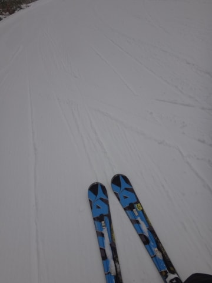

ちょっと滑ると，すぐに下地のアイスバーンが

「ようこそおこしやす」

と，顔を出してくるゲレンデ状況で．

あまり滑りよくない状態…（涙）

そして．

普段は完全に待ちゼロの焼額第2高速．

今日は，朝9時の段階で，もう人が多くなってきて…

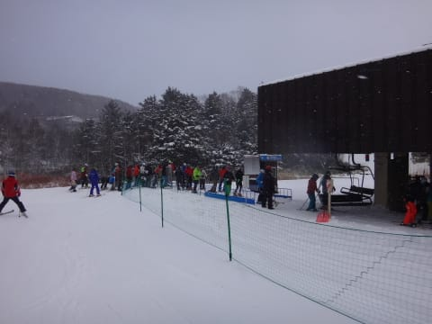

で．ゲレンデの人口密度も．

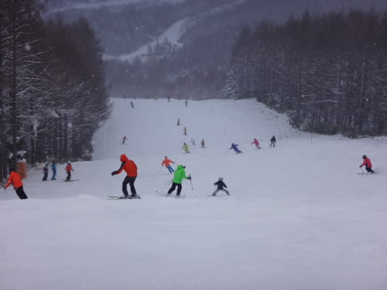

あれ？

えええ？

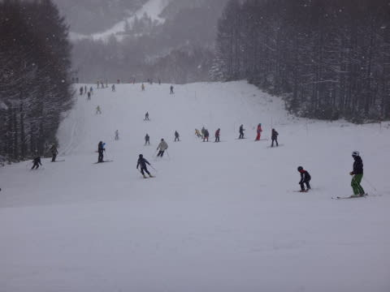

なに，これ？

なんなの，この人口密度は…（涙）

そして．

10時過ぎには…

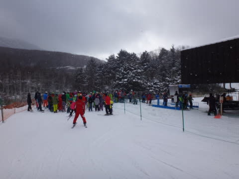

おー，まい，がーっ！！！！

第2高速リフトも，待ち時間が…

ただ，リフト待ちは結構タイミングによってむらがあり

最大5分，最小1分くらい．

運が良ければ人は少なめなんだけど…

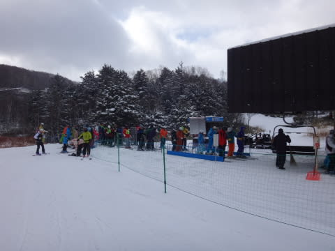

でも，普段待たない第2高速．

待ち時間があるのはつらいし…

で，滑れるゲレンデは，まるでYetiみたいな

こんな状態と来てるし（悲）．

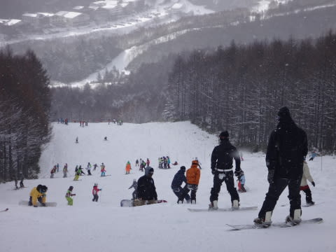

そして，人が滑って，表面の雪が剥げてきたら．

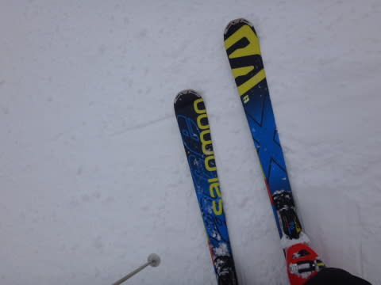

…コースのかなりがアイスバーンに…（涙）

なんてこった．

どうしたこった．

なぜ，こんなことに…（耐え難い涙）

4ロマ側，サウスコースを滑ってみたけど．

まぁ，コースの雪は2高側よりましとはいえ．

やはりアイスバーンに薄く新雪が乗った状態．

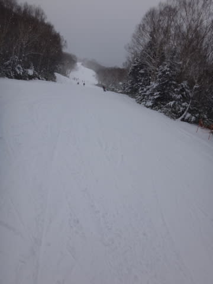

せめてもの救いは，輸送力がペアリフトしかないので，

ゲレンデ混雑はこっちのほうがかなりましかな…

リフト待ちは，最大10分まで行ったみたいだけど．

昼前はこんな感じ．2-3分だったかな？

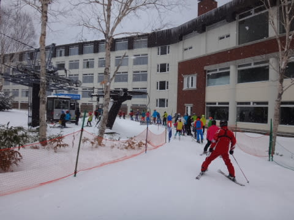

で．この日の天気は．

予想をちょっと外して

夕方までやむことなく雪がちらちら舞う感じ．

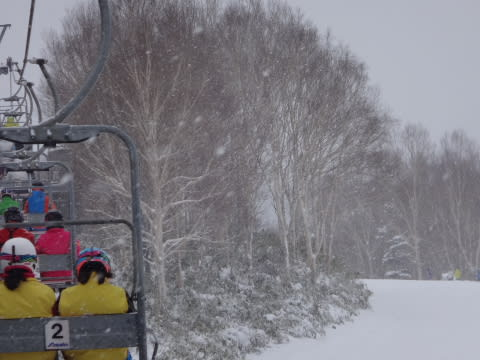

…でも．

全然積もる感じの雪じゃない…（かなり残念）

そして，午後には

アイスバーン＆コブコブの，かなり滑りにくい…

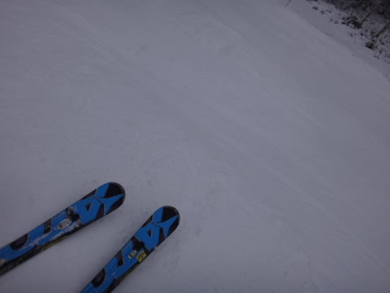

というより．

滑って楽しくないゲレンデ状況になってしまい…

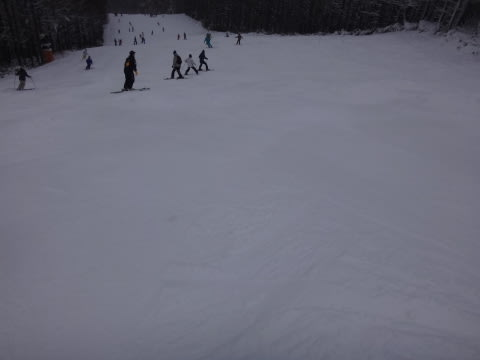

「なぜ？

　どうして，12月下旬の志賀高原で，こんなひどい雪なの？？？」

と，あふれ出る涙をぬぐいながら，

やっぱり16時のリフトストップまで滑ってたのでした←それでも最後まで滑るんかい！！

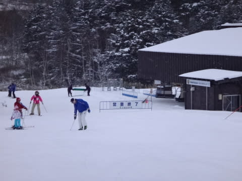

ってことで．

当然，16時半まで営業の一の瀬へ移動するわけですが．←全然「当然」じゃないから．突っ込みどころだから．ここ．

一の瀬は，緩斜面のペアリフト2本しか動いていない，

そんなに面白くないコースだというのに．

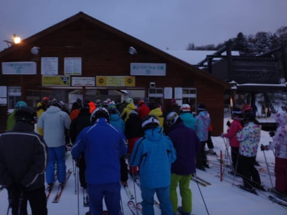

修学旅行生がいっぱいいて，リフト待ちがすごいことに…（涙）

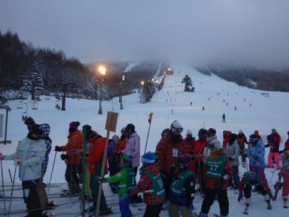

全面オープンになる予定だった，今週．

本来なら，広大なエリアの数多くのリフトに分散されるはずの

多くの人が．

わずか数本のリフトに集中したので．

やっぱり今日はどこも混んだんだなぁ～．

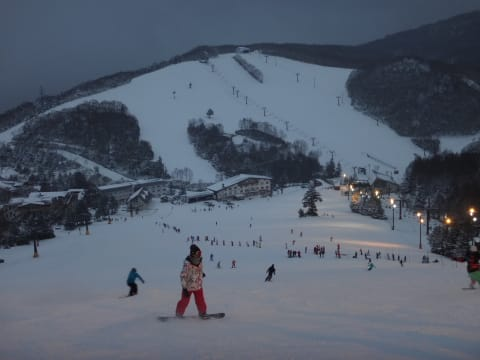

と，思いつつ．

本日もナイター照明がともる，一の瀬営業ラストまで

滑っていたのでした…

…しかし．

だめだ．

ダメだよ．今シーズン（泣）．

雪が足りない…

今，志賀は全然降ってません（涙）

明日，状況が良ければヤケビはゴンドラ動かすつもりで

いるみたいだけど…

うーん．

動いてくれるかなぁ…

動いてほしいなぁ…（懇願）
