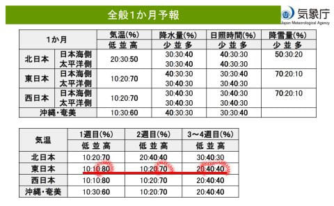

# 木曜なので気象庁一か月予報が出たけど…来週は4月並みの高温が続く異常気象になりそう（泣）．でも，みんなで願えば来週末もそこまでひどいコンディションにならなさそう．

📅 投稿日時: 2024-02-09 01:14:02

えー．

焼額山スキー場ですが．

本日からヤケビウォールがオープンしたよう

です…！

これでやっと，焼額の全コースがオープン

しましたね…

（[焼額山スキー場Facebook](https://www.facebook.com/yakebitaiyama/videos/%E7%9A%86%E3%81%95%E3%81%BE%E3%81%8A%E5%BE%85%E3%81%9F%E3%81%9B%E3%81%84%E3%81%9F%E3%81%97%E3%81%BE%E3%81%97%E3%81%9F%E4%BB%8A%E3%82%B7%E3%83%BC%E3%82%BA%E3%83%B3%E3%81%AE%E3%83%A4%E3%82%B1%E3%83%93%E3%82%A6%E3%82%A9%E3%83%BC%E3%83%AB%E6%9C%AC%E6%97%A5%E3%82%88%E3%82%8A%E5%96%B6%E6%A5%AD%E9%96%8B%E5%A7%8B%E3%81%A7%E3%81%99%E4%BB%8A%E9%80%B1%E6%9C%AB%E3%81%AE%EF%B8%8F%E4%BA%88%E5%A0%B1%E3%81%AB%E6%9C%9F%E5%BE%85%E3%81%AB%E8%83%B8%E8%86%A8%E3%82%89%E3%81%BE%E3%81%9B%E3%81%A6%E3%81%84%E3%81%BE%E3%81%99%E4%BB%8A%E9%80%B1%E6%9C%AB%E3%81%AF%E3%83%A4%E3%82%B1%E3%83%93%E3%81%A7%E3%81%97%E3%82%87%E3%83%A4%E3%82%B1%E3%83%93%E3%82%A6%E3%82%A9%E3%83%BC%E3%83%AB%E3%81%AE%E5%85%A5%E5%A0%B4%E3%81%AF%E4%B8%8A%E7%B4%9A%E8%80%85/1738759016634014/)より）

で．

本日の志賀高原も，特派員という名の

仕事をさぼった仕事がお休みの

人たちが滑っていたようで…

午前中は最高雪質のいい天気だという，

悶絶級の写真が送られてきました…！！

うがーーー！！

うおーーー！！！

滑りたい…っ！！！

奥志賀も最高だったみたいですが．

でも，晴れていたのは午前中まで．

午後は曇り空になり，時折

パラパラ雪も舞ったみたいですが…

でも，コンディションよかったみたい

ですね…

…ってなことで，本題へ．

今週末まではトップシーズンらしい，

結構いいコンディションが続きそう

ですが．

果たしてこのGoodコンディションはいつまで

続くのか気になるところ．

で，本日は木曜なので，気象庁の[1か月
予報](https://www.sunny-spot.net/chart/FCXX92.pdf)の発表日ですね～．

とりあえず，1か月予報をみてみま

しょうか…

…

ふむ．

…

…

え？

…

あ…？

…

だ，ダメだ…

ダメだこりゃ（泣）

第1週は高温になる可能性80％，

第2週は同じく70％，

そして，第3，4週も冷えそうにない感じ…（涙）

[FCVX14](https://n-kishou.com/ee/image4/lfax/fcvx14_202402072100.png?x=27&y=22)を見ても，

12日あたりから20日過ぎまで

あり得ないほどの高温になりそうで…

なんてったって，赤く記した部分，

グラフの上を激しく突き抜ける予想も

あるくらいで…

これはひどすぎる（涙）

平年比+10℃を越えかねない危なさ

なんですが…（泣）

そして．

これだけの異常高温なので…

早期天候情報が出るレベルですね（涙）

気象庁から異常高温に注意するよう，

高温にかかわる[早期天候情報が出てます](https://www.data.jma.go.jp/gmd/cpd/souten/?reg_no=21)（泣）

とりあえず．1か月予報資料に戻り，

第1週，2/10～2/16の850hPa気温傾向を

見てみると．

…この水色で塗った領域，平年比+5℃って

ことになってるんですが…！？？

1週間の平均が平年比+5℃って，

かなり危険レベルの異常気象です（泣）

そして，第2週，2/17～2/23の850hPa気温は．

うーん…

これも，水色に塗った領域は1週間平均で

平年比+4℃という，かなりヤバいレベルの

異常高温…（涙）

これは2月下旬まで，雪がドサドサ降る可能性は

限りなく0っぽい…

とりあえず．

今週末はまだいいけど．

来週13，14日からは4月並みの気温になり

ますね（泣）

13，14日はまだ晴れるからいいけど．

15日がヤバい．

空から液体が降ってくる危険度がかなり

高い！！

ただ…

今，15日の特定高度線の予想を見ても，

まだ赤く記したように予想ばらつきが

かなり大きい感じなので…

だもんで．

15日の気温の予想ばらつきも，まだ

かなり大きい感じ．

皆さんの日ごろの行いが良く，

15日の予想が低い方に行ってくれれば．

平年より気温が3-4℃高くても，2月の

この時期なら雪になってくれるので…

16，17日の週末も，ゲレンデはそこまで

ひどいコンディションにならなさそう．

ただ，皆さんの日ごろの行いが悪くて，

気温が高いほうにずれると…

…

…

いや．

考えない．

そんな恐ろしいことは考えないぞ…！！

とりあえず．

スキーヤーの皆様におかれましては．

これから来週末にかけて，

一片の曇りもないほど，日ごろの行いを

良くしてくださいますよう，よろしく

お願いいたします…

## 💬 コメント一覧

### 💬 コメント by (レインボー76)
**タイトル**: Unknown
**投稿日**: 2024-02-09 15:31:34

金曜日の志賀高原情報

シーズン初の一ゴンスタート。知り合いばかりで、待ってるだけでしゃべり過ぎて疲れました。

まずはオリンピック。少しガスっていたけど超絶快楽バーン。ヤケビ全域極楽です。

10時からは3高で、ボードからスキーに挑戦する人のレッスン。すると、次から次へと名人クラスが指導に現れて、とっても助かりました。

今日も悶絶志賀雪で、不満はゼロ。こんな日にも運命に逆らえないエス様が、輝いて見えます。

### 💬 コメント by (アリス)
**タイトル**: Unknown
**投稿日**: 2024-02-09 18:19:12

Ｓ様

本日は志賀高原で職場仲間と合流して楽しんでいました。

天気、景色、雪申し分ないです。

明日は12人でのヤケビ、オクシ参戦になります。

どうなる事やらです。

### 💬 コメント by (アツシ)
**タイトル**: Unknown
**投稿日**: 2024-02-09 21:01:26

今日は仕事休んで志賀高原。朝イチは曇ってましたが10時頃には雲も去り、夕方まで極楽モードでした。リフト・ゴンドラもゲレンデも空いてて、やっぱ平日スキー最高‼️先の見通しさえ立てば早期退職して平日スキー生活できるのに、なかなかそんな見通しは立ちません。宝くじでも当たらんかな？？買わな無理か(笑)

### 💬 コメント by (Skier_S)
**タイトル**: 明日はスキーに行けず（泣）
**投稿日**: 2024-02-10 03:08:36

＞レインボー76さま

今日も良かったみたいですね…

そして明日もいいんだろうなぁ…

私も悶絶志賀雪を滑りたい…

明日も運命に逆らえないです（涙）

＞アリスさま

明日もコンディションいいと思います…

12人とは大勢ですね！楽しんできてください！

＞アツシさま

ええ～！サボリーマンやってたんですね．

今日は絶好の休み日和（？）だったかと．いいなぁ…

私も平日スキーしたい．

…その前に，休日に確実にスキーできるようにしないと…

