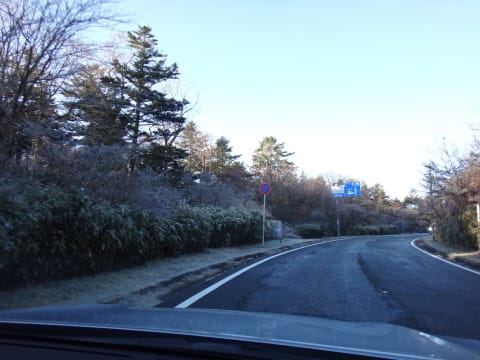

# 11月16日土曜日のYetiは…コース幅もちょっと広がったかな

📅 投稿日時: 2013-11-17 00:00:57

ということで．

今日は予告どおり，またまたYetiに行ってきましたよ～！

…4回目なので，そろそろ飽きてきたころですが…(ぼそ）．

で．

今日の朝．

御殿場から，BRレガシィ君でYetiへの道を順調に登っていたときのこと．

予想外の凍結が！

日陰の部分．ところどころ，路面が凍りついていたのでした…

Yetiの付近には凍結防止剤が大量に撒かれており，

夏タイヤでもゆっくり走れば問題ないレベルでしたが．

途中で路肩のがけに突き刺さっている車1台．

…いやー．この時期で晴天の時に．

路面が凍っているとは思わなかったんでしょうね～．

ということで．

イエティに着いても，日陰は凍りついているような冷えた朝．

8時の営業開始と同時に，ゲレンデに出てみると…

うむ．

なんか，今日の雪質はすごく荒い粗目で，板が潜るんですが…

でも．

天気も良く．

人も少ないコースが滑れて．

朝イチはいいねぇ！

…雪は板が潜りぎみで滑りにくいけど(ちょっと残念)．

でも，朝のうちは，9時過ぎまでリフト待ちも少なく．

…相変わらず，朝10時ごろまでは混まないスキー場だわ…

コース幅も，先週に比べるとさらに幅が広がってきましたね～．

しかし．

さすがに10時を過ぎると人が増え始めてきて．

ちょっと滑る意欲が失われてきます…

んでも，クワッドリフト待ちは午前中は3分程度．

10時半ごろから平行してかかるペアリフトが動き出し，

こっちは終日待ち時間0．

この時期にリフト待ち無しで滑れるって，いいですね～！

…でも．

だけど．

このYetiって．

今の時期もナイターがやっていて．

さらに一日券が夜10時のナイターまで通しで使える，ってのが

効いているのか．

土曜は午後から出てくる人が多いんですね～．

なんだか…

昼を過ぎると…

ゲレンデ上の人口密度は，戦闘意欲をなくすに十分な混雑に

なっちゃうんですが…(泣)．

そして，朝のうちの雪がザクザクしていたので．

踏み固められたゲレンデは，ちょっと波なみ状態…

で．

天気は．

終日晴れの予想が，富士山のふもとだけ雲がかかり，Yetiは昼前から曇り．

だもんで，雪はべとべとにならず，気温も低めだったので比較的滑る雪だったのが

救いでしたね～．

午後は，ちょっと滑りが悪いところもあったけど…

雪の厚みも増えたのか，土も出てきてなくて．

コース幅が広がったのもあいまって，

人さえいなければかなり滑りやすくなってきたかと…

…

…でも．

幅が広がってくると．

はっきり分かっちゃうのだ．

「このゲレンデ…ゆるすぎて面白くない…」

ってことで．

今シーズンも4週間にわたってお世話になりましたが．

さすがに来週はもう来ないでしょう…

来週は，アサマ2000だなっ！

ってことで．

Yeti．

今シーズンも，お世話になりました～！！

