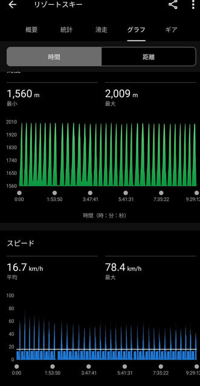

# 月曜はやっぱり寝ちゃうなぁ…そして日曜は一緒に滑った人がYukiyamaアプリで移動距離全国1位だった？

📅 投稿日時: 2025-04-22 12:26:36

🏷️ カテゴリ: [日記](cc4b5682fb7b8b144980957a978653fb0.md)

やっぱりだめだ…

土日にスキーした後の週明けの月曜．

帰宅が深夜0時を過ぎていて，それから

Blogを書こうと思ったけど，

お風呂に入った後，気づいたら死んだ

ように床で倒れてました…

だもんで，いつもと違って昼休みに

更新！

最近の週末，早朝営業が始まってから

土曜朝の出発時間も朝3時に早まって，

2時間睡眠で出かけてるし．

それでいて土曜夜も10時過ぎまで

ダベッて過ごしてしまい，

さらに日曜朝も早朝に行くために5時前に

起きて，それでいて帰宅後寝るのが

3時近かったので…

週末も睡眠不足が激しくて，月曜は

やっぱり起きてられない…（泣）

でも，早朝営業が始まると，雪がいい

朝6時からたくさん滑れるので，睡眠時間は

削られて辛いけど，いっぱい滑れるのは

嬉しい限り！！

で．

当然，この日曜日も朝6時から営業終了の

15:30まで，こんな感じでいつも通り休まず

止まらず滑っていたわけですが…

だいたい移動距離は160kmくらいですね．

お客さんが少なく，ゴンドラの運転速度が

遅かったので，滑走標高差はせいぜい

15000mくらいと，あんまり大した量は

滑れてないのですが．

この日は，朝からずっととある方と一緒に

滑っていたのですが．

その方はどうやらこの日のYukiyamaの

移動距離で全国1位だったようです…

うーむ．

それってつまり，私もこの日，移動距離

日本一タイだったってことかな？？

ってなことは．

普段も大体このペースで滑ってる私は，

いつも日本トップクラスの滑走量って

ことですね…たぶん…．

睡眠不足なのに，極限まで身体を酷使

してます（笑）．

そろそろ志賀高原のシーズンも終盤なので…

もうすぐ志賀高原が滑れなくなるという

名残惜しさから，今のうちにいっぱい

滑っておかないと！！！

と，ついついペースを上げてしまうわけ

ですが．

今後の志賀高原は，23日は雨が降りそうだけど，

そのあとは27日の週末までは晴れそうかな～．

26日は朝はかなり冷えそうですよ！！

早朝はガチガチかもしれないけど，

午前中くらいは晴れて冷えて，バーンが

締まった結構いいコンディションで

滑れそうです！！

PS1. しかし，Yukiyamaをやっていないだろう，

志賀高原の20000mクラブの大御所の

某氏やら某氏は，普段からもっと滑ってる

だろうから…

志賀高原には恐ろしい人がいっぱい

います（笑）

PS2．そして，Yukiyama全国1位とは，やはり元焼額スーパー

キッズはすごかった…
