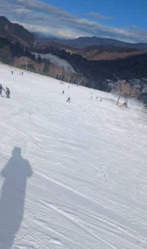
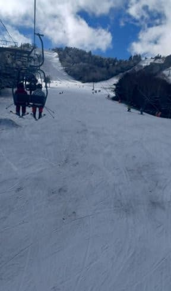
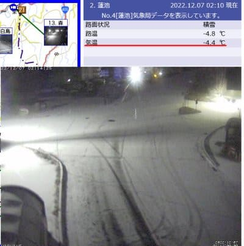
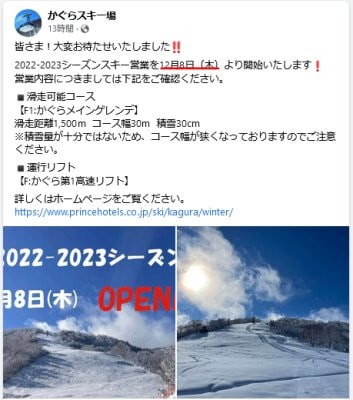

# 今シーズンも開催！物欲選手権・第3回長岡編その4…勝負はまだ終わっていなかった…

📅 投稿日時: 2022-12-07 03:21:17

🏷️ カテゴリ: [スキー雑談](c1f9d2cb7478308da16419928ea3945e9.md)

えー．

今週いっぱいは，雨が降るような高温に

なる心配もないけど，冷えもしない…

という微妙な気温が続くわけですが．

昨晩は一瞬微妙な冬型に入ったようで．

熊の湯もわずか数cmほど，天然雪の

積み増しがあったようです！

特派員の写真によると，人工降雪と合わせて

ゲレンデ状況はちょっと良くなって

きているみたいですね…

ただ，まだコースの最後のリフトを

くぐるあたりはちょっとヤバそうですが…

そして．今晩も微妙な冬型で，

志賀高原も蓮池で-4.4℃とそこそこ

冷え込んで，雪がわずかに積もってます！！

…でも，今後もしばらく，強い冬型には

入らないので，積もってもせいぜい

一晩数cmと言った，この程度の積雪が

続きそう…（涙）

とりあえず，今は人工降雪機に

ガンバレ！！とエールを送りましょう…

そんな中，かぐらはなんとか人工降雪を

積み増せたようで．

やっと8日（木）からオープンするようです！！！

（[かぐらスキー場Facebook](https://www.facebook.com/snowkagura/)より）

…わが焼額は，まだオープン日アナウンスが

出てませんが…

一体いつオープンするのか…

ってなことで．

本題へ．

実は[前回で終わってなかった](ece68838b53dfc37b212fc4ba5af4733c.md)らしい物欲選手権．

果たして，Skier_Sの物欲沼はどうなったのか？

ーーーー

アナウンサー　「さぁ．

　　『第3回 スキーヤーの物欲を刺激する

　危険なスキー専門店に来て，

　物欲にまみれたスキーヤーが

　買い物をせずに我慢できるか

　選手権』

　が続いてますが．

　ブーツの当たりだしと

　板のチューンナップに出しに来た

　だけのはずのSkier_S選手．

　想定外にブーツと板を買っちゃうという

　大敗を喫しました…！！！」

解説　「いや，それ，想定外じゃなく，

　十分想定の範囲内ですから」

アナウンサー　「しかし．エキップ社長さん，

　勝負はついたというのにまだまだ

　攻撃の手を緩めず，容赦なく

　Skier_S選手の物欲をさらに刺激

　し続けているようです！！」

解説　「もう，

　エキップ社長さんによる物欲刺激に

　Skier_S選手が一方的にやられる勝負

　を見る場になってきましたね…

　この選手権」

アナウンサー　「さて．エキップ社長さん．

　ブーツと板で勝利した後，

　まだどこのSkier_S選手の物欲の

　ツボを突こうというんでしょうか…？？」

解説　「どうやら今度は，

　試乗でSkier_S選手がこれまでにない

　最高のフィーリングを得られたという

　[FISCHERのRC4 SC Pro](e365707c42944ab9a8c0597cc8d39d1c6.md).

　ヨーロッパ情勢が不安定なので，

　数が少なく，そろそろ売り切れそう…

　という危ない情報を入れている

　ようですね」

アナウンサー　「あー．なるほど．

　昨シーズンからSkier_S選手は

　ロングの板しか買ってないから．

　ショートの板は，危ないですね…

　それも，Skier_S選手が人生最高に

　気に入っていたATOMICのSXを

　超えるんじゃないか？という

　試乗で最高の印象をもった板．

　それが売り切れそうだけどいいのか？

　という見事な物欲刺激です！！」

解説　「これはまた…

　また見事に，Skier_S選手の

　物欲の秘孔をピンポイントで突いて

　きましたね…

　玄人と素人の勝負です．

　勝負になってないです．

　エキップ社長さんの方が，

　Skier_S選手より2枚も3枚も

　上手ですね…」

アナウンサー　「これも，

　ダメですかね…」

解説　「ダメっぽいですね…」

アナウンサー　「やっぱりダメですかね…」

解説　「…秘孔を突かれて，もうすでに

　死んでますね」

アナウンサー　「あぁ…やはり…

　やはりダメでした！！！！！

　ここでSkier_S選手，

　あっさり陥落しました…！！

　なんと．

　なんと．さらにショートの板も

　行っちゃいました～！！」

解説　「上手い…

　エキップ社長，上手すぎる…」

アナウンサー　「ってなことで．

　昨シーズンもブーツと板2セット

　という，

　史上最高の歴史的大敗

　をしたこの選手権．

　さすが物欲大魔王，

　今シーズンも，ブーツと板2セットという，

　記録に並ぶ大敗を続けて

　しまいました！！！」

解説　「いやーーー．

　やはり長岡のこのお店．

　危険ですね…」

アナウンサー　「…ということで．

　加工が終わったブーツを受け取って

　Skier_S選手，満足げな表情です！」

解説　「負けて満足げって，

　どういうことですかね…」

（続く）

## 💬 コメント一覧

### 💬 コメント by (northfox)
**タイトル**: Unknown
**投稿日**: 2022-12-07 10:11:07

取り敢えずは板購入おめでとう❓ございます。

お買い得のRCを先に出してからSCで畳み掛けるとは、エキップの社長さんは手練れですね。

しかし、まだ続く…のですか😱

物欲無限列車の状態ですね

### 💬 コメント by (レインボー改めブラボー75)
**タイトル**: Unknown
**投稿日**: 2022-12-07 15:53:52

水曜日の熊の湯&横手情報

熊の湯はどうも朝一は8時15分頃から乗せてくれたみたい。良心的だなあ。

あれれ？狭くなつてた下部が昨日よりさらに広くなってる。頑張ってくれたんだ。ありがとう。快適です。しかも、南風でないので(西風)スノーマシンが10時まで働いてくれました。週末に期待を抱かせる上の尾根にも。

最初の10本くらいは飛び乗り状態だったのに、そのうち二本続けて3分待ちに。リフトから横手の海和ゲレンデを見ると、がらがら。人間、欲は限りない。ブーツを片足脱いで車移動する馬鹿者もいました。

いざ海和ゲレンデに着いてぎゃふーん！並んでるよー。ゲートが一つだけだから、ここで詰まるのか！約6分待っていざ！

左端へ飛び込んだら、なんと青氷のつるんつるん。センターはまずまずだったけど、右端にまた青氷が。結局センターを滑れば問題なかったんだけど、リフト待ちが嫌で、ラーメン食べて終了。

もっと熊の湯に忠誠を誓うべきでした。

でも皆様、熊の湯にお越しのせつは、特に年配のかたは軽い板です。300mくらいは歩かねばならないので、重い板ではそれだけで疲れてしまいますよ。

### 💬 コメント by (さち)
**タイトル**: Unknown
**投稿日**: 2022-12-07 16:09:15

嘘でしょ！？

そしてまだ(続く)とは…w

ポタ電とウェアをポチった位の私なんてかわいいもんですわ…

今年は土日フルでスキー場行けないから、浮いたおかねだしいいよね♪と思っていませんか？私は思ってます！

なんだか勇気が出ました！←え？w

### 💬 コメント by (Skier_S)
**タイトル**: 仕事が終わらない…
**投稿日**: 2022-12-08 02:03:23

＞northfoxさま

そうなんです…まだ続くんですよ…

＞ブラボー75さま

熊の湯＆横手レポートありがとうございます！

今週土日は，焼額と一の瀬はオープンしそうですが，高天ヶ原はあかないし焼額もペアだけだから…

混みそうですよね（涙）

＞さちさま

ポタ電とウェアをポチったんですか！

まだあのウェア新しかったように見えたんですが…

私は，夏休みにどこにも行かなかったので，その分お金使っていいよね…

と自分を甘やかしてます

