# これからの一か月予想を見てみたけど…スキー場にとっては壊滅的な天気(涙)．そして3月16日の志賀高原スキー場特派員情報

📅 投稿日時: 2023-03-17 02:33:22

🏷️ カテゴリ: [日記](cc4b5682fb7b8b144980957a978653fb0.md)

ということで．

本日も，志賀高原に忠誠を誓う特派員から

ゲレンデ状況が送られてきました～！

今日は晴れの予想を裏切って，うす曇りで

スタートだったみたいで…

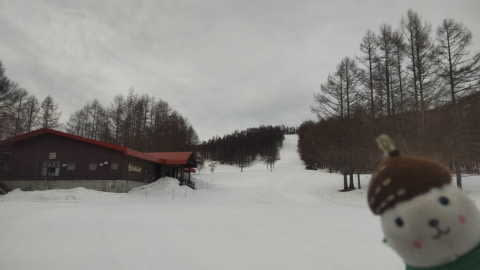

とはいえ，夜中は氷点下まで冷えたので，

あさイチはちょっと硬めのバーンだった

ようですが…

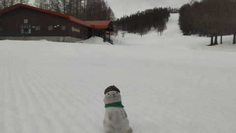

でも．

あさイチの気温はギリギリ0℃前後と，

この時期にしては高めだったので…

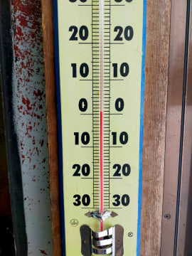

そのせいで，バーンはすぐに緩み始めたよう

ですが．

うす曇りの天気が良かったみたいで，

そこまでひどく緩まずに，午前中は

適度に緩んでエッジが食い込む，

いい感じの斜面だったみたいです…！

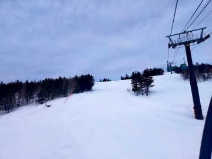

ただ，焼額はやはり昼前には緩みきった感じで．

寺小屋が14時ごろまで良かったという報告が…

（この写真は焼額だけど）

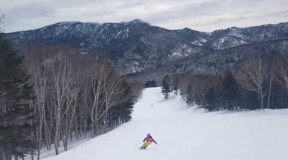

気温は最高+5℃くらいまで上がっちゃったので，

3月中旬というのに，緩斜面は滑りの悪い雪に

なりかけたところもあったみたいですが．

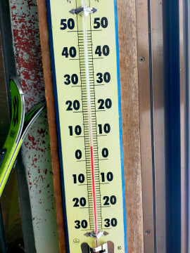

でも，人も少なそうで，

午後になっても荒れてなさそうだし．

…私も平日に滑りたい…

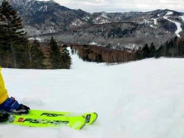

ってなことで．

異常高温が続いたこの3月上旬だったわけですが．

これからもこの異常高温が続くのか，

気になるところ…

はい．そうです．

今日は木曜日ですね！！

皆さんご存知のように，本日木曜は気象庁から

1か月予報が発表される日です…！←そんなマニアックなこと知ってる人少ないから．皆さん知ってないから

なので．

皆さん当然のごとく，

これから一か月は-10℃以下激冷えで腰パフパウダーが

毎日積もる天気になるはず

と期待を込めて←すごい期待だ…

[FCXX92](https://www.sunny-spot.net/chart/FCXX92.pdf)を眺めていると思います！！←だからそんなマニアックな人いないから

当然，私も期待しながら，FCXX92を

眺めるわけですが…

…

…

…

…なんじゃこりゃあ

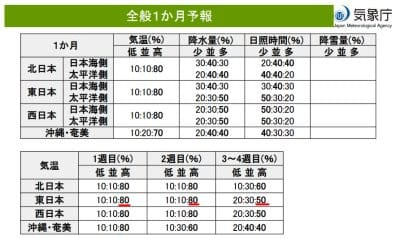

1週目，2週目ともに高温になる確率80％？？

80％なんて高い確率，これまで見たことないよ…！？？

そして，3週目も高温になる確率50％？？

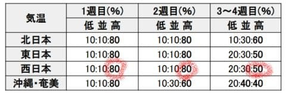

…ダメです．

これだけで，すでにこれから1か月，壊滅的な

予感しかしません…（涙）

そして…

「全国的に，期間の前半は気温がかなり高くなる」

ことに注意しろと言われてますね…（激泣）

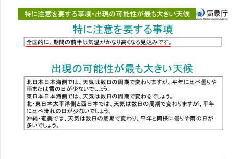

とりあえず．

気象庁のコンピューター様は．

これから一か月間ずっと，気温が高いと

仰せのようですね…（泣）

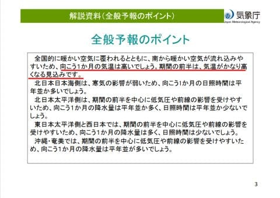

なんてったって．

これから1カ月間の850hpa予想図．

赤い0℃線はもう津軽海峡くらいまで

上がっちゃってるし…

さらに，水色で囲ったエリアは平年比

+3℃以上の高温領域です…

志賀は平年比+3℃のエリアに入ってますね…（涙）

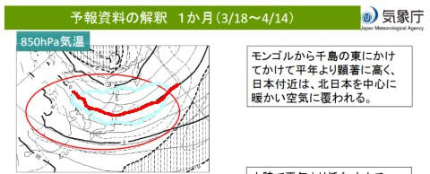

1週間平均で平年比+3℃と言えば

もう異常高温レベルなのに．

一か月平均で平年比+3℃というのは，

異常すぎる気象としか言いようが

ないんですが…（落胆）

もう，赤矢印で示したこれから一か月，

全く冷えそうな気配がない…（泣）

…ただ．

これまで書いているように．

気象庁の1か月予想は外れることが多い

のだ！！！

だもんで．

気象庁が1か月気温が上がるということは．

その予想が外れて，気温が低くなるはず…！！

と，期待して．

これからの激冷え＆腰パフパウダーの

冷え込みを待ちましょう…！！

と，前向きに言ってみたけど．

…むなしい…

なぜか，むなしい…（涙）

## 💬 コメント一覧

### 💬 コメント by (レインボー75)
**タイトル**: Unknown
**投稿日**: 2023-03-17 13:33:44

金曜日の志賀高原情報

朝の湯田中は小雨。下界はガスで運転が怖い。でも、上に行くとガスはなくみごとな雲海が！

白樺、唐松はまずまず。昨日よりもやわらかめ。オリンピックはすでに柔らかすぎ。

GS、奥志賀は棄てて寺子屋へ。読みがズバリ。快適バーンで、アリスさんと坂東先生とでウハウハ滑りました。寺子屋ラーメンのあとは、既に快感のない柔らかさになってました。

12時過ぎのファミリーもすでにもこもこ。疲れるので途中で休まないと足が持たない。サウスも然り。これからは午前だけでいいのかなって思ってしまいます。

### 💬 コメント by (アリス)
**タイトル**: Unknown
**投稿日**: 2023-03-17 19:00:59

S様

こんばんは😃🌃

仕事が大変みたいで、Sさんが仕事で多忙の中スキー三昧して申し訳ありません🙇

今日もニゴン一番機で頂上へ✨

素晴らしい景色、ゲレンデと日常では味わえない幸せを堪能しました🎵

ヤケビ常連さんの皆様とも合流させていただき、楽しさ倍増です☀️

多少、雪質は悪くなっていますが雪のない地域に生活してる私には、スキーが出来るだけ満足しております☺️

レインボー様、皆様

本日はお世話になりました❗️

すごく楽しかったです🙆

坂東先生も後半エンジンがかかり、モコモコの中のファミリーを圧巻の滑りをしていました❗️

### 💬 コメント by (Skier_S)
**タイトル**: 今週末もスキーに行けず（涙）
**投稿日**: 2023-03-18 02:31:14

＞レインボー75さま

今日は雲海が終日見事だったみたいですね…

しかし，ここ数日気温が高すぎますね（涙）

普通はこの時期，まだ冷え冷え雪で滑れる時期で，

寺小屋に逃げるなんて4月の週末以降だったのに…

でも，今週末は日曜はコンディションちょっと復活するかも？？

＞アリスさま

残念ながら，仕事が大変です（涙）

家の引っ越しをしても翌週にスキーに行くこの私が，毎月1回，スキーに行けない週末が来るとは…

恐るべし，現職場．

とりあえず，志賀高原が楽しめたようで良かったです！

